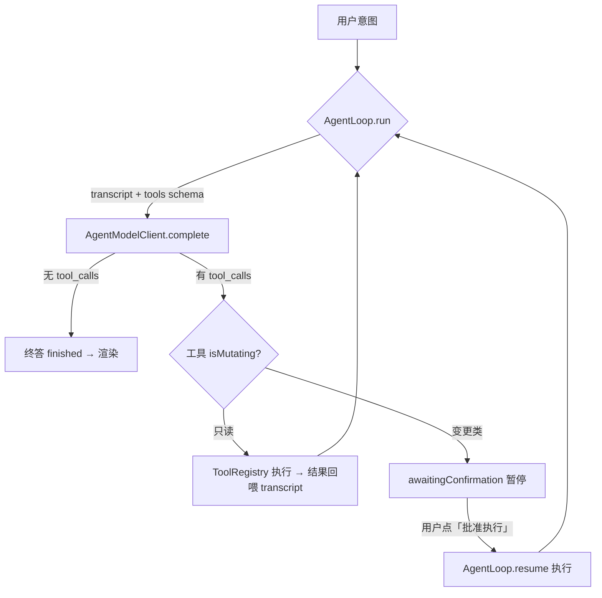

# AI 原生 Agent 工具层 — 设计文档

> 本文件记录猴毛「AI 原生 tool-calling agent」的工具层设计，以及**邮件方向工具**的能力与摘要缓存 key 设计，方便后续参考与扩展。
>
> 关联文档：底层邮件摘要/去噪/缓存内部机制见 [proactive-agency.md §8](proactive-agency.md#8-邮件三句话摘要v3)；总架构见 [product-architecture-roadmap.md](product-architecture-roadmap.md)。

---

## 0. 背景与定位（一次有意的架构反转）

猴毛早期的第一架构原则（赫尔佐格 / ADR-1 / ADR-13 / ADR-14）是「不做 tool-calling 大脑，LLM 仅作文本层」。本工具层是对该方向的**有意反转**：让模型自己决定调用哪些工具、并把多个工具串起来完成一个更高层意图。

落地策略 = **混合、可回退**：

- 新增一个独立 **`/ai` 窗口**承载 tool-calling agent；
- 现有确定性面板（`/mail` `/pr` `/do` …）**全部保留**不动；
- 能力逐个包成工具，随时可停可退。

**底线不放弃（ADR-8）**：**变更类工具（删邮件、写文件…）绝不自主执行**——`AgentLoop` 遇到变更类工具会暂停、等人工确认后才执行。AI 原生 ≠ 放任模型改数据。

---

## 1. 分层与文件

纯 Foundation、可单测的原语放 `Core/Tools/`；窗口外壳放根目录（Shell）。

| 层 | 文件 | 职责 |
| --- | --- | --- |
| Core | [JSONValue.swift](../mac/houmao/houmao/Core/Tools/JSONValue.swift) | 递归 JSON 值（工具参数 schema + 模型回传 args），Codable |
| Core | [AgentTool.swift](../mac/houmao/houmao/Core/Tools/AgentTool.swift) | `AgentTool` 协议 + `ToolCall` + `AssistantTurn` |
| Core | [ToolRegistry.swift](../mac/houmao/houmao/Core/Tools/ToolRegistry.swift) | 工具注册表；`specs()` 产 OpenAI 风格 `tools` 数组 |
| Core | [AgentLoop.swift](../mac/houmao/houmao/Core/Tools/AgentLoop.swift) | 工具使用循环 + 变更类确认中断（`AgentMessage`/`AgentActivity`/`AgentOutcome`） |
| Core | [AgentModelClient.swift](../mac/houmao/houmao/Core/Tools/AgentModelClient.swift) | tool-calling 的 OpenAI wire 层（`requestBody`/`parseTurn`/`complete`/`modelCall`） |
| Shell | [AgentChatViewModel.swift](../mac/houmao/houmao/AgentChatViewModel.swift) | 驱动 `AgentLoop`，管理对话/工具活动/确认状态 |
| Shell | [AgentChatView.swift](../mac/houmao/houmao/AgentChatView.swift) | `/ai` 对话 UI + 变更类确认条 |

> 目录取名 `Core/Tools/` 而非 `Core/Agent/`——后者已被「主观能动性」被动收件箱子系统（`AgentEvent`/`Watcher`/`AgentDaemon`）占用，两者概念不同（那个是被动感知/通知，这个是主动工具使用）。

**刻意不改 `AiTxtClient`**：tool-calling 的线格式（`arguments` 编成 JSON 字符串、`tool` 角色带 `tool_call_id`、`content` 可为 null）与既有聊天 client 差异大，单独放 `AgentModelClient`，现有 chat/mail/pipeline 路径零风险。

---

## 2. AgentLoop：循环与确认机制

- **单步 vs 多步**：单工具只是循环跑一圈的退化情形；多步串联（如 `list → read → 分析`）由同一循环自然得到，不设「只准一个工具」的天花板。
- **护栏**：`maxSteps`（默认 8）防止模型无限循环；`AgentOutcome.maxStepsReached` 兜底。
- **确认链路**：变更类工具 → `run` 返回 `.awaitingConfirmation(call, transcript)` → UI 显示确认条 → 用户批准 → `resume(afterApproving:)` 执行该工具并续跑；拒绝 → 回喂一条「user declined」让模型收尾。

---

## 3. 工具契约（新增工具照此写）

`AgentTool` 协议：

| 成员 | 说明 |
| --- | --- |
| `name` | 暴露给模型的函数名，snake_case、稳定 |
| `description` | 一句话，模型据此决定何时调用 |
| `parametersSchema` | JSON Schema（`.object`），描述参数 |
| `isMutating` | 是否修改用户数据；变更类**绝不自动执行**（默认 `false`） |
| `invoke(arguments:)` | 用解码后的参数执行，返回喂回模型的**文本**结果 |

约定：

1. **tool = 现有 view 的确定性取数 + 动作**——复用既有 `Provider`（`GmailProvider` / `PullRequestProvider` / `GitHubCLI` …），只是把「人点按钮」换成「模型决定调用」。
2. **确定性逻辑该封装进工具**（去噪、聚类、取数、格式化）；**依赖用户意图、且外层 agent 自己能做的智力工作，不要塞进工具**（见 §5 的嵌套 LLM 取舍）。
3. 依赖注入 `Provider`（协议）→ 工具**可 mock、可单测**。
4. 新增工具流程：① `Core/Tools/XxxTool.swift` 实现协议；② 在 [AgentChatViewModel](../mac/houmao/houmao/AgentChatViewModel.swift) 的 `registry` 注册；③ 变更类设 `isMutating=true`；④ 加单测（注入假 Provider）；⑤ 新文件需 `xcodegen generate`。

---

## 4. 邮件方向工具能力

首批邮件工具（均复用 `GmailProvider`，token 走现成的 `GoogleAccount.accessToken()`）：

| 工具 | 类型 | 参数 | 复用 | 作用 |
| --- | --- | --- | --- | --- |
| `list_recent_mail` | 只读 | `query`(默认 `is:unread`)、`limit`(默认 20，上限 50) | `listMessages`+`fetchMetadata` | 列最近邮件：id / 发件人 / 主题 / snippet |
| `read_mail` | 只读 | `id`(必填) | `fetchFull` | 读某封全文（供深入分析） |
| `triage_inbox` | 只读 | `query`(默认 `is:unread in:inbox newer_than:30d`)、`limit`(默认 100，上限 200) | `MailGrouping`+`MailImportance`+`MailWatcher.summarize`（带缓存，见 §5） | 挑重点：去噪 + 聚类 + 逐重点簇三句话摘要 |
| `trash_mail` | **变更类** | `ids`(数组) | `trashMessages` | 移到废纸篓（可恢复）；**需人工确认** |

对应实现：[ListRecentMailTool](../mac/houmao/houmao/Core/Tools/ListRecentMailTool.swift)、[ReadMailTool](../mac/houmao/houmao/Core/Tools/ReadMailTool.swift)、[TriageInboxTool](../mac/houmao/houmao/Core/Tools/TriageInboxTool.swift)、[TrashMailTool](../mac/houmao/houmao/Core/Tools/TrashMailTool.swift)。单测：[MailToolsTests](../mac/houmao/houmaoTests/MailToolsTests.swift)。

### 典型 agent 用法（多步）

- **「今天有哪些重要邮件，先处理哪些？」** → `triage_inbox` 拿到去噪后的重点簇 + 摘要 → agent 在其上**排序**（先看哪些、后看哪些）。
- **「XX 那封讲了什么？」** → `list_recent_mail` 找到 id → `read_mail` 读全文 → agent 分析。
- **「把这些促销邮件删了」** → agent 提出 `trash_mail(ids)` → **暂停等用户点「批准执行」** → 执行。

`AgentChatViewModel` 的 `systemPrompt` 引导模型：想快速了解重点用 `triage_inbox`；看具体某封先 `list_recent_mail` 再 `read_mail`；删邮件用 `trash_mail`（会先请用户确认）；需要数据时调工具、不臆造。

---

## 5. 邮件摘要 key 与缓存设计（核心）

`triage_inbox` 的逐重点簇三句话摘要复用 `MailWatcher.summarize`——这意味着**在工具内部再嵌套一次 LLM 调用（每个重点簇一次）**。为让这层可接受，加了**幂等缓存**。

### 5.1 复用现成缓存，不另建 tmp

摘要缓存**直接复用现有的 `MailMemoryStore`**（[Core/Mail/MailMemoryStore.swift](../mac/houmao/houmao/Core/Mail/MailMemoryStore.swift)），**不新建 tmp 目录缓存**：

- 现有 `MailMemoryStore` 落盘 `~/Documents/houmao/mail/memory.json`，且被 **watcher + `/mail` + 本工具三者共享**——同一份缓存，永不重复付费、不漂移。
- 另起 tmp 缓存会：被系统定期清理（更易失效）、与另两条路径**各存一份 → 三份漂移**。

### 5.2 缓存 key = 簇签名（排序 message-id 的 SHA256）

key 用现成的 `MailSignature.cluster(cluster)` = 簇内 Gmail **message-id 排序后 join → SHA256 hex**。

这个 key **优于**「title hash + 最近邮件时间」：

| 方案 | 加/删邮件失效？ | 检测得到删除？ | 同标题不同线程碰撞？ |
| --- | --- | --- | --- |
| **排序 message-id 哈希（采用）** | ✅ 集合一变即变 | ✅ | ❌ 不碰撞 |
| title hash + 最近时间 | 部分 | ❌ 删除检测不到 | ✅ 会碰撞 |

即：**簇内只要没有新增/删除邮件，key 不变 → 命中缓存**；一旦有变化 → key 变 → 重新摘要。这正是「无新邮件只付一次」的幂等性。

### 5.3 只对 cache miss 花预算

`triage_inbox.invoke` 内：`load()` 一次 → 逐重点簇按 `sig` 查 `state.summaries`：

- **命中** → 直接用，**免费、无上限**；
- **未命中** 且 `generated < summaryBudget`(8) → 调一次 `summarize`，写回缓存、计入预算。

`summaryBudget=8` 只约束**新摘要**（对齐 watcher 的预算语义），防止一次调用对超大收件箱无界 fan-out。**无新邮件 → `generated==0` → 零 LLM 开销**（单测 `triageCachesSummariesAcrossCalls` 证明第二次调用摘要器只跑一次）。

### 5.4 两层职责分离

- **工具层（`triage_inbox`）**：确定性去噪 + 聚类 + **带缓存**的逐簇摘要 → 产出「重点 digest」。
- **agent 层**：在 digest 之上做**依赖意图**的判断——先看哪些、后看哪些、是否需要 `read_mail` 深入、是否建议 `trash_mail`。

### 5.5 嵌套 LLM 的取舍（一般原则）

工具内部再调 LLM（compound tool / sub-agent）**并非天然反模式**，判据：

- **适合**：map-reduce 压缩超长语料（外层上下文塞不下）、异构能力子代理（代码执行 / OCR 视觉 / 检索重排）、与外层对话意图无关的自包含子任务。
- **不适合的信号**：内外层同一模型做重叠智力工作、数据本就很小（无压缩收益）、把摘要格式/意图**写死**、工具因此变非确定性。

`triage_inbox` 的**确定性部分（去噪 + 聚类）该留**——那是 agent 自己做不到、值得封装的价值；**逐簇摘要属于弱点**（数据小、写死了「背景/目的/处理」格式），靠 §5.1–5.3 的**幂等缓存**把成本摊薄成「每簇仅在有新邮件时付一次」来抵消。若日后要更贴合用户意图，可把摘要拆成独立的、agent 可自主选择调用的 `summarize_mail_cluster` 工具。

---

## 6. 现状与后续

**已落地工具**：`list_pull_requests`（GitHub）、`list_recent_mail`、`read_mail`、`triage_inbox`、`trash_mail`。

**UI**：失败（出错 / 达最大步数 / 空回复）时 header 显示「重试」按钮，重放上次请求、不用重打字；变更类工具确认条显示 `工具名 + 参数 JSON`，批准前能看清将要操作什么。

**已定不做（避免过度工程）**：

- **终答流式**：会反转刻意的非流式健壮性选择，且流式 `tool_calls` 分片累积 + `<think>` 过滤复杂易碎（本地模型格式不一）；而 `AgentLoop` 已把每步「调用工具 / 工具结果」逐步流式反馈 + 输入栏有转圈指示器。改为上面的**手动重试**。
- **摘要缓存淘汰**：每簇摘要约 150 字节、增长极慢（万簇 ≈ 1.5MB），多年都非问题；正确的 LRU 需改 `State` schema 记录访问时间、或随机丢弃、或让工具耦合当前 sig 集——为不会发生的增长加这些属过度工程。

**未做 / 待办**：

- 把 `/pr`、`/issue` 的 ghia 深度分析包成工具（让 agent 串「列 PR → 深度分析某个」）；
- 补一条 ADR 正式记录本次方向反转（ADR-1/13/14）；
- `/ai` 窗口 GUI 无法无头验证，真机联调需配好 provider（支持 function calling）+ 已连 Gmail / `gh auth`。
