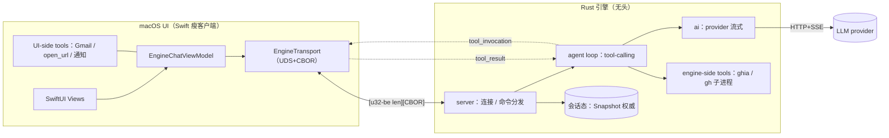
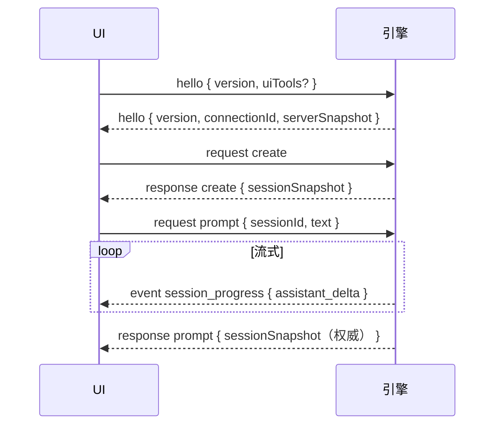
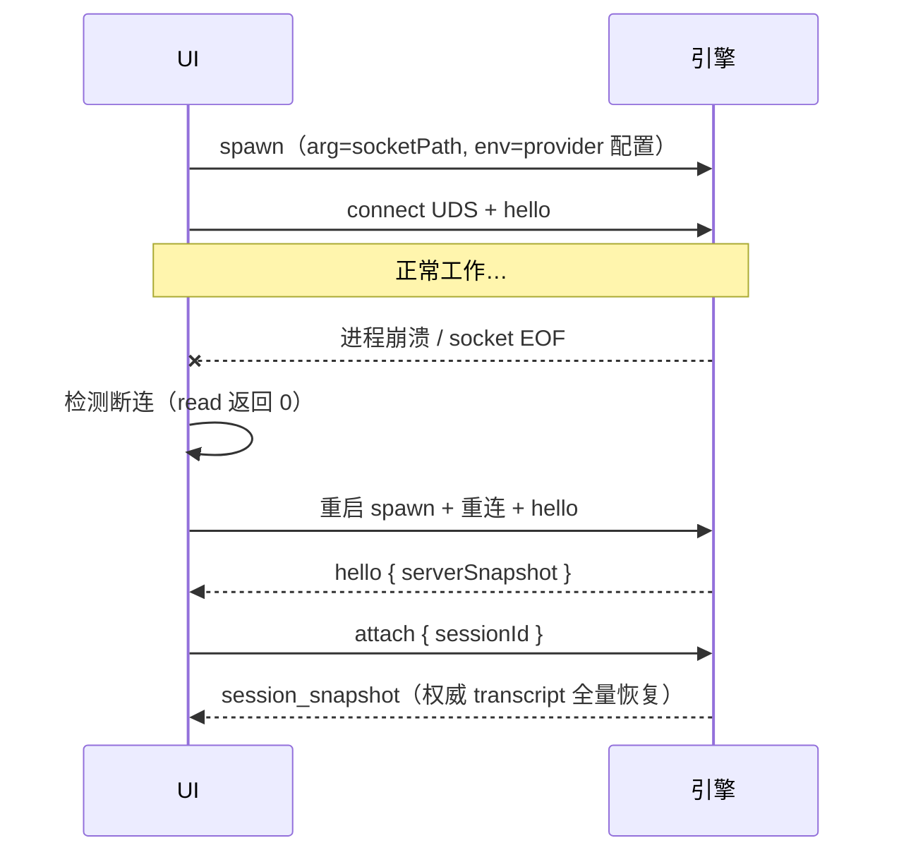
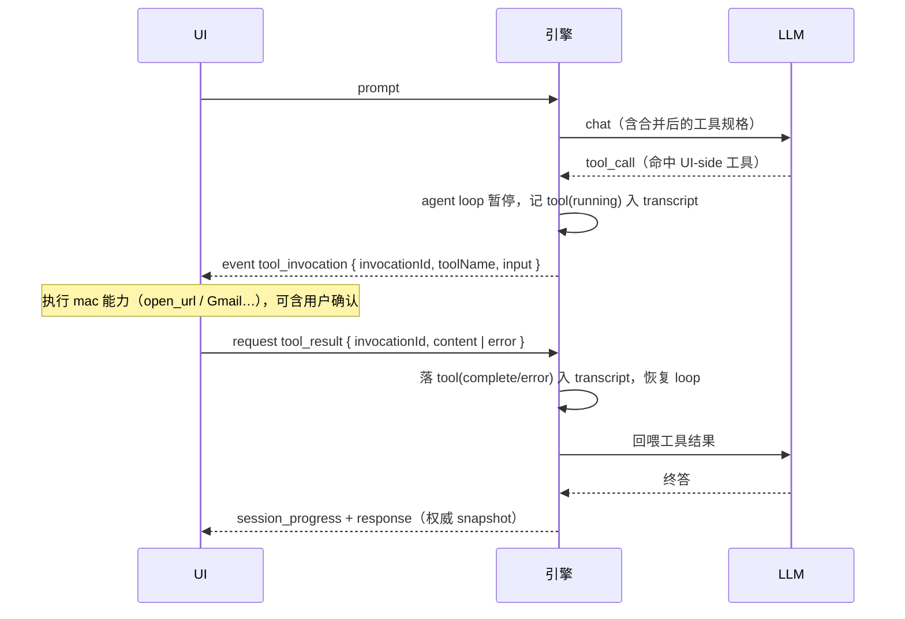

# 引擎/UI 解耦（Rust 无头引擎 + macOS 瘦客户端）

状态：进行中。引擎（协议+framing+server+provider 调用+**agent 多步 tool-calling 循环**+engine 工具 get_time+UI-side tool 回调 open_url）与 macOS 瘦客户端（线格式+传输+聊天窗+断线重连）已端到端接通并测试。后续：会话持久化、真 token 流式、更多工具、下线 Swift 内联引擎。第一参考实现：`pi`（`~/f/pi`，TS/Bun monorepo）。

## 0. 目标

UI 与 LLM/agent 引擎互相独立、可各自替换：

- **引擎**：一个 Rust 无头二进制，体积最小、性能最好。负责 provider 调用、agent 循环、工具执行、会话状态。
- **UI**：目前仅 macOS 原生（SwiftUI）。退化为瘦客户端，只负责渲染 + 输入 + 提供 mac 能力回调（UI-side tool），**不含任何 LLM/agent 逻辑**。

约束沿用仓库既有准则：小步快跑、最小 diff、能回退。分阶段推进，每步不破坏 Swift 现有链路。

### 系统架构总览



**信任与职责边界**：编排（选模型、串工具、多轮）全在引擎；渲染与 mac 原生能力全在 UI。凭据分治——LLM API key 仅存引擎内存（由 UI 经 `configure` 下发），Google OAuth 令牌/Keychain **永不入引擎**（只经 UI-side tool 在 UI 内使用）。

## 1. 参考：pi 的切分边界

pi 已经实现了本文档要的解耦，作蓝本。它的边界是**全量**——UI 是纯渲染器，工具全在引擎进程执行：

| 层 | 归属 | 内容 |
| --- | --- | --- |
| `pi-ai` | 引擎侧 | 多 provider LLM（OpenAI/Anthropic/Google/Bedrock）、模型目录、OAuth、流式 |
| `pi-agent` | 引擎侧 | agent loop、tool-calling、工具执行（sequential/parallel）、steering/queue、compaction |
| `pi-server` | 引擎侧 | 会话生命周期、每会话 `PiSessionRuntime`、Unix socket 监听、广播 snapshot/event |
| 工具 | 引擎进程内 | coding-agent 把 file/bash 等注册进 harness，在 server 所在主机执行 |
| 会话态 | 引擎权威 | `SessionSnapshot`：transcript / phase / model / thinkingLevel / revision |
| `pi-protocol` | 中间 | 见 §2 |
| `pi-client` / `pi-tui` | UI 侧（瘦） | 连接、镜像 snapshot、发 `Command`、渲染 progress |

**关键设计原则（照搬）**：

1. 会话 snapshot 是**权威态**；progress 事件是**瞬态 UI 提示**，不得据以重建权威态（丢了重连拉 snapshot 即可）。
2. 首帧必为 client `hello`（带协议版本）；传输层在协议字节之前完成鉴权（Unix socket 靠文件权限）。
3. 命令是 request/response 关联信封；服务端主动事件是单独的 event 信封。

## 2. 协议规范（Unix socket + 长度前缀 CBOR）

线格式：`[4 字节大端无符号长度][1 个 definite-length CBOR item]`。单帧上限 16 MiB。CBOR 用严格子集（无符号整数 / 文本串 / 数组 / 字符串键 map / bool / null），内部标签枚举 `{ "type": "...", ...fields }`（标签键在前），便于 Swift `Codable` 与 Rust serde 双向对齐。

### 2.1 握手与版本

首帧必为 client `hello`，携带 `version`。版本不匹配→server 回 `error{code:"version"}` 并断开。握手成功后 server 回 `hello`（带 `connectionId` + 全局 `ServerSnapshot`）。**传输层在协议字节之前完成鉴权**（UDS 靠 socket 文件权限 0600）。



### 2.2 消息族

- **ClientMessage**：`hello { version, uiTools? }` | `request { id, command }`
- **ServerMessage**：`hello { version, connectionId, snapshot }` | `response { id, result }` | `error { id, error }` | `event { ... }`

`request`/`response` 经 `id` 关联；server 主动推送走 `event`。

### 2.3 Command（client → server）

| command | 阶段 | 语义 |
| --- | --- | --- |
| `list` | 已实现 | 列会话元数据 |
| `create` | 已实现 | 新建会话（可选 name / model） |
| `prompt` | 已实现 | 向会话发一条用户消息，触发一轮 agent |
| `abort` | 已实现 | 取消当前轮（路由给 worker，尽力而为） |
| `configure` | 已实现 | 下发 provider 配置（base/model/key），见 §8 |
| `attach` | 已实现 | 拉某会话权威 snapshot（重连恢复） |
| `tool_result` | 已实现 | 回填 UI-side 工具执行结果，见 §7 |
| `set_model` | 规划 | 切模型 |
| `detach` | 规划 | 退订某会话的事件流（多客户端） |

### 2.4 ServerEvent（server → client，主动推送）

| event | 语义 |
| --- | --- |
| `server_snapshot { snapshot }` | 会话列表 + 模型列表 + revision |
| `session_snapshot { snapshot }` | 单会话权威态（transcript 全量），重连据此恢复 |
| `session_progress { sessionId, progress }` | 瞬态增量（UI 提示） |
| `session_removed { sessionId }` | 会话销毁 |
| `tool_invocation { sessionId, invocationId, toolName, input }` | 请 UI 执行 UI-side 工具，见 §7 |

`TranscriptProgress` 增量类型：`assistant_delta { messageId, delta }`（已实现）/ `item_finished { item }`（已实现）/（规划）`item_started` / `item_updated` / 带 `contentIndex,kind` 的富增量（对齐 pi）。

### 2.5 Transcript 条目与内容块

条目：`user` / `assistant`(streaming|complete|error|aborted) / `tool`(running|complete|error)。内容块：`text` / `thinking` / `image` / `toolCall`。当前最小实现只有 `user`/`assistant` + `text`；其余随 agent/工具落地补齐，vocabulary 对齐 pi 以便复用其 UI 概念。

### 2.6 错误码（`ProtocolError.code`）

`version` / `invalid_request` / `not_found` / `busy` / `not_implemented` / `internal_error`。错误分层见 §9.4。

### 2.7 兼容性

协议实验中、无向后兼容承诺。`version` 单调递增；跨语言线格式契约由 golden 字节固定（§12）。破坏性变更须同步 Rust `protocol.rs`、Swift `EngineProtocol.swift`、两侧 golden。

## 3. houmao 的差异与分阶段（不照抄全量的原因）

houmao 现有"工具"里，一部分绑定 mac 侧能力，短期难迁进 Rust：

| 能力 | 现状 | 迁移难度 |
| --- | --- | --- |
| provider HTTP 调用 | Swift `AiTxtClient` / `AgentModelClient` | 低（纯 HTTP+SSE） |
| agent 循环 | Swift `AgentLoop` | 中（纯逻辑，可移植） |
| `analyze_pr/issue` | 外挂 Go `ghia` 子进程 | 低（引擎也能 spawn） |
| GitHub 列表 | `gh` CLI 子进程 | 低（引擎也能 spawn） |
| `open_url` | NSWorkspace | 需保留在 UI 侧 |
| Gmail | GoogleAuthProvider + Keychain + NSWorkspace loopback OAuth | 高（Keychain/OAuth 绑 mac） |
| Watcher / 通知 | 后台 daemon + UserNotifications | 高（绑 mac） |

因此引入 **UI-side tool（UI 侧工具）**：绑定 mac 能力的工具留在 Swift，引擎经协议 `tool_invocation`/`tool_result` 回调 UI 执行；其余工具在引擎进程内跑。完整设计见 §7（已实现 open_url）。

### 分阶段路线

- **Phase 1（当前，Option A 的超集）**：Rust 引擎立起来——`houmao-protocol`（线类型+framing）+ `houmao-ai`（OpenAI 兼容 provider，流式）+ `houmao-agent`（loop 骨架）+ `houmao-engine`（Unix socket server）。端到端打通一条：Swift 发 `prompt` → 引擎调 provider → 流式 `assistant_delta` 回来 → 最终 `session_snapshot`。**不迁工具**，Swift 现有工具链路保持不动。
- **Phase 2**：把可移植工具（ghia/gh 子进程类）注册进引擎 agent；协议加 `tool_invocation` 双向；Swift 侧把普通自由聊天路径切到走引擎。
- **Phase 3**：UI-side tool 落地（Gmail/open_url/通知经协议回调 UI）；逐步下线 Swift 内联引擎（`AiTxtClient`/`AgentLoop`/`Core/Tools`）。
- **Phase 4（可选）**：引擎抽独立仓库，houmao-mac 只依赖其产物二进制。

**现状（见 §6）**：Phase 1 + Phase 2/3 的**引擎侧**已落地——provider 调用、agent 多步 tool-calling 循环、engine 工具（get_time）、UI-side tool 回调（open_url）、Swift 瘦客户端与 `/engine` 窗口均已接通。尚未：迁 ghia/gh/Gmail 等更多工具、下线 Swift 内联引擎（`AiTxtClient`/`AgentLoop`）、多 crate 拆分。当前仍单 crate（`engine/`）。

## 4. 代码落点（用户已拍板：houmao-mac 内新增顶层目录）

```
engine/                     # Rust 引擎（新增顶层目录）
  Cargo.toml
  src/
    main.rs                 # 二进制入口：起 Unix socket server
    lib.rs                  # 库入口（供集成测试访问模块）
    protocol.rs             # 线消息类型（serde）
    framing.rs              # [u32-be 长度][CBOR] 读写
    ai.rs                   # OpenAI 兼容 provider（阻塞 ureq + 非流式 tool-calling + think 剥离）
    tools.rs                # engine 侧内建工具（get_time）
    server.rs               # 连接处理 + hello 握手 + 命令分发 + agent 多步循环（worker 线程）
  tests/
    prompt_stream.rs        # 端到端集成测试（mock provider：plain / engine 工具 / UI 工具往返）
  README.md
```

第一阶段用**单 crate + 模块划分**（最小可审）。目标多 crate 拆分（`houmao-protocol` / `houmao-ai` / `houmao-agent` / `houmao-engine`）在引擎长大后再拆，对齐 pi 的包边界。

体积/性能取舍：不引 async runtime（tokio），用 std 阻塞 Unix socket + 线程/连接；CBOR 用 `ciborium`（纯 Rust、小）。`.app` 打包时把二进制作为资源 bundle，Swift 侧 spawn 并连其 socket。

## 5. 进程生命周期与监督

引擎是 UI spawn 的子进程，随 UI 生命周期存续；崩溃可自动重启并恢复。



- **socket 路径**：UI 用 `NSTemporaryDirectory() + houmao-engine.sock`（运行时短路径 < `sun_path` 104 上限），并把该路径作为 arg 传给 spawn 的引擎，两端一致。
- **spawn（已 bundle）**：`mac/houmao/project.yml` 的 `Bundle houmao-engine` postCompileScript 在签名前 `cargo build --release` 并拷进 `houmao.app/Contents/Resources/houmao-engine`，`make build`/`make install` 自带引擎。解析顺序 = `HOUMAO_ENGINE_BIN` env（开发覆盖）→ bundle Resources。
- **鉴权**：UDS 文件权限 0600，仅当前用户。
- **断线检测与自动恢复（已落）**：UI 后台读线程 `read()` 返回 ≤0 → `onClose` → `handleClose` 延迟 0.5s 后重建 transport 重连（必要时重 spawn）→ 重新 hello + configure → **`attach { sessionId }` 拉回会话权威 snapshot 并重建 transcript**；attach 报 `not_found`（引擎已重启、旧会话丢）则回退 `create` 新会话。
- **关停**：UI 退出时关 socket，引擎 `read` 返回而退出连接线程；引擎作为子进程随父退出（或显式 kill）。
- **单实例**：UI 已是进程级单实例；引擎每 UI 一个，socket 路径含用户隔离。

## 6. 现状

**已确认的北极星原则**：UI 与 LLM **完全分离**——UI 只负责渲染 + 输入 + 提供 mac 能力回调（UI-side tool），**不含任何 LLM/agent 逻辑**。编排全在引擎。

### 引擎侧（Rust）

- 协议 + framing + Unix socket server + hello 握手。
- **provider 调用**：非流式 `ai::complete`（阻塞 ureq + tool-calling，`<think>` 从 content 剥离）。
- provider 配置**经协议 `configure` 命令下发**（UI 从 `AppSettings.resolveModel` 取 base/model/key，握手后即发）；引擎只在内存持有、**不落盘不日志不读环境变量**。多轮历史来自会话 transcript。
- **agent 多步 tool-calling 循环 + 工具**：`prompt` 在每轮 worker 线程跑 agent 循环（非流式 `complete`，最多 8 步）；engine 侧工具 `get_time`，UI 侧工具经 `tool_invocation`/`tool_result` 回调。连接线程读帧并把 `tool_result`/`abort` 经 mpsc 路由给 worker（避免死锁）。终答分片伪流式。
- 验证：`cargo test` = 9 单测 + 3 集成测试（plain / engine 工具循环 / **UI 工具往返**，均 mock provider）。

### UI 侧（Swift 瘦客户端，已接通）

- **线格式地基**（`Core/Engine/`，纯 Foundation、可单测）：`EngineCBOR.swift`（CBOR 子集编解码，与 ciborium 逐字节一致）、`EngineFraming.swift`（4 字节大端 + 增量分帧）、`EngineProtocol.swift`（镜像 Rust 类型；编码 `EngineClientMessage`、解码 `EngineServerMessage`）。测试 `EngineWireTests.swift`（11 例，含用 Rust ciborium 真实字节交叉验证解码）。
- **传输 + 瘦客户端 + UI**：`EngineTransport.swift`（Darwin POSIX UDS，后台线程读帧）、`EngineChatViewModel.swift`（@MainActor @Observable：连接/必要时 spawn 引擎/握手/建会话/发 prompt/订阅 progress 增量渲染；**声明 UI 工具 open_url、收 tool_invocation → NSWorkspace 打开→发 tool_result**，不含任何 LLM 逻辑）、`EngineChatView.swift`（最小气泡 UI）。窗口按 ADR-11/12 接线：`/engine` 命令、侧栏「引擎」入口、`houmaoEnterEngineWindow`。
- **手动验证**（GUI 无头测不了）：① `cd engine && cargo build --release` ② 设 `HOUMAO_ENGINE_BIN=engine/target/release/houmao-engine`（让 App 自启引擎）或手动先跑引擎 ③ 在 App 设置里配好 provider（引擎 spawn 时读 `AppSettings.resolveModel` 注入 env）④ `/engine` 打开窗口发消息。

### 未做

会话持久化 / provider `set_model` 切换 / 富 transcript（tool/thinking 条目）/ 真 token 流式（现为非流式 complete + 分片伪流式）/ 更多工具（Gmail 等）。

## 7. UI-side tool 协议（mac 能力的信任边界）

**已落地**：engine 侧 agent 循环 + `get_time`；UI 侧 `open_url`（hello 声明→`tool_invocation`→NSWorkspace→`tool_result`）。并发：每轮 worker 线程 + 连接线程经 mpsc 路由 `tool_result`/`abort`。下面为完整设计。

完全分离下，编排在引擎、但部分能力绑 mac（Gmail OAuth/Keychain、NSWorkspace open_url、UserNotifications、划词/窗口）。这些**不迁进引擎**——引擎经协议把工具执行**委派**回 UI，UI 执行后回填结果，令牌与原生 API 永不出 UI。

### 7.1 工具位置

每个工具声明 `location`：

- `engine`：引擎进程内执行（纯逻辑 / 子进程 / 受限文件访问）。如 `analyze_pr`/`analyze_issue`（spawn ghia）、`list_pull_requests`（spawn gh）、`read_document`。
- `ui`：委派连接的 UI 客户端执行。如 `open_url`、`gmail_*`、`notify`。

### 7.2 能力登记

UI 在 `hello` 中携带 `uiTools: [{ name, description, parametersSchema }]`。引擎把 UI 声明的工具 + engine-side 工具合并成 agent 的工具集，喂给模型。UI 未连接或未声明某工具 → 该工具对模型不可见（能力发现随连接动态变化）。

### 7.3 调用时序



### 7.4 语义细节

- **权威记录**：工具调用/结果仍以 `tool` transcript 条目落引擎会话态，重连可回放。`tool_invocation`/`tool_result` 只是执行通道。
- **超时/取消**：引擎给 invocation 设超时；`abort` 取消当前轮。UI 在 invocation 悬空期间断连 → 引擎将该工具判 error 结果，按策略继续或暂停。
- **变更类确认（ADR-8）**：变更类 UI-side 工具（删邮件等）在 **UI 侧**弹确认后再执行——确认天然发生在能力所在端，无需引擎 `awaitingConfirmation`。引擎侧变更类工具仍走引擎确认。两条并存、互不冲突。
- **幂等**：`invocationId` 全局唯一；UI 对重复 invocation 去重。

## 8. Provider 配置与凭据流

- **已落地**：UI 是 provider/密钥的唯一持有者（密钥在 Keychain）。握手后 UI 经 `configure { base_url, model, api_key }` 下发给引擎（从 `AppSettings.resolveModel` 取）；引擎**只在内存持有、绝不落盘、绝不日志、不读环境变量**。
- **规划**：`set_model` 切换、或按会话携带不同配置。
- **传输面**：密钥经本地 UDS（0600）传输，不出本机。
- **OAuth（Gmail）**：完全留 UI，经 UI-side tool 在 UI 内用；引擎永不见 Google 令牌。

## 9. 并发与背压

### 9.1 引擎

- 线程/连接（阻塞 std socket，不引 tokio）。
- **已实现**：`prompt` 在**每轮 worker 线程**跑；连接线程只读帧/分发，把 `tool_result`/`abort` 经 mpsc 路由给活跃 worker，故生成期间 `abort`/其他命令仍响应，且 UI-side 工具往返不与读帧线程死锁。socket 写经 `Arc<Mutex<UnixStream>>` 序列化。
- **背压**：server 向 socket 写事件；UI 读得慢 → 内核缓冲反压 → 引擎该轮写阻塞（可接受）。帧上限 16 MiB 防失控分配。
- **何时重估无 tokio**：会话数/扇出显著上升、或需要大量并发网络 IO 时再引入异步运行时。

### 9.2 UI

- 单后台读线程喂增量 Decoder；写在主线程加锁。传输回调 `Task { @MainActor }` 跳主线程后改 `@Observable` 态。

## 10. 安全（OWASP 视角）

- **传输**：UDS 文件权限 0600 + 用户私有临时目录；把所有传输视为不可信——校验帧长度上限、拒绝畸形 CBOR、无不定长/无超额分配。
- **凭据**：LLM API key 仅引擎内存、不落盘/不日志；Google OAuth 令牌不出 UI（§8）。
- **工具沙箱**：engine-side 触碰文件的工具（`read_document`）限于 `~/Documents/houmao`；`open_url` 只放行 http/https；变更类工具需确认（ADR-8）。
- **进程**：引擎为子进程、继承用户权限、无提权；单实例。
- **注入**：工具输出/模型回传经协议进入 UI 前按数据处理，不作为命令执行；子进程调用（ghia/gh）参数化、不拼 shell。

## 11. 会话持久化

- **现状**：引擎会话纯内存，进程退出即失。
- **目标**：引擎把会话 transcript（权威）持久化到 `~/Documents/houmao/engine/sessions/<id>.{json|cbor}`。`list` 返回持久会话；`attach` 加载并推 `session_snapshot`；UI 重连即恢复历史。落地在需要「重启不丢会话 / 多客户端」时推进。

## 12. 测试策略

- **引擎（Rust）**：单测（协议往返、framing、tool_call 解析、think 剥离）+ 集成（mock provider 端到端：plain / engine 工具循环 / UI 工具往返）。
- **UI（Swift）**：单测线格式（CBOR/framing/协议映射）+ **跨语言 golden**：用 Rust ciborium 真实字节固定线格式契约。
- **契约**：golden 字节是跨语言契约；协议变更须两侧同步 regenerate。
- **GUI**：无头测不了，手动重启实测（见 §6 手动验证）。

## 13. 组件职责与退役映射

| Swift 现状 | 引擎/UI 归属 | 退役阶段 |
| --- | --- | --- |
| `AiTxtClient`（provider 调用） | 引擎 `ai.rs` | Phase 3（全部聊天走引擎后） |
| `AgentModelClient` / `AgentLoop` | 引擎 agent | Phase 3 |
| `Core/Tools/*`（只读/纯逻辑） | 引擎 engine-side 工具 | Phase 2–3 |
| `IssueAnalyzer`（ghia） | 引擎 spawn ghia | Phase 2 |
| `GitHubCLI` / gh | 引擎 spawn gh | Phase 2 |
| Gmail / `GoogleAuth` | **留 UI**（UI-side tool） | 不退役 |
| `open_url` / 通知 | **留 UI**（UI-side tool） | 不退役 |
| Watcher / `AgentDaemon`（主观能动性） | 待定（引擎后台 vs UI） | 开放问题 §15 |

## 14. ADR（本子系统）

- **ADR-E1 传输 = UDS + 长度前缀 CBOR**：拒 JSON/HTTP——二进制紧凑、原生双向事件、有会话语义；本地 socket 文件权限即鉴权。
- **ADR-E2 引擎不引 async runtime**：阻塞线程/连接，体积与简单优先；高并发再议（§9.1）。
- **ADR-E3 snapshot 权威 / progress 瞬态**：丢帧靠重连拉 snapshot 恢复，UI 不据 progress 重建权威态。
- **ADR-E4 UI-side tool = mac 能力信任边界**：Keychain/OAuth 令牌与原生 API 永不入引擎（§7）。
- **ADR-E5 provider 配置**：经协议 `configure` 下发（不读环境变量）；API key 仅引擎内存不落盘（§8）。
- **ADR-E6 CBOR 子集手写编解码**：不给 Swift 引第三方 CBOR 库——两端自控、可单测、与 ciborium golden 逐字节对齐（§12）。
- 与既有 **ADR-8**（变更类工具需人工确认）一致：确认发生在能力所在端（UI-side 工具在 UI 确认、engine-side 工具在引擎确认）。

## 15. 开放问题

- 主观能动性 Watcher/daemon 归属：引擎常驻后台轮询，还是留 UI？（涉及后台唤醒、通知、mac 绑定）
- 多 UI 客户端 attach 同一会话是否需要（pi 有 attach/detach + 锁）？
- 会话持久化时机与格式（JSON vs CBOR）？
- 引擎二进制分发：打进 `.app` 需 codesign / 公证；跨架构（arm64/x86_64）产物。
- 富 transcript（thinking/image/tool 条目 + `contentIndex` 增量）何时补齐以对齐 pi UI 概念。
