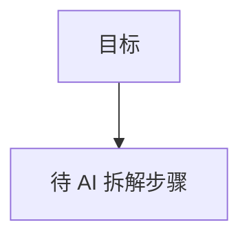

# Goal 面板 — Todo 的升级版 · UI 对齐契约与持久化设计

> 状态：v1（2026-07-16）· 面向 `Goal` 面板的 UI 对齐约定与本地持久化格式
> 代码落点：`Core/Goals/`（模型 + Store）、`GoalsViewModel.swift`、`GoalsView.swift`、`MermaidView.swift`
> 待办格式与共享部分见 [todo.md](todo.md)；文档绑定 chat / Mermaid 渲染见 [product-architecture-roadmap.md](product-architecture-roadmap.md) §3.10 / 第 9 节

## 0. 定位：Goal = Todo 的升级版

- **同一套组织方式**：Goal 复用 Todo 的**两级结构**——固定「领域」(工作/生活) → 用户可编辑「主题」→ 条目。差别只在**条目是什么**：
  - Todo 条目 = 一个**可勾选的待办**（完成即归档）。
  - Goal 条目 = 一份**目标文档**（正文 + 结尾 ```mermaid 图）；「完成」是对 AI 说、由 AI 重写图，不走勾选/归档。
- **结论**：Goal 页面的**外壳/交互骨架必须与 Todo 一致**（见 §1 契约），只有「条目语义」这一层不同（见 §2）。任何一边调整外壳，另一边**同步跟改**。

## 1. UI 对齐契约（必须与 Todo 一致，改动需两边同步）

以 Todo（`DoView`）为基准，Goal（`GoalsView`）在以下方面**逐项对齐**：

| 区域 | 契约（与 Todo 完全一致） |
| --- | --- |
| 顶部领域切换 | 原生 `Picker(.segmented)` 绑定 `selectedTab`，`ForEach(DoTabKind.allCases)`；`padding` 水平 16 / 上 16 / 下 10 |
| 主题胶囊行 | 水平 `ScrollView` 排 `Capsule` 胶囊；选中 = `theme.accent`+`onAccent`+`.semibold`，未选 = `theme.surface`+`textPrimary`；右侧「管理主题」按钮 `slider.horizontal.3` → `.popover` |
| 主题管理 popover | 宽 300、List 高 220；行内改名（TextField + onSubmit）+ 拖排（`.onMove`）+ 删除（`trash`）；底部「新主题…」TextField onSubmit 新增；**删除含条目的主题需 `confirmationDialog` 二次确认** |
| 详情列表容器 | `ScrollView { LazyVStack(spacing: 6) { …rows; addRow }.padding(16) }` |
| 列表行外观 | `padding(.vertical, 8).padding(.horizontal, 12)` + `theme.surface.opacity(0.5)` 圆角 8 背景 + `theme.divider` 描边；`contextMenu`（打开/删除） |
| 底部新增行 | `addRow` = `plus.circle`（`textSecondary`），列表最末一行；**唯一的新增入口**（不放顶部「+」按钮栏） |
| 行内删除 | 行右侧 `xmark`（`textSecondary.opacity(0.6)`，size 11 medium） |
| 空主题态 | `currentTopic == nil` 时居中提示 + 「管理主题」按钮 |
| 选中态 | 每领域各记一个当前主题（master-detail，一次只显一个主题的详情） |

> 反面清单（**不要**在 Goal 引入 Todo 没有的外壳）：顶部独立「+」按钮栏、行左侧无意义图标以外的额外控件、与 Todo 不同的间距/圆角/配色。

## 2. 有意的差异（Goal 特有，不需对齐）

| 维度 | Todo | Goal | 原因 |
| --- | --- | --- | --- |
| 行左图标 | 复选圆圈（点=完成→归档） | `scope` 图标（无动作，仅标识） | 目标无「勾选完成」概念 |
| 行右主操作 | 删除 | 删除 | 一致 |
| 胶囊角标 | `openCount`（未完成数） | `goalCount`（目标数） | 语义对应 |
| 双击 | 打开通用 Markdown 编辑器改标题/正文 | 打开**只读 Mermaid 详情**（右上 AI 按钮进文档绑定 chat 改文档） | 目标内容由 AI 经 chat 改，人不直接编辑 |
| 新增 | 编辑器空白 → 保存建条目 | 新建目标文档（模板）→ 直接进详情 | 目标是文档不是一行文字 |
| 完成/归档 | 完成即移入月度归档文件 | **不做**（P2 再议） | 目标进度靠 AI 重写图表达 |

## 3. 存储位置与文件

```
~/Documents/houmao/goals/
  工作/
    _topics.txt                 # 该领域主题顺序清单（manifest）
    目标/
      goal-20260716-101500.md   # 一目标一文件（正文 + 结尾 ```mermaid 图）
    学到老/
      goal-20260716-101822.md
  生活/
    _topics.txt
    …
```

- **领域 = 一级子目录**（中文显示名，复用 `DoTabKind.title`：工作/生活）。
- **主题 = 二级子目录**（用户可增删/改名/拖排；文件夹名 = 主题名）。
- **目标 = 主题目录下的 `<stem>.md`**，`stem = goal-yyyyMMdd-HHmmss`（时间戳保证唯一，标题可重复、可被 AI 改）。
- **`_topics.txt` = 主题顺序 manifest**（每领域一个），保证顺序稳定、**空主题也能保活**（主题文件夹按需在写入第一个目标时创建）。
- 目录不存在时按需创建。
- **旧版迁移**：早期扁平布局把目标放在 `goals/*.md`（无领域/主题）。首次启动 `migrateFlatGoals(into: .work, topic: "目标")` 把这些文件搬到 `工作/目标/` 下。
- **默认播种**：领域无任何主题时，播种单个默认主题 `目标` 并写入 manifest。

## 4. 文件格式

### 4.1 主题 manifest（`工作/_topics.txt`）

```markdown
# 工作
- 目标
- 学到老
```

| 元素 | 语法 | 含义 |
| --- | --- | --- |
| 领域标题 | `# <显示名>` | 仅展示，解析忽略 |
| 主题项 | `- <主题名>` | 顺序 = 展示顺序；解析去重 |

- 解析：仅取 `-` 行的标题（顺序、去重）；其余行忽略。
- 加载时：manifest 顺序优先，磁盘上存在但不在 manifest 的主题文件夹按名称追加在后（容错）。

### 4.2 目标文档（`工作/目标/goal-*.md`）

```markdown
# 学会游泳

用一句话描述目标；点右上角 AI 让它按方法论拆解步骤。



```

- **标题** = 首个 `# ` 标题，否则首个非空非 `#` 行（`GoalDoc.parseTitle`）。
- **图** = 首个 ```mermaid 变长围栏块内的代码（`GoalDoc.parseMermaid`，围栏长度 CommonMark 兼容）。
- 原始 Markdown 是唯一事实来源；由 AI 经文档绑定 chat 写回。

## 5. 运行时模型（不落盘的部分）

- `GoalDoc { id: String(=文件 stem), markdown }`：`title`/`mermaid` 为对 markdown 的解析视图。
- `GoalTopic { id: UUID, title, goals }`：`goalCount = goals.count`；`id` 仅会话内识别，**不落盘**（磁盘身份 = 文件夹名 `title`）。
- `GoalTab { kind: DoTabKind, topics }`：复用 `DoTabKind`（工作/生活）。
- `GoalsViewModel`（`@MainActor @Observable`，结构镜像 `DoViewModel`）：`tabs`/`selectedTab`/`selectedTopicID[kind:UUID]`；`reload()` 按主题 title 保持选中。

## 6. 解析 / 序列化与操作约定

- 主题增/改名/删/拖排 → 改写该领域 `_topics.txt`（`saveManifest`）；改名同时 `move` 主题文件夹；删除 `removeItem` 文件夹（含目标需二次确认）。
- 目标新建/删除/保存 → 直接写/删 `<主题>/<stem>.md`（`saveGoal`/`deleteGoal`），并同步内存树。
- 目标内容编辑 = **文档绑定 chat**：详情右上 AI 按钮 → `startDocumentChat` → AI 产出 ````markdown 全文 → 「保存到原文档」`saveDocumentFromChat` 写回该 `.md`。
- ⚠️ 手动改主题文件夹名/目标文件名可能与内存不同步；以 App 内操作为准。

## 7. 未来扩展位（暂不做，P2/P3）

- 完成态约定与交互细化（目标节点/步骤「完成」的图样式）。
- Drive 镜像（新增「目标」子目录映射，现只本地；对齐 google-drive.md 的镜像规则）。
- 编辑器 / 聊天内联渲染 mermaid（现仅目标详情用 WebView）。
- 目标归档浏览。
