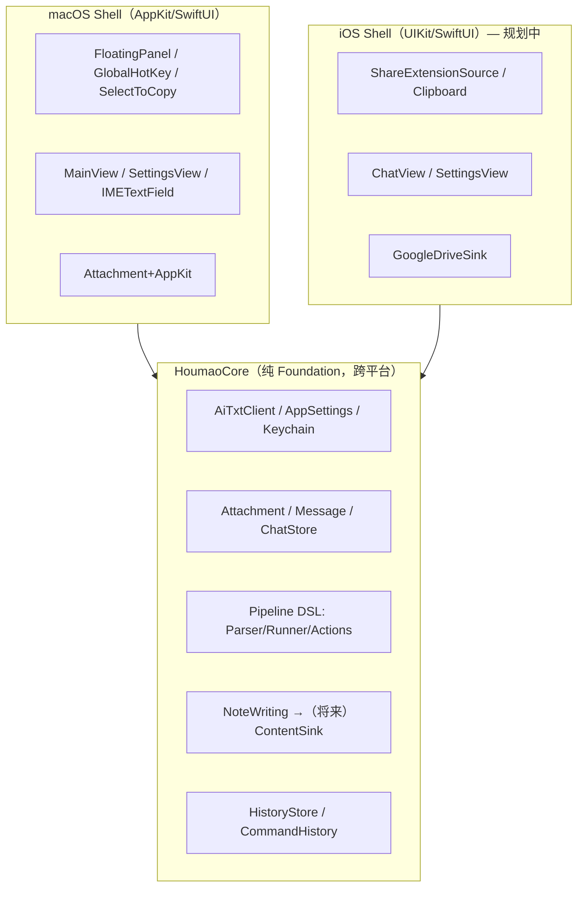
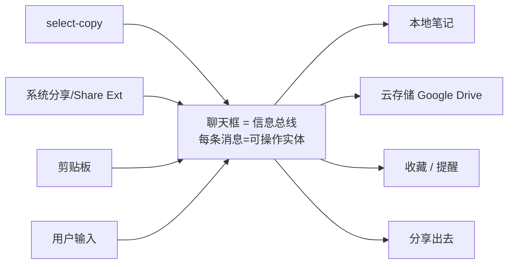
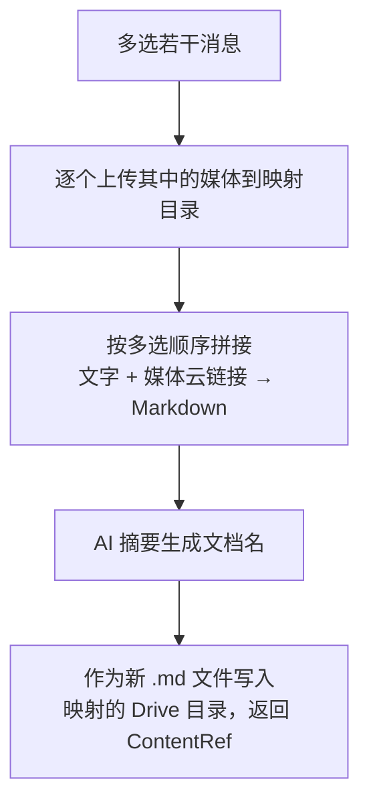

# 猴毛（Houmao）产品架构与开发路线图

> 本文件是项目的「活文档」：梳理用户使用习惯、整体架构设计与功能开发方案，并以开发事项清单的形式跟踪进度。**后续每完成一刀就回来更新对应状态与说明。**
>
> 最近更新：2026-06-30（极简框一次性问答 + 第3次自动升级为独立可缩放/全屏标准聊天窗口）｜ 维护方式：每次提交涉及架构/功能变更时同步本文件。

---

## 0. 文档导航

1. [产品定位与用户使用习惯分析](#1-产品定位与用户使用习惯分析)
2. [整体架构设计](#2-整体架构设计)
3. [功能模块与开发方案](#3-功能模块与开发方案)
4. [开发路线图与事项跟踪](#4-开发路线图与事项跟踪)
5. [关键决策记录（ADR）](#5-关键决策记录adr)
6. [待澄清事项与外部前置](#6-待澄清事项与外部前置)

---

## 1. 产品定位与用户使用习惯分析

### 1.1 一句话定位

猴毛是一个**碎片任务助手**：在任意场景下，把「随手抓到的一段信息」快速喂给 AI 做处理（翻译 / 摘要 / 问答），并能把结果沉淀（存笔记 / 收藏到云）。聊天框是所有信息的**总线**，一端接 OS 工具链，一端接云存储。

### 1.2 平台使用习惯差异（决定形态）

| 维度 | macOS | iOS |
|---|---|---|
| 第一习惯 | **键盘优先**——尽量纯键盘完成所有操作 | **触屏 + 系统分享**为主 |
| 第二习惯 | 鼠标其次 | 长按 / 多选手势 |
| 主入口 | 双击 Option 唤起极简输入框（overlay） | Share Extension（分享菜单）+ 剪贴板 |
| 划词 | 全局 select-copy（划词即抓取）已实现 | 无全局监听，仅 app 内系统划词；用分享/剪贴板替代 |
| 形态 | **保持极简输入框默认**，`/chat` 命令切聊天模式 | 直接以聊天列表为主界面 |

### 1.3 核心交互原则

- **macOS 极简优先**：默认就是一个输入框，不打断心流；高级能力（聊天、管道、设置）都通过键盘命令/快捷键触达，不堆 UI。
- **引用而非拷贝**：本地文件、云文件一律以「链接 + 缩略图」呈现，绝不复制副本，避免数据冗余。
- **信息总线**：聊天框是 sink，多种来源（输入 / 划词 / 分享 / 剪贴板）注入，多种去向（笔记 / 云 / 提醒 / 分享出去）汇聚。

### 1.4 现有交互速查（macOS，已实现）

| 操作 | 行为 |
|---|---|
| 双击 Option | 显示 / 收起主输入框 |
| `⌘L` | 清空当前对话 |
| `⌘B` / 输入 `b` | 历史记录面板 |
| 输入 `h` | 帮助面板 |
| `⌘W` | 关闭当前面板 |
| `⌘,` | 设置面板 |
| `@model 问题` | 指定模型提问 |
| `文本 \| $action \| $action` | 管道处理（见 3.2） |

---

## 2. 整体架构设计

### 2.1 分层原则：Core / Shell

核心策略是**一套平台无关 Core + 各平台 Shell**。Core 严禁出现任何 AppKit/UIKit 符号，保证可在 macOS 与 iOS 间直接复用。



### 2.2 当前代码边界（已落地）

**`mac/houmao/houmao/Core/`（纯 Foundation，iOS 可直接复用）**

| 文件 | 职责 |
|---|---|
| [AiTxtClient.swift](../mac/houmao/houmao/Core/AiTxtClient.swift) | OpenAI 兼容 LLM 客户端（流式/非流式） |
| [AppSettings.swift](../mac/houmao/houmao/Core/AppSettings.swift) | Provider 列表、模型解析；apiKey 走 Keychain |
| [KeychainStore.swift](../mac/houmao/houmao/Core/KeychainStore.swift) | 跨平台密钥存储（Security 框架） |
| [Attachment.swift](../mac/houmao/houmao/Core/Attachment.swift) | 附件模型，图片以 `Data`(JPEG) 存储 |
| [CommandHistory.swift](../mac/houmao/houmao/Core/CommandHistory.swift) | 输入框命令历史（上下键） |
| [HistoryStore.swift](../mac/houmao/houmao/Core/HistoryStore.swift) | 使用记录持久化（JSON） |
| [HistoryViewModel.swift](../mac/houmao/houmao/Core/HistoryViewModel.swift) | 历史分页加载 |
| [Core/Pipeline/](../mac/houmao/houmao/Core/Pipeline/) | 管道 DSL（见 3.2） |
| [Core/Chat/](../mac/houmao/houmao/Core/Chat/) | 聊天模型 Message / ChatStore / Conversation（见 3.3） |

**`mac/houmao/houmao/`（macOS Shell）**

| 文件 | 职责 | iOS 对应 |
|---|---|---|
| [houmaoApp.swift](../mac/houmao/houmao/houmaoApp.swift) | FloatingPanel 覆盖层、生命周期 | 重写（无 NSPanel） |
| [GlobalHotKeyManager.swift](../mac/houmao/houmao/GlobalHotKeyManager.swift) | 双击 Option 全局热键 | 无（iOS 不支持） |
| [SelectToCopyManager.swift](../mac/houmao/houmao/SelectToCopyManager.swift) | 全局划词抓取 | Share Extension 替代 |
| [UsageTracker.swift](../mac/houmao/houmao/UsageTracker.swift) | 前台应用/输入采集 | 无 |
| [IMETextField.swift](../mac/houmao/houmao/IMETextField.swift) | 输入法友好的输入框 | UIKit 重写 |
| [MainView.swift](../mac/houmao/houmao/MainView.swift) | 主界面 | iOS ChatView |
| [SettingsView.swift](../mac/houmao/houmao/SettingsView.swift) | 设置 | iOS 设置 |
| [MainViewModel.swift](../mac/houmao/houmao/MainViewModel.swift) | 业务编排（管道集成在此） | 复用大部分逻辑 |
| [Attachment+AppKit.swift](../mac/houmao/houmao/Attachment+AppKit.swift) | NSImage ↔ Data 桥接 | Attachment+UIKit |

### 2.3 关键抽象协议（已有 + 规划）

| 协议 | 状态 | 说明 |
|---|---|---|
| `PipelineAction` | ✅ 已有 | 一个 `$action` 步骤；`ActionRegistry` 注册 |
| `NoteWriting` | ✅ 已有 | 笔记落盘；`FileNoteWriter` 实现 |
| `ContentSink` | ⬜ 规划 | 泛化 `NoteWriting`：本地笔记 / 云存储 / 收藏统一为 sink |
| `MessageSource` | ⬜ 规划 | 输入源：划词 / 分享 / 剪贴板 |
| `CloudStorageProvider` | ⬜ 规划 | 云存储抽象；`GoogleDriveSink` 第一个实现 |

### 2.4 信息总线模型（目标形态）



---

## 3. 功能模块与开发方案

### 3.1 LLM 接入（✅ 已完成）

- OpenAI 兼容端点，支持多 Provider、`@model` 别名路由、流式输出。
- API Key 存 Keychain（非明文 UserDefaults），含旧数据自动迁移。

### 3.2 管道 DSL（✅ 已完成）

**语法**：`literal | $action | $action`，分隔符半角 `|`，动作英文名以 `$` 引用。

**解析顺序**：先剥 `@model`，再解析管道（含 `$action` 才算管道）；第一段字面文本作为初始输入，纯 `$action` 开头时回退到剪贴板。

**内置动作**：

| 动作 | 行为 |
|---|---|
| `$translate` | 中英互译 |
| `$summarize` | 原语言摘要 |
| `$save` | 追加到 `~/Documents/houmao/notes/yyyy-MM-dd.md` |

**示例**：

```text
你好世界 | $translate | $save     字面文本 → 翻译 → 存笔记
$translate                        翻译剪贴板内容
@deepseek $summarize | $save      指定模型摘要后保存
```

**扩展位**：`$` 是「函数/变量」语义占位，未来支持用户自定义流程变量（如 `$mypipe = $translate | $save`），只需扩展 `ActionRegistry` 与解析器。

### 3.3 聊天模型（🚧 进行中 — 多轮与标准办公窗口已通）

- ✅ [Message.swift](../mac/houmao/houmao/Core/Chat/Message.swift)：`Identifiable/Equatable/Sendable/Codable`，`Role`=user/assistant/system，`isStreaming`。
- ✅ [ChatStore.swift](../mac/houmao/houmao/Core/Chat/ChatStore.swift)：`@MainActor @Observable` 多会话容器，流式 token 累积、`historyMessages` 过滤；[Conversation.swift](../mac/houmao/houmao/Core/Chat/Conversation.swift) + [ConversationStore.swift](../mac/houmao/houmao/Core/Chat/ConversationStore.swift) 负责 JSON 持久化。
- ✅ macOS `/chat` 模式切换 + 多轮上下文（`MainViewModel.toggleChatMode/executeChatTurn`，历史回传 `AiTxtClient`，流式写入 `ChatStore`）。
- ✅ 标准聊天窗口 UI（头像气泡 / 多行输入 `ChatInputField` / 发送键 / `TypingIndicator` / 空状态），抽为独立 [ChatView.swift](../mac/houmao/houmao/ChatView.swift)，设计规范见 [chat-ui-design.md](chat-ui-design.md)。
- ✅ 极简框一次性问答 → 第 3 次提交自动升级到标准办公窗口（`oneShotTurns` 计数 + `autoUpgradeToChat` 迁移前几轮上下文）。
- ✅ 聊天窗口为独立标准 `NSWindow`（可缩放 / 原生全屏，不继承极简框悬浮属性），见 [houmaoApp.swift](../mac/houmao/houmao/houmaoApp.swift) `chatWindow`。

**交互与生命周期决策（Q3 / Q4）**：

- **极简框 = 一次性问答；连续 3 次自动升级**：极简输入框定位单轮快问快答，第 3 次提交自动升级为独立的标准办公型聊天窗口（可缩放 / 原生全屏），并把前几轮 Q/A 迁移为上下文；也可随时输入 `/chat` 手动升级。
- **退出**：聊天窗口标题栏关闭、header `✕`、`⌘W` 或再输 `/chat` 均退出（`exitChatMode`）；双击 Option 唤起极简框时自动收起聊天窗口，两个界面不重叠。
- **默认持久化、可跨会话**：`ChatStore` 通过 `ConversationStore` 以 JSON 落盘（`~/Documents/houmao/conversations.json`），重启恢复多会话，左侧列表可切换/删除。
- **仅「收藏」等显式动作触发落盘**：未收藏的聊天一律不写文件；一旦收藏，把该次聊天导出为**独立 `.md` 文件**（见 3.5），不做增量数据库。

### 3.4 内容引用与云存储（⬜ 规划）

核心模型是**目录映射 + 只增不改**（Q1 / Q2）：不创建原生 Google Docs，而是把「本地某目录」与「Google Drive 某目录」建立对应关系，收藏产物以 Markdown 文件**新增**进去（不修改、不删除已有文件）。

- `ContentRef`：轻量引用（本地/云**文件名 + 链接 + 缩略图**），不上数据库，延续 `HistoryStore` 的 JSON 思路。
- `ContentSink`：泛化 `NoteWriting`，`save([Message]) -> ContentRef`，返回引用不留副本；本地 `.md` 落盘与云目录上传是它的两个实现。
- `DirectoryMapping`：记录「本地目录 ↔ Drive 目录」对应关系；同步语义限定为**只新增文件**，规避双向冲突与删除风险。
- `GoogleDriveSink`：OAuth 2.0 + Drive REST API（`files.create`，指定 `parents` 为映射目录的 folderId），第一个云实现，落地格式统一为 `.md`。

### 3.5 收藏到云文档（⬜ 规划 — 云 MVP）

**目标工作流**（用户多选消息后点「收藏」才触发；未收藏不落盘）：



- 媒体先上传拿到云链接；文字与链接按选中顺序组装成 **Markdown** 文档；用 LLM 摘要出文档名。
- 写入语义为**新增**：每次收藏生成一个新 `.md`，不覆盖既有文件。
- 复用 `$summarize` 的能力生成文档名；复用 `ContentSink` + `DirectoryMapping` 落云。

### 3.6 输入源（⬜ 规划）

- macOS：`SelectCopySource`（已有 SelectToCopyManager）/ Services / 剪贴板。
- iOS：`ShareExtensionSource`（主入口）/ 剪贴板 / App Intents。

---

## 4. 开发路线图与事项跟踪

> 状态：✅ 完成 ｜ 🚧 进行中 ｜ ⬜ 待办。每刀都要求 `make build` + `make test` 零回归。

### Phase 0 — 抽取 Core 地基 ✅

| # | 事项 | 状态 |
|---|---|---|
| 0.1 | `Attachment` 去 NSImage 化（Data 桥接 + `Attachment+AppKit`） | ✅ |
| 0.2 | apiKey 迁 Keychain（含旧明文自动迁移、删除防孤儿） | ✅ |
| 0.3 | Core 目录归拢（7 个纯 Foundation 文件入 `Core/`） | ✅ |

### Phase 1 — 管道 DSL ✅

| # | 事项 | 状态 |
|---|---|---|
| 1.1 | 解析器 + 模型 + Runner + Registry | ✅ |
| 1.2 | 内置动作 `$translate` / `$summarize` / `$save` | ✅ |
| 1.3 | `NoteWriting` + `FileNoteWriter`（Markdown 追加） | ✅ |
| 1.4 | `MainViewModel` 集成 + 单元测试（9 用例） | ✅ |

### Phase 2 — 聊天形态 🚧

| # | 事项 | 状态 |
|---|---|---|
| 2.1 | Core `Message` + `ChatStore`/`Conversation`/`ConversationStore` + 单测 | ✅ |
| 2.2 | macOS `/chat` 模式切换（退出复用面板显隐：双击 Option / `⌘W`；再输 `/chat` 切回；单测 5 用例） | ✅ |
| 2.3 | 聊天气泡 UI 精修（标准聊天窗口：头像气泡 / 多行输入 / 发送键 / typing / 空状态，见 [chat-ui-design.md](chat-ui-design.md)） | ✅ |
| 2.4 | 多轮上下文接入 `AiTxtClient`（history 不再为空；JSON 持久化、可跨会话） | ✅ |

### Phase 3 — 内容引用与右键操作 ⬜

| # | 事项 | 状态 |
|---|---|---|
| 3.1 | `ContentRef` 引用模型（本地/云文件名 + 缩略） | ⬜ |
| 3.2 | `ContentSink` 协议（泛化 `NoteWriting`；本地 `.md` 实现） | ⬜ |
| 3.3 | 消息多选 + 右键菜单（收藏触发落盘/分享/提醒占位） | ⬜ |

### Phase 4 — 云存储与收藏 ⬜

| # | 事项 | 状态 |
|---|---|---|
| 4.1 | `CloudStorageProvider` 协议 + OAuth 基建 + `DirectoryMapping`（本地↔Drive 目录、只增不改） | ⬜ |
| 4.2 | `GoogleDriveSink`（上传媒体、`files.create` 新增 `.md` 到映射目录） | ⬜ |
| 4.3 | 「收藏到云文档」工作流（Markdown 拼接 + AI 摘要文件名） | ⬜ |

### Phase 5 — iOS Shell ⬜

| # | 事项 | 状态 |
|---|---|---|
| 5.1 | iOS App target（复用 Core） | ⬜ |
| 5.2 | 聊天主界面（ChatView） | ⬜ |
| 5.3 | Share Extension 输入源 | ⬜ |
| 5.4 | App Intents / Shortcuts | ⬜ |

### 跨阶段：测试与质量

- 测试框架：Swift Testing（`@Test` / `#expect`）。
- 已有单测套件：`CommandHistoryTests`、`AiTxtClientTests`、`HistoryStoreTests`、`ModelResolutionTests`、`PipelineParserTests`、`ChatStoreTests`、`ChatModeTests`。
- 约束：每刀完成后 `make build` 与 `make test` 必须全绿；新增/删除 `.swift` 文件后先 `cd mac/houmao && xcodegen generate`。

---

## 5. 关键决策记录（ADR）

### ADR-1：不引入 LangChain

- **决策**：不引入 LangChain（或同类重型编排框架）。
- **理由**：(1) Swift 无可用版本，引入等于背 Python 运行时，破坏单二进制与跨平台、iOS 不可行；(2) 其核心能力要么已自研（链式=Pipeline、prompt 注入=每个 action 自带、provider 抽象=AppSettings），要么不需要（agent/RAG）；(3) 行业趋势回归原生 tool calling + 轻量编排。
- **替代**：prompt 解耦用轻量 `PromptTemplate`（~20 行）；自主选工具用 OpenAI 原生 function calling，复用现有 `ActionRegistry` 作为 tool registry。

### ADR-2：iOS 用 Share Extension 替代全局划词

- **决策**：iOS 不追求「全局划词」，以 Share Extension + 剪贴板为输入源。
- **理由**：iOS 沙盒禁止跨 app 监听选区；macOS 那套 `AXIsProcessTrusted` + 全局 `NSEvent` 在 iOS 无对应 API。Share Extension 是官方等价物，体验更可控。

### ADR-3：引用语义（不复制）

- **决策**：本地/云内容一律以 `ContentRef`（链接 + 缩略图）呈现，不存副本。
- **理由**：避免数据冗余，统一本地与云的呈现；延续 `Attachment` 的 `Data` 桥接演进为「指针」。

### ADR-4：Core / Shell 分层

- **决策**：纯 Foundation 的 `HoumaoCore`（逻辑边界已在 `Core/` 目录成型），各平台 Shell 注入平台能力。
- **理由**：最大化 macOS/iOS 代码复用；当前业务内核已几乎纯 Foundation，抽取成本低。

### ADR-5：云存储采用「目录映射 + 只增不改」，统一 Markdown

- **决策**：不创建原生 Google Docs；建立「本地某目录 ↔ Google Drive 某目录」映射，收藏产物以 **Markdown 文件新增**写入（不改、不删既有文件）。
- **理由**：(1) 原生 Google Docs 重且强绑定 Google，跨云/跨平台差；(2) Markdown 近似纯文本、可读可迁移、对 LLM 生成最友好；(3) 限定「只新增」可规避双向同步的冲突与删除风险，实现与心智都最简单。
- **影响**：`CloudStorageProvider` 只需 `createFile`（不需要 update/delete）；`DirectoryMapping` 维护本地与 Drive 的 folderId 对应。

### ADR-6（已修订）：聊天多会话 JSON 持久化

- **决策（已修订）**：`ChatStore` 通过 `ConversationStore` 将多会话以 JSON 持久化到 `~/Documents/houmao/conversations.json`，重启恢复、可跨会话，左侧列表支持切换/删除；原「纯内存态、仅收藏落盘」方案已废弃。
- **理由**：(1) 碎片任务助手定位下，绝大多数聊天是一次性的，默认持久化只会堆垃圾；(2) 「单次聊天 = 一个文件」比增量数据库更直观、易迁移，与目录映射的「只新增」语义天然契合；(3) 把写盘收敛到收藏动作，I/O 与隐私边界清晰。
- **影响**：聊天关闭即丢弃；退出方式复用面板显隐（双击 Option / `⌘W`），无需独立持久化 UI。

---

## 6. 关键决策（已拍板 Q1–Q4）

> 以下问题已确认，落地细节并入对应章节与 ADR（ADR-5 / ADR-6）。

| # | 事项 | 决策 | 影响阶段 |
|---|---|---|---|
| Q1 | Google Drive 集成形态 | 建立「本地目录 ↔ Drive 目录」映射，**只新增文件**（不改不删）；不创建原生 Google Docs | Phase 4 |
| Q2 | 云端文档格式 | **Markdown（.md）**：近似纯文本、跨平台/对 LLM 最友好 | Phase 4 |
| Q3 | `/chat` 退出方式 | 与极简输入框一致：双击 Option 收起、`⌘W` 关闭；再输 `/chat` 在两种模式间切换 | Phase 2.2 |
| Q4 | 聊天持久化 | **已落地：多会话 JSON 持久化、可跨会话**（`ConversationStore`） | ✅ Phase 2 |

**仍需的外部前置**：Q1 需在 Google Cloud Console 注册 OAuth 2.0 Client（macOS/iOS 类型）拿到 Client ID（Phase 4 启动前准备）。

---

> 维护提示：完成任一事项后，更新对应表格状态（⬜→🚧→✅）、补充实现说明与文件链接，并刷新顶部「最近更新」日期。
