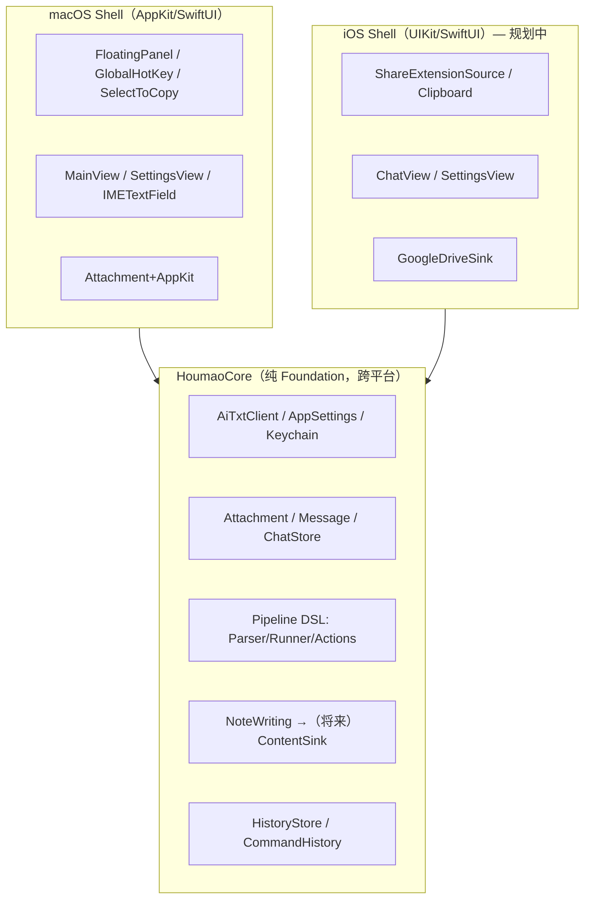
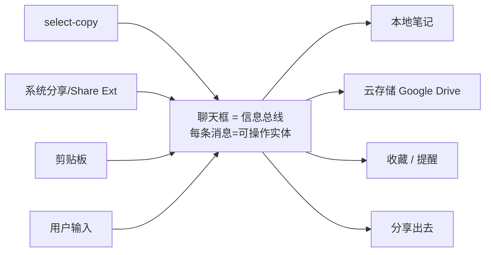
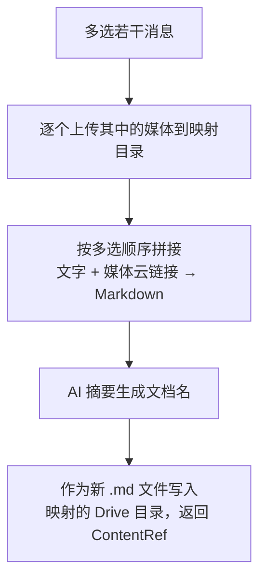
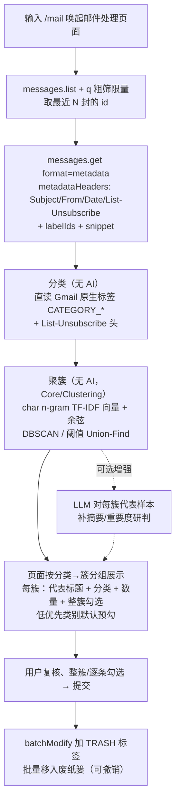

# 猴毛（Houmao）产品架构与开发路线图

> 本文件是项目的「活文档」：梳理用户使用习惯、整体架构设计与功能开发方案，并以开发事项清单的形式跟踪进度。**后续每完成一刀就回来更新对应状态与说明。**
>
> 最近更新：2026-07-16（**通用 Markdown 编辑器（§3.10）**：houmao 唯一、通用、独立的编辑器窗口 `MarkdownEditorView` + `AppDelegate.presentMarkdownEditor(title:text:onSave:)`（单例窗口，`markdownEditorModel` 承载当前文档/保存去处）；聊天输入栏加 `square.and.pencil` 按钮唤起空白编辑器（保存→**按 md 标题命名**写 `~/Documents/houmao/notes/<标题>.md`）；**任何内容编辑优先复用它**。Do 面板 `+`/双击已有行改为唤起该编辑器（不再内联/无草稿），`DoViewModel.addItem(fullText:)`/`updateItem(_:fullText:)` 提交，标题空即删；保存图标或关闭窗口都=保存。｜ 也含 §3.8 Do 条目 body 与 §3.9 GitHub 面板。）
> 2026-07-16（**Do 面板条目升级**：`DoItem` 加 `body`（可选 md 正文），行只显示标题、**双击整行**打开自适应高度的 md 全文编辑（首行=标题/其余=正文，失焦提交/Esc 取消/清空标题即删）；去掉「添加待办」输入框，新增改由**列表底部 `+` 按钮**新建空行并进入编辑——编辑入口仅「+新建 / 双击已有」两个。正文以**活动文件缩进两格续行**持久化；归档单行格式未动（完成暂丢正文，见 §3.8 / [todo.md](todo.md) §7）。详见 §3.8。）
> 2026-07-15（新增 **Google Drive 同步（Phase 4.1/4.2 ✅）**：todo（Do 面板 `work.md`/`life.md`）每次本地保存后**防抖单向镜像**到 Drive `houmao/do` 文件夹；`Core/Cloud/GoogleDriveClient`（v3 REST）+ `DriveSyncService` + 抽出的 `GoogleOAuth` 共享连接 helper（Mail 复用）；Drive 用 `drive.file` 最小 scope，与 Gmail **共用一次 OAuth 同意/同一 refresh token**（`Scope.appDefault`）；设置页加「Google Drive 同步」连接入口。聊天气泡右键收藏留后续 4.3。｜ 也含 GitHub PR/Issue 面板（§3.9 / Phase 8）与 Do 待办面板（§3.8 / Phase 7）。维护方式：每次提交涉及架构/功能变更时同步本文件。

---

## 0. 文档导航

1. [产品定位与用户使用习惯分析](#1-产品定位与用户使用习惯分析)
2. [整体架构设计](#2-整体架构设计)
3. [功能模块与开发方案](#3-功能模块与开发方案)
4. [开发路线图与事项跟踪](#4-开发路线图与事项跟踪)
5. [关键决策记录（ADR）](#5-关键决策记录adr)
6. [待澄清事项与外部前置](#6-待澄清事项与外部前置)

---

## 1. 产品定位与用户使用习惯分析

### 1.1 一句话定位

猴毛是一个**碎片任务助手**：在任意场景下，把「随手抓到的一段信息」快速喂给 AI 做处理（翻译 / 摘要 / 问答），并能把结果沉淀（存笔记 / 收藏到云）。聊天框是所有信息的**总线**，一端接 OS 工具链，一端接云存储。

### 1.2 平台使用习惯差异（决定形态）

| 维度 | macOS | iOS |
|---|---|---|
| 第一习惯 | **键盘优先**——尽量纯键盘完成所有操作 | **触屏 + 系统分享**为主 |
| 第二习惯 | 鼠标其次 | 长按 / 多选手势 |
| 主入口 | 双击 Option 唤起极简输入框（overlay） | Share Extension（分享菜单）+ 剪贴板 |
| 划词 | 全局 select-copy（划词即抓取）已实现 | 无全局监听，仅 app 内系统划词；用分享/剪贴板替代 |
| 形态 | **保持极简输入框默认**，`/chat` 命令切聊天模式 | 直接以聊天列表为主界面 |

### 1.3 核心交互原则

- **macOS 极简优先**：默认就是一个输入框，不打断心流；高级能力（聊天、管道、设置）都通过键盘命令/快捷键触达，不堆 UI。
- **引用而非拷贝**：本地文件、云文件一律以「链接 + 缩略图」呈现，绝不复制副本，避免数据冗余。
- **信息总线**：聊天框是 sink，多种来源（输入 / 划词 / 分享 / 剪贴板）注入，多种去向（笔记 / 云 / 提醒 / 分享出去）汇聚。

### 1.4 现有交互速查（macOS，已实现）

| 操作 | 行为 |
|---|---|
| 双击 Option | 显示 / 收起主输入框 |
| `⌘L` | 清空当前对话 |
| `⌘B` / 输入 `b` | 历史记录面板 |
| 输入 `h` | 帮助面板 |
| `⌘W` | 关闭当前面板 |
| `⌘,` | 设置面板 |
| `@model 问题` | 指定模型提问 |
| `文本 \| $action \| $action` | 管道处理（见 3.2） |
| `/chat` | 打开 / 切换标准聊天窗口（见 3.3） |
| `/mail` | 打开邮件处理页面：余弦聚簇 + Gmail 标签分类（无 AI）+ 勾选批量清理（见 3.7） |

> **命令一致性（单一事实来源）**：所有 `/工具` 命令（`/chat`、`/mail`、`/issue`、`/pr`…）的识别与分发集中在 `MainViewModel.handleToolCommand(_:)` 一个函数里。极简输入框（`submit()`）与标准聊天窗输入框（`sendChatTurn()`）**都先调用它**，因此两个输入面暴露的工具集永远一致——新增工具只在此处加一次即可两面生效。各面仅保留自身差异（极简框=一次性单轮、聊天窗=多轮；帮助的呈现：面板 vs 气泡）。回归由 `ChatModeTests` 的一致性用例守护。曾出现 `/mail` 只在极简框生效、聊天窗漏拦的 bug，即因两面各自路由命令所致。

---

## 2. 整体架构设计

### 2.1 分层原则：Core / Shell

核心策略是**一套平台无关 Core + 各平台 Shell**。Core 严禁出现任何 AppKit/UIKit 符号，保证可在 macOS 与 iOS 间直接复用。



### 2.2 当前代码边界（已落地）

**`mac/houmao/houmao/Core/`（纯 Foundation，iOS 可直接复用）**

| 文件 | 职责 |
|---|---|
| [AiTxtClient.swift](../mac/houmao/houmao/Core/AiTxtClient.swift) | OpenAI 兼容 LLM 客户端（流式/非流式） |
| [AppSettings.swift](../mac/houmao/houmao/Core/AppSettings.swift) | Provider 列表、模型解析；apiKey 走 Keychain |
| [KeychainStore.swift](../mac/houmao/houmao/Core/KeychainStore.swift) | 跨平台密钥存储（Security 框架） |
| [Attachment.swift](../mac/houmao/houmao/Core/Attachment.swift) | 附件模型，图片以 `Data`(JPEG) 存储 |
| [CommandHistory.swift](../mac/houmao/houmao/Core/CommandHistory.swift) | 输入框命令历史（上下键） |
| [HistoryStore.swift](../mac/houmao/houmao/Core/HistoryStore.swift) | 使用记录持久化（JSON） |
| [HistoryViewModel.swift](../mac/houmao/houmao/Core/HistoryViewModel.swift) | 历史分页加载 |
| [Core/Pipeline/](../mac/houmao/houmao/Core/Pipeline/) | 管道 DSL（见 3.2） |
| [Core/Chat/](../mac/houmao/houmao/Core/Chat/) | 聊天模型 Message / ChatStore / Conversation（见 3.3） |

**`mac/houmao/houmao/`（macOS Shell）**

| 文件 | 职责 | iOS 对应 |
|---|---|---|
| [houmaoApp.swift](../mac/houmao/houmao/houmaoApp.swift) | FloatingPanel 覆盖层、生命周期 | 重写（无 NSPanel） |
| [GlobalHotKeyManager.swift](../mac/houmao/houmao/GlobalHotKeyManager.swift) | 双击 Option 全局热键 | 无（iOS 不支持） |
| [SelectToCopyManager.swift](../mac/houmao/houmao/SelectToCopyManager.swift) | 全局划词抓取 | Share Extension 替代 |
| [UsageTracker.swift](../mac/houmao/houmao/UsageTracker.swift) | 前台应用/输入采集 | 无 |
| [IMETextField.swift](../mac/houmao/houmao/IMETextField.swift) | 输入法友好的输入框 | UIKit 重写 |
| [MainView.swift](../mac/houmao/houmao/MainView.swift) | 主界面 | iOS ChatView |
| [SettingsView.swift](../mac/houmao/houmao/SettingsView.swift) | 设置 | iOS 设置 |
| [MainViewModel.swift](../mac/houmao/houmao/MainViewModel.swift) | 业务编排（管道集成在此） | 复用大部分逻辑 |
| [Attachment+AppKit.swift](../mac/houmao/houmao/Attachment+AppKit.swift) | NSImage ↔ Data 桥接 | Attachment+UIKit |

### 2.3 关键抽象协议（已有 + 规划）

| 协议 | 状态 | 说明 |
|---|---|---|
| `PipelineAction` | ✅ 已有 | 一个 `$action` 步骤；`ActionRegistry` 注册 |
| `NoteWriting` | ✅ 已有 | 笔记落盘；`FileNoteWriter` 实现 |
| `ContentSink` | ⬜ 规划 | 泛化 `NoteWriting`：本地笔记 / 云存储 / 收藏统一为 sink |
| `MessageSource` | ⬜ 规划 | 输入源：划词 / 分享 / 剪贴板 |
| `CloudStorageProvider` | ⬜ 规划 | 云存储抽象；`GoogleDriveSink` 第一个实现 |
| `GoogleAuthProvider` | ⬜ 规划 | Google OAuth 2.0（Desktop app + PKCE + loopback）；Drive 与 Gmail 共用，token 存 Keychain |
| `MailProvider` | ⬜ 规划 | 邮件抽象（列表/元数据/移废纸篓/删除）；`GmailProvider` 第一个实现（见 3.7） |

### 2.4 信息总线模型（目标形态）



---

## 3. 功能模块与开发方案

### 3.1 LLM 接入（✅ 已完成）

- OpenAI 兼容端点，支持多 Provider、`@model` 别名路由、流式输出。
- API Key 存 Keychain（非明文 UserDefaults），含旧数据自动迁移。

### 3.2 管道 DSL（✅ 已完成）

**语法**：`literal | $action | $action`，分隔符半角 `|`，动作英文名以 `$` 引用。

**解析顺序**：先剥 `@model`，再解析管道（含 `$action` 才算管道）；第一段字面文本作为初始输入，纯 `$action` 开头时回退到剪贴板。

**内置动作**：

| 动作 | 行为 |
|---|---|
| `$translate` | 中英互译 |
| `$summarize` | 原语言摘要 |
| `$save` | 追加到 `~/Documents/houmao/notes/yyyy-MM-dd.md` |

**示例**：

```text
你好世界 | $translate | $save     字面文本 → 翻译 → 存笔记
$translate                        翻译剪贴板内容
@deepseek $summarize | $save      指定模型摘要后保存
```

**扩展位**：`$` 是「函数/变量」语义占位，未来支持用户自定义流程变量（如 `$mypipe = $translate | $save`），只需扩展 `ActionRegistry` 与解析器。

### 3.3 聊天模型（🚧 进行中 — 多轮与标准办公窗口已通）

- ✅ [Message.swift](../mac/houmao/houmao/Core/Chat/Message.swift)：`Identifiable/Equatable/Sendable/Codable`，`Role`=user/assistant/system，`isStreaming`。
- ✅ [ChatStore.swift](../mac/houmao/houmao/Core/Chat/ChatStore.swift)：`@MainActor @Observable` 多会话容器，流式 token 累积、`historyMessages` 过滤；[Conversation.swift](../mac/houmao/houmao/Core/Chat/Conversation.swift) + [ConversationStore.swift](../mac/houmao/houmao/Core/Chat/ConversationStore.swift) 负责 JSON 持久化。
- ✅ macOS `/chat` 打开独立聊天窗 + 多轮上下文（`MainViewModel.openChatWindow/sendChatTurn/executeChatTurn`，历史回传 `AiTxtClient`，流式写入 `ChatStore`；窗口可见即状态，无 `isChatMode` 标志）。
- ✅ 标准聊天窗口 UI（头像气泡 / 多行输入 `ChatInputField` / 发送键 / `TypingIndicator` / 空状态），抽为独立 [ChatView.swift](../mac/houmao/houmao/ChatView.swift)，设计规范见 [chat-ui-design.md](chat-ui-design.md)。
- ✅ 极简框一次性问答 → 第 3 次提交自动升级到标准办公窗口（`oneShotTurns` 计数 + `autoUpgradeToChat` 迁移前几轮上下文）。
- ✅ 聊天窗口为独立标准 `NSWindow`（可缩放 / 原生全屏，不继承极简框悬浮属性），见 [houmaoApp.swift](../mac/houmao/houmao/houmaoApp.swift) `chatWindow`。

**交互与生命周期决策（Q3 / Q4）**：

- **极简框 = 一次性问答；连续 3 次自动升级**：极简输入框定位单轮快问快答，第 3 次提交自动升级为独立的标准办公型聊天窗口（可缩放 / 原生全屏），并把前几轮 Q/A 迁移为上下文；也可随时输入 `/chat` 手动升级。
- **退出**：聊天窗口标题栏关闭、header `✕`、`⌘W` 或再输 `/chat` 均退出（`exitChatMode`）；双击 Option 唤起极简框时自动收起聊天窗口，两个界面不重叠。
- **默认持久化、可跨会话**：`ChatStore` 通过 `ConversationStore` 以 JSON 落盘（`~/Documents/houmao/conversations.json`），重启恢复多会话，左侧列表可切换/删除。
- **仅「收藏」等显式动作触发落盘**：未收藏的聊天一律不写文件；一旦收藏，把该次聊天导出为**独立 `.md` 文件**（见 3.5），不做增量数据库。

### 3.4 内容引用与云存储（⬜ 规划）

核心模型是**目录映射 + 只增不改**（Q1 / Q2）：不创建原生 Google Docs，而是把「本地某目录」与「Google Drive 某目录」建立对应关系，收藏产物以 Markdown 文件**新增**进去（不修改、不删除已有文件）。

- `ContentRef`：轻量引用（本地/云**文件名 + 链接 + 缩略图**），不上数据库，延续 `HistoryStore` 的 JSON 思路。
- `ContentSink`：泛化 `NoteWriting`，`save([Message]) -> ContentRef`，返回引用不留副本；本地 `.md` 落盘与云目录上传是它的两个实现。
- `DirectoryMapping`：记录「本地目录 ↔ Drive 目录」对应关系；同步语义限定为**只新增文件**，规避双向冲突与删除风险。
- `GoogleDriveSink`：OAuth 2.0 + Drive REST API（`files.create`，指定 `parents` 为映射目录的 folderId），第一个云实现，落地格式统一为 `.md`。

### 3.5 收藏到云文档（⬜ 规划 — 云 MVP）

**目标工作流**（用户多选消息后点「收藏」才触发；未收藏不落盘）：



- 媒体先上传拿到云链接；文字与链接按选中顺序组装成 **Markdown** 文档；用 LLM 摘要出文档名。
- 写入语义为**新增**：每次收藏生成一个新 `.md`，不覆盖既有文件。
- 复用 `$summarize` 的能力生成文档名；复用 `ContentSink` + `DirectoryMapping` 落云。

### 3.6 输入源（⬜ 规划）

- macOS：`SelectCopySource`（已有 SelectToCopyManager）/ Services / 剪贴板。
- iOS：`ShareExtensionSource`（主入口）/ 剪贴板 / App Intents。

### 3.7 邮件助手：余弦聚簇分类 + 勾选批量清理（⬜ 规划）

**目标**：输入 `/mail` 唤起独立的**邮件处理页面**（与 `/chat` 同构的独立 `NSWindow`）；用**余弦相似度（无 AI）把标题近似的成批模板邮件聚成簇**，分类直接用 **Gmail 原生分类标签**，按簇展示（每簇一行 + 数量）；用户整簇/逐条勾选要删的→提交→自动**批量移入废纸篓**（默认可恢复）。AI 总结/重要度研判为**可选增强**（第一版可全程无 AI）。首个且当前唯一目标邮箱为 **Gmail**。

**为什么走 Gmail API（REST）而非 IMAP**：见 ADR-8。核心是——REST 返回结构化 JSON（含 labelIds）便于直接做分类/聚类（也便于可选喂 LLM）、`batchModify`/`batchDelete` 原生支持一次上千封、纯 `URLSession` 契合 Core 纯 Foundation、且能复用 Phase 4 的 Google OAuth 基建。

**工作流**：



**分组策略：分类与聚合正交（均无 AI，见 ADR-9）**：

- **分类（用 Gmail 原生标签，零算法）**：余弦只能把「相似的聚成簇」，给不出语义类别名。直接读 Gmail 返回的 `labelIds`（`CATEGORY_PROMOTIONS/SOCIAL/UPDATES/FORUMS/PERSONAL`）+ `List-Unsubscribe` 头（有即营销/订阅）作为分类维度，免费、稳定、无 AI。
- **聚合（余弦相似度，Core/Clustering）**：在分类（或发件人域名）内，用**字符 n-gram（如 3-gram）TF-IDF 向量 + 余弦相似度**把模板化标题聚成簇。选 char n-gram 而非词级：对短标题/中英混杂/模板文本更鲁棒。聚类用 **DBSCAN（余弦距离）** 或**阈值 Union-Find**：不预设簇数，DBSCAN 能把散邮件归为噪声点（不强行归簇）。
- **规模**：粗筛限量 N 封后两两比较 O(n²) 完全可接受（千量级毫秒）；若将来 N 极大，再加 **LSH（SimHash/MinHash）** 预筛降到近线性。
- **AI 可选增强**：第一版全程无 AI；待接入 LLM 后，只对**每簇代表样本**补摘要与重要度研判（一簇共享一个判断），而非逐封。

**交互决策（与 `/chat` 一致）**：`/mail` 唤起独立可缩放 `NSWindow`（非极简框）；页面内邮件**按分类→簇分组**（同簇可整簇勾选/折叠），每簇一行（代表标题 + 分类标签 + 数量 + 整簇勾选框），展开可看簇内逐条；底部「提交清理 N 封」按钮；聚簇瞬时完成即渲染（接入 LLM 增强时，摘要/重要度按簇流式回填，不阻塞）。

**默认分类（来自 Gmail 原生标签，无 AI）**：促销 `CATEGORY_PROMOTIONS` / 社交 `CATEGORY_SOCIAL` / 更新通知 `CATEGORY_UPDATES` / 论坛 `CATEGORY_FORUMS` / 个人 `CATEGORY_PERSONAL`；另用 `List-Unsubscribe` 头辅判营销/订阅。低优先类别（促销/更新/论坛）页面默认预勾选，用户仍可整簇/逐条改。

**最佳实践清单（选型与性能确认）**：

- **聚类为主、AI 可选**：分类（Gmail 标签）+ 聚合（char n-gram TF-IDF + 余弦）均无 AI，第一版即可落地；若后续接入 LLM，**只对每簇代表样本判一次**（簇内共享）、无法聚簇的散邮件才分批打包喂 LLM（结构化输出 `summary/importance/suggestDelete`），而非每封一次往返；搭配服务端 `q` 粗筛限量避免全量扫描。
- **认证**：OAuth 2.0 **Desktop app** client + **PKCE + loopback（`http://127.0.0.1:<port>`）**；Google 已弃用 OOB（复制粘贴 code），loopback 是桌面应用官方推荐流程。
- **权限最小化**：scope 取 `https://www.googleapis.com/auth/gmail.modify`——可读 + 改标签/移废纸篓，但**无法永久删除**；恰好满足需求。永久删除需 `https://mail.google.com/` 全权限，默认不申请。
- **只取元数据**：`messages.get` 用 `format=metadata` + `metadataHeaders=From,Subject,Date,List-Unsubscribe`（配 snippet、labelIds），不下载正文，省配额省流量；聚簇取 Subject、分类取 labelIds/List-Unsubscribe。
- **批量清理**：`users.messages.batchModify` 加 `TRASH` 标签（一次 ≤1000 id）为默认动作；`users.messages.batchDelete`（永久）需二次确认且需全权限，非默认。
- **Token**：refresh token 存 `KeychainStore`（复用现有 Keychain 基建）。

**抽象**：新增 `MailProvider` 协议（`listMessages(query:)` / `fetchMetadata(ids:)` / `trashMessages(ids:)` / `deleteMessages(ids:)`），`GmailProvider` 首个实现，放 Core（纯 `URLSession`，跨平台）；**聚类算法独立于业务**——放 `Core/Clustering/`（纯算法，不依赖任何 Mail/Chat 类型，只吃 `[String]`/泛型、输出簇索引，可独立单测与复用）；OAuth 由 `GoogleAuthProvider` 提供（与 Phase 4 Drive 共享，扩展 scope）。LLM 总结（可选）复用 `AiTxtClient`。

**安全护栏（见 ADR-8）**：默认移废纸篓不永久删；提交前页面强制用户复核勾选（系统仅按低优先类别预勾、不自动执行）；永久删除须显式二次确认——误删要紧邮件的代价不可逆。

---

### 3.8 Do 待办面板：两固定领域 + 可编辑主题的纯文本 todo（✅ 已完成）

**需求**：一个轻量待办组织器，聊天窗输入栏 `checklist` 按钮或 `/do` 命令唤起独立窗口。两级分类：**固定领域**（工作/生活，顶部自绘分段 tab，不可增删）→ **可编辑主题**（清单）→ 主题下的**条目**。同一时刻只显示一个主题的详情列表（master-detail）。默认主题：工作=`todo`/`学到老`，生活=`衣食住行`/`吃喝玩乐`。

**条目交互（title + 可选 md 正文）**：每行只显示标题（`DoItem.text`）+ 左侧完成圆圈 + 右侧删除。**编辑入口仅两个**（无独立「添加待办」输入框），且均唤起 §3.10 的**通用 Markdown 编辑器窗口**：① 列表底部 `+` 按钮打开空白编辑器（保存首行非空则新建条目）；② 已有行**双击**打开编辑器（预填 首行=标题、其余=正文）。保存=提交（首行=标题/其余=正文），标题清空则删除。保存图标或关闭编辑器窗口都会落盘。

**易用性依据**：对齐主流实践——Things 的 Areas(稳定)›Projects、Apple 提醒事项/滴答清单的「侧栏选清单→看详情」。主题用 tab 下一行**胶囊/分段**切换（主题少时最简洁，符合当前极简风）；主题的增/改名/拖排/删集中在 popover（「管理清单」心智），删除含条目主题二次确认；主题胶囊带未完成计数徽章。

**持久化（纯文本，人类可读可手改）**：活动/归档分离的 Markdown（扩展名 `.txt`）。**活动**每领域一份 `~/Documents/houmao/do/{工作,生活}.txt`（仅未完成项，`- [ ] 文本 <!--yyyy-MM-dd-->` 尾注=创建日；条目下方**缩进两格的续行**=该条 md 正文）；**归档**按 tab×月滚动 `工作·yyyy-MM·归档.txt`（完成即入档，单行 `- 文本 · 起 D · 止 D`）。任一变更即时整文件 `.atomic` 重写 + 防抖镜像 Drive。格式与解析/序列化约定的单一事实来源见 [todo.md](todo.md)。**取舍**：不引 JSON/数据库；条目/主题的运行时 `id`（UUID）不落盘（格式无跨会话引用）；文件为 App 托管的规范格式，手改的自由文字会在下次保存被规范化丢弃。

**抽象**：`Core/Do/DoModel.swift`（`DoItem`{`text`/`body`/`createdAt`/`completedAt?`}/`DoTopic`{`openCount`}/`DoTabKind`{`activeFileName`/`archiveFileName(month:)`/`legacyFileName`/`defaultTopics`}/`DoTab`）+ `Core/Do/DoStore.swift`（纯 Foundation，活动/归档两套 `static parse/serialize` 可独立单测；`load` 缺文件回空由 VM 播种 defaults，旧版 `work.md`/`life.md` 首次迁移）。`DoViewModel`（`@MainActor @Observable`；item/topic CRUD 每次变更即持久化；`addItem(fullText:)`/`updateItem(_:fullText:)` 拆首行=标题/其余=正文）；`DoView`（tab / 主题胶囊 / `TopicManagerView` popover / 详情列表 + 底部 `+` addRow；`+`/双击调 `AppDelegate.presentMarkdownEditor` 唤起通用编辑器）。接线与 Issue 面板同构（`GlobalHotKeyManager` 通知 + `houmaoApp` 窗口工厂 `makeDoWindow`，标题栏 glyph `checklist`）。

---

### 3.10 通用 Markdown 编辑器：houmao 唯一的内容编辑器（✅ 已完成）

**需求**：一个**独立、通用、全局唯一**的 Markdown 编辑器窗口；聊天输入栏加 `square.and.pencil` 按钮唤起。**任何内容编辑优先复用它**（Do 条目、将来的笔记/收藏等），不再各写各的内联编辑。保存语义：窗口内 `square.and.arrow.down` 保存图标 **或**关闭窗口（红点/⌘W）都=保存（无独立丢弃路径，延续 app 内「关闭即提交」的一致行为）。

**抽象**：`MarkdownEditorView.swift`（shell）——`MarkdownEditorModel`（`@MainActor @Observable`，承载 `text`/`title`/`onSave` 保存去处）+ `MarkdownEditorView`（`@Bindable model`，填满窗口的 `TextEditor` + 顶部保存按钮，按钮 post `.houmaoCommitEditor`）。`houmaoApp` 持**单例** `markdownEditorWindow` + `markdownEditorModel`：`presentMarkdownEditor(title:text:onSave:)`（复用窗口、换 content/model，present 前先 `save()` 旧文档）、`finishMarkdownEditor()`（保存+隐藏，供保存按钮与 `windowShouldClose` 复用）、`presentScratchEditor()`（聊天栏空白入口，保存→**按 md 标题命名整文件**写 `~/Documents/houmao/notes/<标题>.md`，`markdownTitle` 取首行去 `#` 并规范化文件名）。参数化 `onSave` 让不同视图各自决定落点：Do 传 `viewModel.addItem/updateItem`，聊天栏传标题命名写入。接线：`GlobalHotKeyManager` 加 `.houmaoEnterEditorWindow`/`.houmaoCommitEditor`；ChatView 输入栏 Do 按钮后加编辑器按钮。**编辑区保持纯 `TextEditor`**（不上 NSTextView 底座）；header 加一个极简放大镜搜索框，双用途：输入 `/h` 弹 Markdown 格式帮助浮层，否则做**全文搜索**（列出含匹配的行 + 行号，只读辅助——纯 `TextEditor` 无法移动光标/高亮，故不跳转）。浮层仅在搜索框聚焦且有查询时显示，不干扰正常输入。

---

### 3.9 GitHub PR/Issue 面板：`gh` 驱动的「我的 PR / 我的 Issue」（✅ 已完成）

**需求**：聊天窗输入栏加 PR（`arrow.triangle.pull`）/ Issue（`smallcircle.filled.circle`）按钮，各唤起一个独立窗口，用 `gh` 展示与我相关的条目：**PR** 面板 open 直接展开、近三个月 closed 默认折叠；**Issue** 面板分「指派给我」+「我创建的」两 section（都展开）。两面板均**按仓库分组**，行内左标题吃满宽 + 右 `MM-dd` + 左侧状态色条，**双击在浏览器打开**/右键复制链接。

**数据源 = `gh` CLI 子进程**（非 ghia）：抽共享 helper `Core/GitHub/GitHubCLI.swift`（enum，`locateBinary()` 候选 `/opt/homebrew/bin/gh`→`/usr/local/bin`→`/usr/bin`（GUI app PATH 受限）+ 泛型 `runJSON<T:Decodable>(_ args)`，JSONDecoder `.iso8601`）；**认证复用用户 `gh auth login` 会话，不碰 token**。PR/Issue 的 provider 均调 `GitHubCLI.runJSON`。`gh search prs --author=@me --state=open/closed`（closed 查询含 merged，state 返 `merged`）；`gh search issues --author/--assignee=@me --state=open`（**默认不含 PR**）。

**抽象**：`Core/GitHub/PullRequest.swift`(`PullRequestItem`) + `PullRequestProvider`；`Core/GitHub/Issue.swift`(`IssueItem`) + `IssueProvider`（`fetchAuthored`/`fetchAssigned`）。`PRViewModel`/`IssueViewModel`（root，`@MainActor @Observable`，Phase idle/loading/loaded/failed，`async let` 并发拉取；Issue 对 assigned **去重**排除已 authored）。`PRView`/`IssueView` 极简（无 header，靠 show→自动 load；失败态留「重试」）。接线同构：`GlobalHotKeyManager` `.houmaoEnter{PR,Issue}Window` + `houmaoApp` `make{PR,Issue}Window`（标题栏 glyph，`addTitleGlyph` 泛化共用），左移不遮聊天窗，每次 open 自动刷新。无单测（纯外部 `gh` 依赖）。

---

## 4. 开发路线图与事项跟踪

> 状态：✅ 完成 ｜ 🚧 进行中 ｜ ⬜ 待办。每刀都要求 `make build` + `make test` 零回归。

### Phase 0 — 抽取 Core 地基 ✅

| # | 事项 | 状态 |
|---|---|---|
| 0.1 | `Attachment` 去 NSImage 化（Data 桥接 + `Attachment+AppKit`） | ✅ |
| 0.2 | apiKey 迁 Keychain（含旧明文自动迁移、删除防孤儿） | ✅ |
| 0.3 | Core 目录归拢（7 个纯 Foundation 文件入 `Core/`） | ✅ |

### Phase 1 — 管道 DSL ✅

| # | 事项 | 状态 |
|---|---|---|
| 1.1 | 解析器 + 模型 + Runner + Registry | ✅ |
| 1.2 | 内置动作 `$translate` / `$summarize` / `$save` | ✅ |
| 1.3 | `NoteWriting` + `FileNoteWriter`（Markdown 追加） | ✅ |
| 1.4 | `MainViewModel` 集成 + 单元测试（9 用例） | ✅ |

### Phase 2 — 聊天形态 🚧

| # | 事项 | 状态 |
|---|---|---|
| 2.1 | Core `Message` + `ChatStore`/`Conversation`/`ConversationStore` + 单测 | ✅ |
| 2.2 | macOS `/chat` 模式切换（退出复用面板显隐：双击 Option / `⌘W`；再输 `/chat` 切回；单测 5 用例） | ✅ |
| 2.3 | 聊天气泡 UI 精修（标准聊天窗口：头像气泡 / 多行输入 / 发送键 / typing / 空状态，见 [chat-ui-design.md](chat-ui-design.md)） | ✅ |
| 2.4 | 多轮上下文接入 `AiTxtClient`（history 不再为空；JSON 持久化、可跨会话） | ✅ |

### Phase 3 — 内容引用与右键操作 ⬜

| # | 事项 | 状态 |
|---|---|---|
| 3.1 | `ContentRef` 引用模型（本地/云文件名 + 缩略） | ⬜ |
| 3.2 | `ContentSink` 协议（泛化 `NoteWriting`；本地 `.md` 实现） | ⬜ |
| 3.3 | 消息多选 + 右键菜单（收藏触发落盘/分享/提醒占位） | ⬜ |

### Phase 4 — 云存储与收藏 🚧

> 按数据产生源分两条：用户输入数据（如 todo）默认全量自动同步；聊天气泡走「右键收藏」（后续）。Drive 用 `drive.file` 最小 scope，与 Gmail 共用同一次 OAuth 同意（`Scope.appDefault = [gmailModify, driveFile]`，单一共享 refresh token）。

| # | 事项 | 状态 |
|---|---|---|
| 4.1 | Google Drive 接入：`Core/Cloud/GoogleDriveClient`（v3 REST，find-or-create 文件夹 + `upsertTextFile` 覆盖式）+ `GoogleOAuth` 共享连接 helper（抽出 Mail 复用）+ `Scope.driveFile`/`appDefault` | ✅ |
| 4.2 | todo 全量自动同步：`DriveSyncService`（`@MainActor @Observable`，连接/防抖镜像/状态；`houmao/do` 文件夹缓存）+ `DoViewModel` 每次本地保存后单向镜像 `work.md`/`life.md` 到 Drive；设置页「Google Drive 同步」连接入口+状态 | ✅ |
| 4.3 | 聊天气泡右键（单选/多选）保存到 Drive（`ContentSink` 收藏工作流） | ⬜ |
| 4.4 | `DirectoryMapping`（本地↔Drive 目录映射，规划中；当前为单向镜像固定 `houmao/do`） | ⬜ |

> **外部前置（阻塞真机联调）**：需在 Google Cloud Console 给该 OAuth Client **启用 Drive API** 并在同意屏加 `drive.file` scope；已连 Gmail 的用户需重新授权一次以补 Drive 权限（scope 已合并）。代码可离线编译。

### Phase 5 — iOS Shell ⬜

| # | 事项 | 状态 |
|---|---|---|
| 5.1 | iOS App target（复用 Core） | ⬜ |
| 5.2 | 聊天主界面（ChatView） | ⬜ |
| 5.3 | Share Extension 输入源 | ⬜ |
| 5.4 | App Intents / Shortcuts | ⬜ |

### Phase 6 — 邮件助手（余弦聚簇分组 + 批量清理）⬜

> 依赖 Google OAuth 基建（与 Phase 4 Drive 共享 `GoogleAuthProvider`）。分类/聚合均无 AI，LLM 为可选增强。见 3.7 / ADR-8 / ADR-9。

| # | 事项 | 状态 |
|---|---|---|
| 6.0 | `GoogleAuthProvider`（OAuth 2.0 Desktop app + PKCE + loopback；scope `gmail.modify`；refresh token 存 Keychain）+ `LoopbackAuthReceiver`（127.0.0.1 回环捕获回调） | ✅ |
| 6.1 | `MailProvider` 协议 + `MailMessage`/`MailCategory` 模型 + `GmailProvider`（`messages.list` 粗筛 / `get` 元数据含 labelIds / `batchModify` 移废纸篓 / `batchDelete`） | ✅ |
| 6.2 | `Core/Clustering/TextClustering`（char 3-gram TF-IDF + 余弦 + 阈值 Union-Find，与业务解耦）+ 单测 9 例 | ✅ |
| 6.3 | `MailGrouping` 分组装配：**括号多级标签**（`()` 1 级 / `[]` 2 级 / 其他括号更后）+ PR/issue 标题匹配 + 无括号回退 Gmail 分类；同组内仅按**标题**近邻聚簇；见 [mail-title-classify.md](mail-title-classify.md) + 单测 | ✅ |
| 6.4 | `/mail` 命令 + `MailViewModel` + `MailView` 邮件处理窗口（独立 NSWindow，与 `/chat` 同构；两级大类›小类分组/整组勾选/默认不预选）+ 选中单封「AI 分析」 + 邮件详情大窗口 + 设置页填 OAuth Client ID | ✅ |
| 6.5 | 提交 → `batchModify` 批量移废纸篓（可撤销）；标记已读（可撤销） | 🚧 实现完成，待真实账号联调 |
| 6.6 | ~~LLM 对每簇代表样本补摘要/重要度~~ **已移除**（`MailInsightAnalyzer` + 簇级展示），改为选中单封的「AI 分析」：在聊天栏插入任务气泡「分析邮件：<标题>」，摘要或自动路由 `/pr`、`/issue`（`MailViewModel.analyzeSelected` + `MainViewModel.analyzeMailForChat`）；点 AI 后**把聊天窗带到前台并将该用户气泡顶到视口顶部**（历史滚出可见区、下方留给回复），邮件窗自然落到后面 | ✅ |

> **外部前置（唯一阻塞）**：`/mail` 端到端联调需在 Google Cloud Console 注册 **Desktop app** 类型 OAuth Client，将 Client ID 填入「设置（⌘,）→ Google OAuth (Gmail)」。分类/聚类/UI 无此依赖，已可离线编译+单测（全套 67 单测绿）。

### Phase 7 — Do 待办面板（两固定领域 + 可编辑主题 + 纯文本持久化）✅

> 见 §3.8 与格式设计 [todo.md](todo.md)。无外部依赖，纯本地。

| # | 事项 | 状态 |
|---|---|---|
| 7.1 | `docs/todo.md` 纯文本 todo 格式设计（`# 领域`/`## 主题`/`- [ ]`·`- [x]`；解析/序列化约定与规范化副作用） | ✅ |
| 7.2 | `Core/Do` 模型 + `DoStore`（纯 Foundation，`static parse/serialize`，`~/Documents/houmao/do/{work,life}.md` `.atomic` 重写）+ 单测 6 例 | ✅ |
| 7.3 | `DoViewModel`（两固定领域 + 主题/条目 CRUD，每次变更即持久化，selection 运行时态） | ✅ |
| 7.4 | `DoView`（顶部领域分段 + 主题胶囊 master-detail + 可勾选条目 + `TopicManagerView` popover 增删/改名/拖排/删含条目二次确认） | ✅ |
| 7.5 | 接线：`/do` 命令 + 聊天窗 `checklist` 按钮 + `houmaoApp` 独立窗口（`makeDoWindow`，标题栏 glyph）+ 帮助文案 | ✅ |

### Phase 8 — GitHub PR/Issue 面板（`gh` 驱动的「我的 PR / 我的 Issue」）✅

> 见 §3.9。数据源 = `gh` CLI 子进程，复用用户 `gh auth login` 会话（不碰 token）；无单测（纯外部依赖）。

| # | 事项 | 状态 |
|---|---|---|
| 8.1 | `Core/GitHub/GitHubCLI.swift` 共享 helper（`locateBinary()` + 泛型 `runJSON<T>`，PATH/brewPaths/`.iso8601`） | ✅ |
| 8.2 | PR 面板：`PullRequest.swift` + `PullRequestProvider`（`gh search prs --author=@me`）+ `PRViewModel`（open/closed 并发）+ `PRView`（open 展开 / 近三月 closed 折叠，按 repo 分组，双击打开） | ✅ |
| 8.3 | Issue 面板：`Issue.swift` + `IssueProvider`（authored/assigned，`gh search issues` 不含 PR）+ `IssueViewModel`（assigned 去重）+ `IssueView`（指派给我/我创建的两 section，按 repo 分组） | ✅ |
| 8.4 | 接线：聊天窗 PR/Issue 按钮 + `GlobalHotKeyManager` 通知 + `houmaoApp` `make{PR,Issue}Window`（标题栏 glyph，`addTitleGlyph` 泛化共用，每次 open 自动刷新） | ✅ |

### 跨阶段：测试与质量

- 测试框架：Swift Testing（`@Test` / `#expect`）。
- 已有单测套件：`CommandHistoryTests`、`AiTxtClientTests`、`HistoryStoreTests`、`ModelResolutionTests`、`PipelineParserTests`、`ChatStoreTests`、`ChatModeTests`。
- 约束：每刀完成后 `make build` 与 `make test` 必须全绿；新增/删除 `.swift` 文件后先 `cd mac/houmao && xcodegen generate`。

---

## 5. 关键决策记录（ADR）

### ADR-1：不引入 LangChain

- **决策**：不引入 LangChain（或同类重型编排框架）。
- **理由**：(1) Swift 无可用版本，引入等于背 Python 运行时，破坏单二进制与跨平台、iOS 不可行；(2) 其核心能力要么已自研（链式=Pipeline、prompt 注入=每个 action 自带、provider 抽象=AppSettings），要么不需要（agent/RAG）；(3) 行业趋势回归原生 tool calling + 轻量编排。
- **替代**：prompt 解耦用轻量 `PromptTemplate`（~20 行）；自主选工具用 OpenAI 原生 function calling，复用现有 `ActionRegistry` 作为 tool registry。

### ADR-2：iOS 用 Share Extension 替代全局划词

- **决策**：iOS 不追求「全局划词」，以 Share Extension + 剪贴板为输入源。
- **理由**：iOS 沙盒禁止跨 app 监听选区；macOS 那套 `AXIsProcessTrusted` + 全局 `NSEvent` 在 iOS 无对应 API。Share Extension 是官方等价物，体验更可控。

### ADR-3：引用语义（不复制）

- **决策**：本地/云内容一律以 `ContentRef`（链接 + 缩略图）呈现，不存副本。
- **理由**：避免数据冗余，统一本地与云的呈现；延续 `Attachment` 的 `Data` 桥接演进为「指针」。

### ADR-4：Core / Shell 分层

- **决策**：纯 Foundation 的 `HoumaoCore`（逻辑边界已在 `Core/` 目录成型），各平台 Shell 注入平台能力。
- **理由**：最大化 macOS/iOS 代码复用；当前业务内核已几乎纯 Foundation，抽取成本低。

### ADR-5：云存储采用「目录映射 + 只增不改」，统一 Markdown

- **决策**：不创建原生 Google Docs；建立「本地某目录 ↔ Google Drive 某目录」映射，收藏产物以 **Markdown 文件新增**写入（不改、不删既有文件）。
- **理由**：(1) 原生 Google Docs 重且强绑定 Google，跨云/跨平台差；(2) Markdown 近似纯文本、可读可迁移、对 LLM 生成最友好；(3) 限定「只新增」可规避双向同步的冲突与删除风险，实现与心智都最简单。
- **影响**：`CloudStorageProvider` 只需 `createFile`（不需要 update/delete）；`DirectoryMapping` 维护本地与 Drive 的 folderId 对应。

### ADR-6（已修订）：聊天多会话 JSON 持久化

- **决策（已修订）**：`ChatStore` 通过 `ConversationStore` 将多会话以 JSON 持久化到 `~/Documents/houmao/conversations.json`，重启恢复、可跨会话，左侧列表支持切换/删除；原「纯内存态、仅收藏落盘」方案已废弃。
- **理由**：(1) 碎片任务助手定位下，绝大多数聊天是一次性的，默认持久化只会堆垃圾；(2) 「单次聊天 = 一个文件」比增量数据库更直观、易迁移，与目录映射的「只新增」语义天然契合；(3) 把写盘收敛到收藏动作，I/O 与隐私边界清晰。
- **影响**：聊天关闭即丢弃；退出方式复用面板显隐（双击 Option / `⌘W`），无需独立持久化 UI。

### ADR-7：改为标准 app（`.regular`），聊天窗为主 UI，输入框为快捷唤起

- **决策**：形态从「`.accessory` 后台热键工具（无 Dock 图标、无主窗、仅靠全局热键）」改为**标准前台 app**（`NSApp.setActivationPolicy(.regular)`）：聊天窗作为主 UI 窗口、启动即呈现，临时输入框保留为可随时唤起的浮动快捷入口。
- **背景**：`.accessory` 下 `make install` 后 Dock/任务栏无任何图标，`Settings…` 也不在应用菜单的惯例位置，用户「找不到 app」。经确认，所有使用场景都能在标准 app 形态下满足，遂拍板标准化。
- **相较之前非标准形态的优势**：
  1. **快捷唤醒随时对话的使用方式不变** —— 全局热键唤起浮动输入框（`FloatingPanel`，非激活、`popUpMenuWindow` 层级）保持原样，轻量即时交互零损失。
  2. **对话框成为主 UI** —— 聊天窗（标准可缩放 `NSWindow`）启动即展示、点 Dock 图标可重新唤起（`applicationShouldHandleReopen`），承载多会话主界面；关窗仅隐藏、app 驻留（`applicationShouldTerminateAfterLastWindowClosed → false`），热键仍可用。
  3. **设置与任务栏显示标准化** —— Dock 出现图标、进 ⌘-Tab、菜单栏常显；`Settings…`（⌘,）落到应用菜单 `About` 之下、`Services` 之上的原生位置，全局可用。
- **影响**：`.accessory → .regular`；`applicationDidFinishLaunching` 末尾 `showChatWindow()`；新增 `applicationShouldHandleReopen`；应用菜单插入标准 `Settings…` 项。单实例（flock）、窗口单例、全局热键均不受影响。安装后需重新 `make install` 覆盖旧的 accessory 版本方能生效。

### ADR-8：邮件功能走 Gmail API（REST），默认移废纸篓不永久删

- **决策**：邮件「AI 过滤 + 批量清理」采用 **Gmail REST API**（而非 IMAP / MailCore2）；认证用 OAuth 2.0 Desktop app + PKCE + loopback；权限取 `gmail.modify`；批量清理默认 `batchModify` 移入 `TRASH`（可恢复），永久 `batchDelete` 需二次确认。
- **理由**：
  1. **结构化优先**：REST 返回 JSON，元数据（发件人/主题/时间/snippet/labelIds）可直接用于分类/聚类（也便于可选喂 LLM），无需自解析 MIME；IMAP 需处理 MIME/编码，复杂且易错。
  2. **批量语义原生**：`batchModify`/`batchDelete` 一次 ≤1000 封，天然契合「批量清理」；IMAP 需 `STORE` + `EXPUNGE` 手工拼。
  3. **服务端粗筛省 token**：Gmail `q` 搜索语法可先过滤（分类/时间/未读），只把候选喂 AI。
  4. **契合架构**：纯 `URLSession`，落 Core 纯 Foundation，不引 ObjC 依赖（MailCore2 会破坏 Core/Shell 分层）；OAuth 复用 Phase 4 Google 基建。
  5. **最小权限 + 可恢复**：`gmail.modify` 不含永久删除能力；默认移废纸篓可撤销，规避 AI 误判导致真实邮件不可逆丢失。
- **代价 / 边界**：仅支持 Gmail（未来 Outlook 走 Microsoft Graph 同理）；**不支持任意自建 IMAP 邮箱**——若将来有此需求，再单独评估在 Shell 层引入 MailCore2。
- **只启用 Gmail API（不用 Gmail MCP / Workspace MCP / Postmaster）**：Google Cloud API Library 里搜 "gmail" 会出现 4 个 API，只需启用 **Gmail API**（"View and manage Gmail mailbox data"，即 `gmail.googleapis.com/gmail/v1/users/me/...`）。其余均不用：
  - **Gmail MCP API / Workspace MCP API**：面向"让 Agent 通过 MCP 工具自主调用 Gmail"的 agentic 架构。houmao 的邮件工作流本体（list→分类→聚类→移废纸篓）是**确定性代码全程无 LLM**（ADR-9），LLM 仅在 6.6 作为**文本摘要器**（`AiTxtClient.ask` 纯文本进出，不调工具、不碰 Gmail）。接 MCP 需引入 MCP Host + tool-calling 运行时（违背 ADR-1 不引重型编排），且**违背 ADR-8 安全护栏**（要求删除前人工复核，而 MCP 的价值恰是模型自主执行），背后照样需 Gmail API + 同一套 OAuth/scope，纯属多余跳转。"本地 LLM 驱动" ≠ "让 LLM 自主收发邮件"。
  - **Gmail Postmaster Tools API**：面向大批量发件方的投递率/信誉分析，与"读取+清理收件箱"无关。
  - 将来接 Drive「收藏到云文档」(Phase 4) 时再额外启用 **Google Drive API**，共用同一 OAuth Client。

### ADR-9：邮件分组用「Gmail 原生标签分类 + char n-gram TF-IDF 余弦聚簇」（无 AI）

- **决策**：邮件分组拆为正交的两个维度，均**不依赖 AI**：
  - **分类**：直接读 Gmail 原生 `labelIds`（`CATEGORY_PROMOTIONS/SOCIAL/UPDATES/FORUMS/PERSONAL`）+ `List-Unsubscribe` 头，零算法。
  - **聚合**：用 **字符 n-gram（如 3-gram）TF-IDF 向量 + 余弦相似度**把模板化标题聚成簇，聚类用 DBSCAN（余弦距离）或阈值 Union-Find。
- **理由**：
  1. **分类不该用余弦**：余弦只能“把相似的聚成簇”，给不出语义类别名；而 Gmail 已免费返回稳定的分类标签，直接用最稳。
  2. **char n-gram 优于词级**：短标题/中英混杂/模板文本下，词级 TF-IDF 词表稀疏；char n-gram 对这类文本鲁棒得多，且无需分词器。
  3. **无 AI 依赖**：纯本地、稳定、可解释、零 token；符合“无 AI 聚合分类”的诉求；纯算法不引入模型依赖，保住 Core 纯 Foundation。
  4. **DBSCAN/阈值**：不预设簇数；DBSCAN 能把散邮件归为噪声点，不强行归簇。
- **规模/升级**：粗筛限量 N 封后两两余弦 O(n²) 完全可接受；若 N 极大再加 LSH（SimHash/MinHash）预筛。若标题措辞差异大但语义同类，再升级为 embedding 余弦（作可选项，不入第一版）。
- **代码隔离**：聚类算法放 `Core/Clustering/`，与业务类型（Mail/Chat）完全解耦，只吃 `[String]`/泛型输入、输出簇索引，可独立单测与复用。

---

## 6. 关键决策（已拍板 Q1–Q5）

> 以下问题已确认，落地细节并入对应章节与 ADR（ADR-5 / ADR-6 / ADR-8 / ADR-9）。

| # | 事项 | 决策 | 影响阶段 |
|---|---|---|---|
| Q1 | Google Drive 集成形态 | 建立「本地目录 ↔ Drive 目录」映射，**只新增文件**（不改不删）；不创建原生 Google Docs | Phase 4 |
| Q2 | 云端文档格式 | **Markdown（.md）**：近似纯文本、跨平台/对 LLM 最友好 | Phase 4 |
| Q3 | `/chat` 退出方式 | 与极简输入框一致：双击 Option 收起、`⌘W` 关闭；再输 `/chat` 在两种模式间切换 | Phase 2.2 |
| Q4 | 聊天持久化 | **已落地：多会话 JSON 持久化、可跨会话**（`ConversationStore`） | ✅ Phase 2 |
| Q5 | 邮件功能范围 | **`/mail` 唤起处理页面：余弦聚簇 + Gmail 标签分类（无 AI）→ 展示 → 用户勾选提交 → 批量移废纸篓**；AI 总结为可选；仅 Gmail、走 Gmail REST API（非 IMAP），默认可恢复不永久删 | Phase 6 |

**仍需的外部前置**：

- **Phase 4（Drive）+ Phase 6（Gmail）共用**：在 Google Cloud Console 注册 OAuth 2.0 Client，类型选 **Desktop app**（用于 PKCE + loopback 流程）拿到 Client ID。Drive 与 Gmail 复用同一 client，按需分别授予 Drive 与 `gmail.modify` scope（Phase 4 / Phase 6 启动前准备）。

---

> 维护提示：完成任一事项后，更新对应表格状态（⬜→🚧→✅）、补充实现说明与文件链接，并刷新顶部「最近更新」日期。
