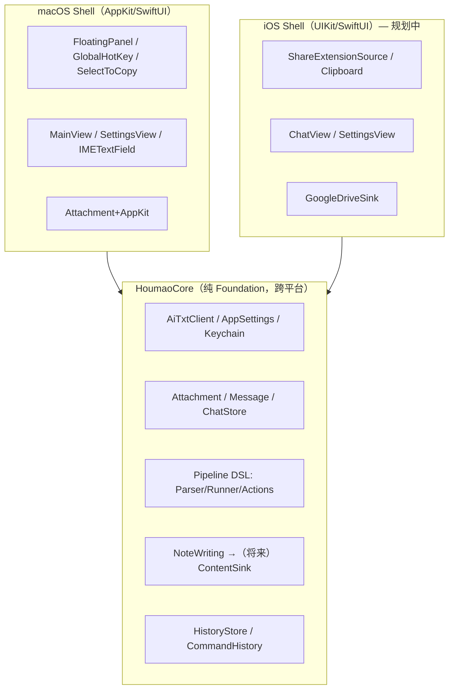
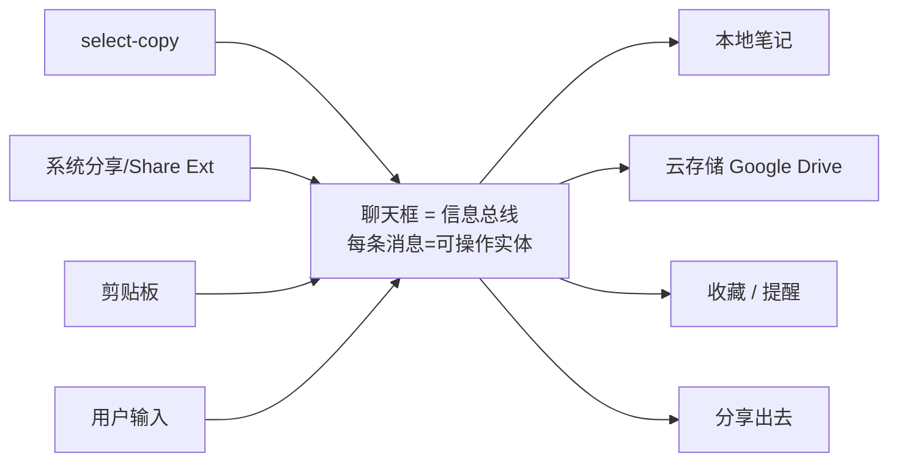
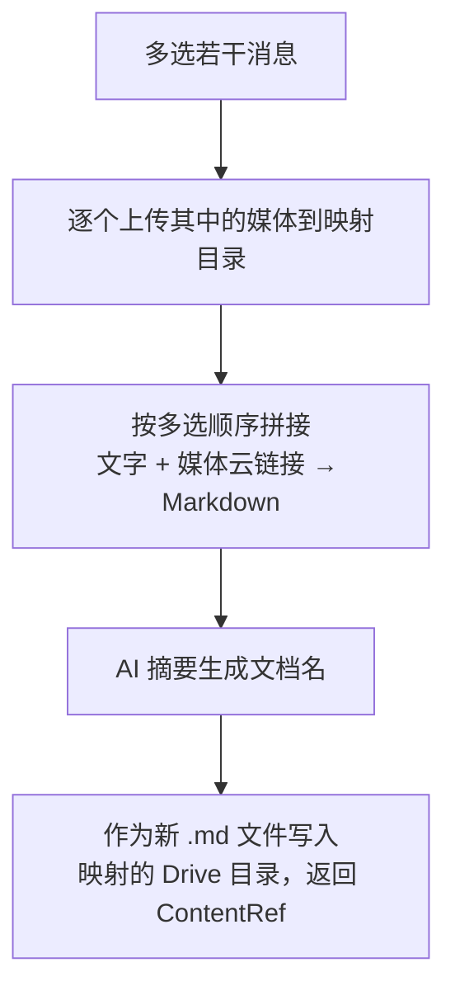
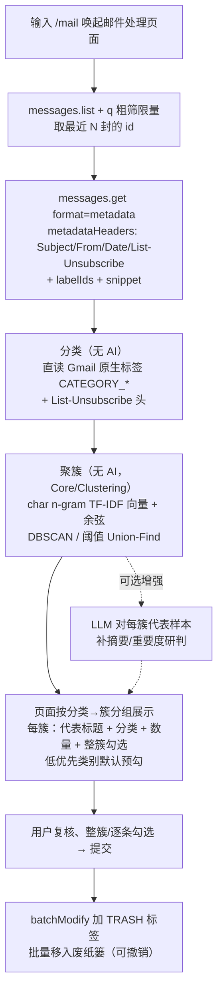

# 猴毛（Houmao）产品架构与开发路线图

> 本文件是项目的「活文档」：梳理用户使用习惯、整体架构设计与功能开发方案，并以开发事项清单的形式跟踪进度。**后续每完成一刀就回来更新对应状态与说明。**
>
> 最近更新：2026-07-17（**工作量总结面板 `/worklog`（§3.12）**：两阶段 GitHub 工作量摘要——阶段一按 `from` 逐个总结我的 PR+issue（每条 30–50 字，`gh` 取数 + `AiTxtClient` 摘要，增量缓存到 `~/Documents/houmao/worklog/<repo>/<月>/`）；阶段二选周期（周/月/季/半年/大半年/年 滚动窗口）→基于可编辑的工作背景按 **OKR 方法论**归纳成 Markdown 报告。**不走 ghia**（深度 review 非短摘要、要改 client-tools）、**不复用 PR/Issue 现成列表**（那是 open/近期，worklog 要 created>=from 全状态·按月·PR+issue 合并）——只共用 gh 封装 `GitHubCLI`。近三月展开/更早折叠。新增 `Core/WorkLog/*` + `WorkLogViewModel`/`WorkLogView`，rail 加"工作量"入口 + `/worklog`。6 单测绿。）
> 最近更新：2026-07-22（**主观能动性设置/说明收进独立窗口**：把 agent 的**设置**（主开关/GitHub watcher/轮询间隔/静默时段）与**使用说明**从「全局 ⌘, 设置 + ⌘K 帮助」收敛进 `agent` 窗口的 header——`⟳ 刷新 / ⚙️ 设置 popover(`AgentSettingsView` 直绑 `AppSettings`，改动即`applyPolicy()`) / ? 说明 popover(`AgentHelpView`使用手册)`；从 `SettingsView` 移除 agent 区（单一来源、无重复维护）。功能自包含在一个独立窗口。build+122 单测绿。）
> 最近更新：2026-07-22（**主观能动性（Proactive Agency）`/agent`（§3.13 / ADR-13）**：把猴毛从「被动问答」升级为「主动感知」——`AgentDaemon` 后台 Timer 轮询 `GitHubWatcher`（请求我 review 的 PR + 指派给我的 Issue），确定性 `AgentDiff` 取新、`AgentPolicy` 护栏（主开关/轮询间隔/静默时段/单轮上限）→ 本地通知（复用 `notifyTaskDone`，点击开收件箱）+「动态」收件箱面板，**双击一键触发已有 `/pr` `/issue` 分析**。`Core/Agent/*` 纯 Foundation 可单测（`AgentDiff`/`AgentPolicy`/`AgentStore` 共 12 例）。**只感知+建议、无任何自主写/删**（严守 ADR-8）；tool-calling/MCP/MCTS 树搜索**本期降级为未来展望**（ADR-1/ADR-13）。rail 加 `bell.badge` "动态" 入口 + `/agent` 命令 + 设置页「主观能动性」区。新增 9 `.swift`→已 xcodegen+build，单测绿。）
> 最近更新：2026-07-17（**命令面板搜索历史 + 清空（ADR-12 §5 约定6）**：命令面板每次打开都是干净空框；**回车=提交搜索**（记录历史→筛选→清空框→关闭），**空框回车=清空当前页筛选**（手动清理入口）；`SearchHistoryStore`（UserDefaults 持久化/最近优先/去重/上限20/全局共享），搜索模式 `↑↓` 调取历史、空框展示「最近搜索」可点选行 + 「清除」按钮。仅 `onSearch != nil` 的页记录/展示。补齐了原 §5「无清除入口」待办。）
> 最近更新：2026-07-17（**详情页删除动作约定（ADR-11 §约定7）**：凡从列表双击进入的 drill-in 详情（`mailDetail` 子窗、`GoalDetailView`），只要列表行支持删除，**详情 header 也提供同一红色 `trash` 删除**，删除后退出详情，并**复用列表已有删除链路**（不另造逻辑）。落地：`MailDetailView`→`MailViewModel.deleteDetail()`（移废纸篓+撤销+关窗）；`GoalDetailView`→`deleteGoal`+`onBack`。）
> 最近更新：2026-07-17（**命令面板 Phase 2**：PR/Issue/Do/Goal 各 VM 加 `searchFilter`+`displayed*` 过滤并接 `paletteSearch`；七页补 `helpLines`；**mail header 搜索框已收敛进命令面板**（移除，帮助并入 helpLines）。待办：md 编辑器搜索(/check)未迁、面板过滤的清除入口。）
> 最近更新：2026-07-17（**命令面板（⌘K，统一搜索框，ADR-12 §5）**：rail 顶部放大镜/⌘K 唤起 `CommandPalette` 浮层，**钉在窗口正上方、不遮正文**；无前缀=搜当前页（已接 mail）、`/`=命令跳转（复用 `PanelDestination`）、`/h`=帮助。抽 `PanelDestination` 为 rail/面板共享导航表；`SidebarChrome` 加 `pageName`/`paletteSearch` 上下文。Phase 2：PR/Issue/Do/Goal 页内搜索 + 各页帮助文档待补。）
> 最近更新：2026-07-17（**按钮 UI 与全局配色统一（ADR-11 §3/§4）**：**页面内**动作图标按钮（header/行内删除·完成）统一系统默认 **bordered** 样式，密集行内加 `.controlSize(.small)`、破坏性加 `.tint(theme.danger)`；**`PanelSidebar` 导航 rail 例外——无边框、仅图标**（VS Code 活动栏风格，`.plain`+textSecondary），与页面 bordered 按钮有意区分；native 控件（复选框/搜索清除/disclosure）保持原样。配色**全部走 Theme 语义色**——新增 `danger`(红)/`success`(绿)/`merged`(紫)/`textTertiary`，把 PR 色条·Issue 圆点·邮件分类色·聊天 ring·删除红·错误文案的硬编码字面量全换成 Theme。主题仍「绿豆沙」，rail 背景实色 `surface`。）
> 最近更新：2026-07-17（**全局统一导航 rail（ADR-12）**：抽共享 `PanelSidebar`——每个面板窗口 leading 边常驻竖直图标 rail（chat/mail/pr/issue/do/goal/editor 七入口，post `.houmaoEnterXxxWindow`），`SidebarChrome` 包裹七窗 rootView，`SidebarState`(@Observable 单例+UserDefaults)控折叠、⌘\ 或顶部按钮切换。**否决了"全局悬浮呼吸式侧边栏/空白处呼出/四边任意"**（悬停隐藏作主导航=反模式+跨窗悬浮易抖动）。`ChatView` 输入栏原 6 个导航按钮已删，只留新对话/Stop。｜ 追加 **ADR-11 新增“可点击图标统一尺寸”约定**：所有 SF Symbol 图标按钮统一用系统默认字号（不加显式 `.font(size:)`），跨页/组件一致，基准=`MailView.header`；侧边栏图标据此对齐。）
> 最近更新：2026-07-16（**面板窗口一致性约定（ADR-11）**：把窗口/header 规范固化——窗口标题=英文小写**单数**文字（chat/mail/pr/issue/todo/md/goal，非 glyph）；header=**图标按钮靠左（无文字）+ Spacer + 搜索框靠右**，不放描述性标题（窗口标题栏已含）；关闭走 `windowShouldClose→hideXxxWindow`，不加从不 post 的 exit 通知占位。据此：`goals`→`goal`/`/goal`；md 编辑器 与 goal 面板 header 改齐 mail 范式并去文字；清掉 Mail/PR/Issue/Do 的死 exit 通知+observer。**新增独立窗口一律照 ADR-11。**）
> 2026-07-16（**目标管理图面板 P1（§3.11，todo 升级版）**：目标=一份 md 文档（正文 + 结尾 ```mermaid 图）；`goal` 窗口列表只显示 title，双击详情=**只读渲染的 mermaid 图**（`MermaidView`=`WKWebView`+离线打包 `Resources/mermaid.min.js`），详情 AI 按钮→**文档绑定 chat**（`MainViewModel.ChatDocumentBinding`/`startDocumentChat`/`saveDocumentFromChat`，ChatView 顶部「编辑文档」横幅+「保存到原文档」）改文档并写回 `~/Documents/houmao/goals/<stem>.md`。核心理念：**人不碰内容，chat 是动作，文档落地是目的**。P2/P3（完成态细化/Drive 镜像/内联渲染）未做；WebView 渲染待真机验证。｜ 也含 §3.10 通用 Markdown 编辑器、§3.8 Do 条目 body、§3.9 GitHub 面板。）
> 2026-07-16（**通用 Markdown 编辑器（§3.10）**：houmao 唯一、通用、独立的编辑器窗口 `MarkdownEditorView` + `AppDelegate.presentMarkdownEditor(title:text:onSave:)`（单例窗口，`markdownEditorModel` 承载当前文档/保存去处）；聊天输入栏加 `square.and.pencil` 按钮唤起空白编辑器（保存→**按 md 标题命名**写 `~/Documents/houmao/notes/<标题>.md`）；**任何内容编辑优先复用它**。Do 面板 `+`/双击已有行改为唤起该编辑器（不再内联/无草稿），`DoViewModel.addItem(fullText:)`/`updateItem(_:fullText:)` 提交，标题空即删；保存图标或关闭窗口都=保存。｜ 也含 §3.8 Do 条目 body 与 §3.9 GitHub 面板。）
> 2026-07-16（**Do 面板条目升级**：`DoItem` 加 `body`（可选 md 正文），行只显示标题、**双击整行**打开自适应高度的 md 全文编辑（首行=标题/其余=正文，失焦提交/Esc 取消/清空标题即删）；去掉「添加待办」输入框，新增改由**列表底部 `+` 按钮**新建空行并进入编辑——编辑入口仅「+新建 / 双击已有」两个。正文以**活动文件缩进两格续行**持久化；归档单行格式未动（完成暂丢正文，见 §3.8 / [todo.md](todo.md) §7）。详见 §3.8。）
> 2026-07-15（新增 **Google Drive 同步（Phase 4.1/4.2 ✅）**：todo（Do 面板 `work.md`/`life.md`）每次本地保存后**防抖单向镜像**到 Drive `houmao/do` 文件夹；`Core/Cloud/GoogleDriveClient`（v3 REST）+ `DriveSyncService` + 抽出的 `GoogleOAuth` 共享连接 helper（Mail 复用）；Drive 用 `drive.file` 最小 scope，与 Gmail **共用一次 OAuth 同意/同一 refresh token**（`Scope.appDefault`）；设置页加「Google Drive 同步」连接入口。聊天气泡右键收藏留后续 4.3。｜ 也含 GitHub PR/Issue 面板（§3.9 / Phase 8）与 Do 待办面板（§3.8 / Phase 7）。维护方式：每次提交涉及架构/功能变更时同步本文件。

---

## 0. 文档导航

1. [产品定位与用户使用习惯分析](#1-产品定位与用户使用习惯分析)
2. [整体架构设计](#2-整体架构设计)
3. [功能模块与开发方案](#3-功能模块与开发方案)
4. [开发路线图与事项跟踪](#4-开发路线图与事项跟踪)
5. [关键决策记录（ADR）](#5-关键决策记录adr)
6. [待澄清事项与外部前置](#6-待澄清事项与外部前置)

---

## 1. 产品定位与用户使用习惯分析

### 1.1 一句话定位

猴毛是一个**碎片任务助手**：在任意场景下，把「随手抓到的一段信息」快速喂给 AI 做处理（翻译 / 摘要 / 问答），并能把结果沉淀（存笔记 / 收藏到云）。聊天框是所有信息的**总线**，一端接 OS 工具链，一端接云存储。

### 1.2 平台使用习惯差异（决定形态）

| 维度 | macOS | iOS |
|---|---|---|
| 第一习惯 | **键盘优先**——尽量纯键盘完成所有操作 | **触屏 + 系统分享**为主 |
| 第二习惯 | 鼠标其次 | 长按 / 多选手势 |
| 主入口 | 双击 Option 唤起极简输入框（overlay） | Share Extension（分享菜单）+ 剪贴板 |
| 划词 | 全局 select-copy（划词即抓取）已实现 | 无全局监听，仅 app 内系统划词；用分享/剪贴板替代 |
| 形态 | **保持极简输入框默认**，`/chat` 命令切聊天模式 | 直接以聊天列表为主界面 |

### 1.3 核心交互原则

- **macOS 极简优先**：默认就是一个输入框，不打断心流；高级能力（聊天、管道、设置）都通过键盘命令/快捷键触达，不堆 UI。
- **引用而非拷贝**：本地文件、云文件一律以「链接 + 缩略图」呈现，绝不复制副本，避免数据冗余。
- **信息总线**：聊天框是 sink，多种来源（输入 / 划词 / 分享 / 剪贴板）注入，多种去向（笔记 / 云 / 提醒 / 分享出去）汇聚。

### 1.4 现有交互速查（macOS，已实现）

| 操作 | 行为 |
|---|---|
| 双击 Option | 显示 / 收起主输入框 |
| `⌘L` | 清空当前对话 |
| `⌘B` / 输入 `b` | 历史记录面板 |
| 输入 `h` | 帮助面板 |
| `⌘W` | 关闭当前面板 |
| `⌘,` | 设置面板 |
| `@model 问题` | 指定模型提问 |
| `文本 \| $action \| $action` | 管道处理（见 3.2） |
| `/chat` | 打开 / 切换标准聊天窗口（见 3.3） |
| `/mail` | 打开邮件处理页面：余弦聚簇 + Gmail 标签分类（无 AI）+ 勾选批量清理（见 3.7） |

> **命令一致性（单一事实来源）**：所有 `/工具` 命令（`/chat`、`/mail`、`/issue`、`/pr`…）的识别与分发集中在 `MainViewModel.handleToolCommand(_:)` 一个函数里。极简输入框（`submit()`）与标准聊天窗输入框（`sendChatTurn()`）**都先调用它**，因此两个输入面暴露的工具集永远一致——新增工具只在此处加一次即可两面生效。各面仅保留自身差异（极简框=一次性单轮、聊天窗=多轮；帮助的呈现：面板 vs 气泡）。回归由 `ChatModeTests` 的一致性用例守护。曾出现 `/mail` 只在极简框生效、聊天窗漏拦的 bug，即因两面各自路由命令所致。

---

## 2. 整体架构设计

### 2.1 分层原则：Core / Shell

核心策略是**一套平台无关 Core + 各平台 Shell**。Core 严禁出现任何 AppKit/UIKit 符号，保证可在 macOS 与 iOS 间直接复用。



### 2.2 当前代码边界（已落地）

**`mac/houmao/houmao/Core/`（纯 Foundation，iOS 可直接复用）**

| 文件 | 职责 |
|---|---|
| [AiTxtClient.swift](../mac/houmao/houmao/Core/AiTxtClient.swift) | OpenAI 兼容 LLM 客户端（流式/非流式） |
| [AppSettings.swift](../mac/houmao/houmao/Core/AppSettings.swift) | Provider 列表、模型解析；apiKey 走 Keychain |
| [KeychainStore.swift](../mac/houmao/houmao/Core/KeychainStore.swift) | 跨平台密钥存储（Security 框架） |
| [Attachment.swift](../mac/houmao/houmao/Core/Attachment.swift) | 附件模型，图片以 `Data`(JPEG) 存储 |
| [CommandHistory.swift](../mac/houmao/houmao/Core/CommandHistory.swift) | 输入框命令历史（上下键） |
| [HistoryStore.swift](../mac/houmao/houmao/Core/HistoryStore.swift) | 使用记录持久化（JSON） |
| [HistoryViewModel.swift](../mac/houmao/houmao/Core/HistoryViewModel.swift) | 历史分页加载 |
| [Core/Pipeline/](../mac/houmao/houmao/Core/Pipeline/) | 管道 DSL（见 3.2） |
| [Core/Chat/](../mac/houmao/houmao/Core/Chat/) | 聊天模型 Message / ChatStore / Conversation（见 3.3） |

**`mac/houmao/houmao/`（macOS Shell）**

| 文件 | 职责 | iOS 对应 |
|---|---|---|
| [houmaoApp.swift](../mac/houmao/houmao/houmaoApp.swift) | FloatingPanel 覆盖层、生命周期 | 重写（无 NSPanel） |
| [GlobalHotKeyManager.swift](../mac/houmao/houmao/GlobalHotKeyManager.swift) | 双击 Option 全局热键 | 无（iOS 不支持） |
| [SelectToCopyManager.swift](../mac/houmao/houmao/SelectToCopyManager.swift) | 全局划词抓取 | Share Extension 替代 |
| [UsageTracker.swift](../mac/houmao/houmao/UsageTracker.swift) | 前台应用/输入采集 | 无 |
| [IMETextField.swift](../mac/houmao/houmao/IMETextField.swift) | 输入法友好的输入框 | UIKit 重写 |
| [MainView.swift](../mac/houmao/houmao/MainView.swift) | 主界面 | iOS ChatView |
| [SettingsView.swift](../mac/houmao/houmao/SettingsView.swift) | 设置 | iOS 设置 |
| [MainViewModel.swift](../mac/houmao/houmao/MainViewModel.swift) | 业务编排（管道集成在此） | 复用大部分逻辑 |
| [Attachment+AppKit.swift](../mac/houmao/houmao/Attachment+AppKit.swift) | NSImage ↔ Data 桥接 | Attachment+UIKit |

### 2.3 关键抽象协议（已有 + 规划）

| 协议 | 状态 | 说明 |
|---|---|---|
| `PipelineAction` | ✅ 已有 | 一个 `$action` 步骤；`ActionRegistry` 注册 |
| `NoteWriting` | ✅ 已有 | 笔记落盘；`FileNoteWriter` 实现 |
| `ContentSink` | ⬜ 规划 | 泛化 `NoteWriting`：本地笔记 / 云存储 / 收藏统一为 sink |
| `MessageSource` | ⬜ 规划 | 输入源：划词 / 分享 / 剪贴板 |
| `CloudStorageProvider` | ⬜ 规划 | 云存储抽象；`GoogleDriveSink` 第一个实现 |
| `GoogleAuthProvider` | ⬜ 规划 | Google OAuth 2.0（Desktop app + PKCE + loopback）；Drive 与 Gmail 共用，token 存 Keychain |
| `MailProvider` | ⬜ 规划 | 邮件抽象（列表/元数据/移废纸篓/删除）；`GmailProvider` 第一个实现（见 3.7） |

### 2.4 信息总线模型（目标形态）



---

## 3. 功能模块与开发方案

### 3.1 LLM 接入（✅ 已完成）

- OpenAI 兼容端点，支持多 Provider、`@model` 别名路由、流式输出。
- API Key 存 Keychain（非明文 UserDefaults），含旧数据自动迁移。

### 3.2 管道 DSL（✅ 已完成）

**语法**：`literal | $action | $action`，分隔符半角 `|`，动作英文名以 `$` 引用。

**解析顺序**：先剥 `@model`，再解析管道（含 `$action` 才算管道）；第一段字面文本作为初始输入，纯 `$action` 开头时回退到剪贴板。

**内置动作**：

| 动作 | 行为 |
|---|---|
| `$translate` | 中英互译 |
| `$summarize` | 原语言摘要 |
| `$save` | 追加到 `~/Documents/houmao/notes/yyyy-MM-dd.md` |

**示例**：

```text
你好世界 | $translate | $save     字面文本 → 翻译 → 存笔记
$translate                        翻译剪贴板内容
@deepseek $summarize | $save      指定模型摘要后保存
```

**扩展位**：`$` 是「函数/变量」语义占位，未来支持用户自定义流程变量（如 `$mypipe = $translate | $save`），只需扩展 `ActionRegistry` 与解析器。

### 3.3 聊天模型（🚧 进行中 — 多轮与标准办公窗口已通）

- ✅ [Message.swift](../mac/houmao/houmao/Core/Chat/Message.swift)：`Identifiable/Equatable/Sendable/Codable`，`Role`=user/assistant/system，`isStreaming`。
- ✅ [ChatStore.swift](../mac/houmao/houmao/Core/Chat/ChatStore.swift)：`@MainActor @Observable` 多会话容器，流式 token 累积、`historyMessages` 过滤；[Conversation.swift](../mac/houmao/houmao/Core/Chat/Conversation.swift) + [ConversationStore.swift](../mac/houmao/houmao/Core/Chat/ConversationStore.swift) 负责 JSON 持久化。
- ✅ macOS `/chat` 打开独立聊天窗 + 多轮上下文（`MainViewModel.openChatWindow/sendChatTurn/executeChatTurn`，历史回传 `AiTxtClient`，流式写入 `ChatStore`；窗口可见即状态，无 `isChatMode` 标志）。
- ✅ 标准聊天窗口 UI（头像气泡 / 多行输入 `ChatInputField` / 发送键 / `TypingIndicator` / 空状态），抽为独立 [ChatView.swift](../mac/houmao/houmao/ChatView.swift)，设计规范见 [chat-ui-design.md](chat-ui-design.md)。
- ✅ 极简框一次性问答 → 第 3 次提交自动升级到标准办公窗口（`oneShotTurns` 计数 + `autoUpgradeToChat` 迁移前几轮上下文）。
- ✅ 聊天窗口为独立标准 `NSWindow`（可缩放 / 原生全屏，不继承极简框悬浮属性），见 [houmaoApp.swift](../mac/houmao/houmao/houmaoApp.swift) `chatWindow`。

**交互与生命周期决策（Q3 / Q4）**：

- **极简框 = 一次性问答；连续 3 次自动升级**：极简输入框定位单轮快问快答，第 3 次提交自动升级为独立的标准办公型聊天窗口（可缩放 / 原生全屏），并把前几轮 Q/A 迁移为上下文；也可随时输入 `/chat` 手动升级。
- **退出**：聊天窗口标题栏关闭、header `✕`、`⌘W` 或再输 `/chat` 均退出（`exitChatMode`）；双击 Option 唤起极简框时自动收起聊天窗口，两个界面不重叠。
- **默认持久化、可跨会话**：`ChatStore` 通过 `ConversationStore` 以 JSON 落盘（`~/Documents/houmao/conversations.json`），重启恢复多会话，左侧列表可切换/删除。
- **仅「收藏」等显式动作触发落盘**：未收藏的聊天一律不写文件；一旦收藏，把该次聊天导出为**独立 `.md` 文件**（见 3.5），不做增量数据库。

### 3.4 内容引用与云存储（⬜ 规划）

核心模型是**目录映射 + 只增不改**（Q1 / Q2）：不创建原生 Google Docs，而是把「本地某目录」与「Google Drive 某目录」建立对应关系，收藏产物以 Markdown 文件**新增**进去（不修改、不删除已有文件）。

- `ContentRef`：轻量引用（本地/云**文件名 + 链接 + 缩略图**），不上数据库，延续 `HistoryStore` 的 JSON 思路。
- `ContentSink`：泛化 `NoteWriting`，`save([Message]) -> ContentRef`，返回引用不留副本；本地 `.md` 落盘与云目录上传是它的两个实现。
- `DirectoryMapping`：记录「本地目录 ↔ Drive 目录」对应关系；同步语义限定为**只新增文件**，规避双向冲突与删除风险。
- `GoogleDriveSink`：OAuth 2.0 + Drive REST API（`files.create`，指定 `parents` 为映射目录的 folderId），第一个云实现，落地格式统一为 `.md`。

### 3.5 收藏到云文档（⬜ 规划 — 云 MVP）

**目标工作流**（用户多选消息后点「收藏」才触发；未收藏不落盘）：



- 媒体先上传拿到云链接；文字与链接按选中顺序组装成 **Markdown** 文档；用 LLM 摘要出文档名。
- 写入语义为**新增**：每次收藏生成一个新 `.md`，不覆盖既有文件。
- 复用 `$summarize` 的能力生成文档名；复用 `ContentSink` + `DirectoryMapping` 落云。

### 3.6 输入源（⬜ 规划）

- macOS：`SelectCopySource`（已有 SelectToCopyManager）/ Services / 剪贴板。
- iOS：`ShareExtensionSource`（主入口）/ 剪贴板 / App Intents。

### 3.7 邮件助手：余弦聚簇分类 + 勾选批量清理（⬜ 规划）

**目标**：输入 `/mail` 唤起独立的**邮件处理页面**（与 `/chat` 同构的独立 `NSWindow`）；用**余弦相似度（无 AI）把标题近似的成批模板邮件聚成簇**，分类直接用 **Gmail 原生分类标签**，按簇展示（每簇一行 + 数量）；用户整簇/逐条勾选要删的→提交→自动**批量移入废纸篓**（默认可恢复）。AI 总结/重要度研判为**可选增强**（第一版可全程无 AI）。首个且当前唯一目标邮箱为 **Gmail**。

**为什么走 Gmail API（REST）而非 IMAP**：见 ADR-8。核心是——REST 返回结构化 JSON（含 labelIds）便于直接做分类/聚类（也便于可选喂 LLM）、`batchModify`/`batchDelete` 原生支持一次上千封、纯 `URLSession` 契合 Core 纯 Foundation、且能复用 Phase 4 的 Google OAuth 基建。

**工作流**：



**分组策略：分类与聚合正交（均无 AI，见 ADR-9）**：

- **分类（用 Gmail 原生标签，零算法）**：余弦只能把「相似的聚成簇」，给不出语义类别名。直接读 Gmail 返回的 `labelIds`（`CATEGORY_PROMOTIONS/SOCIAL/UPDATES/FORUMS/PERSONAL`）+ `List-Unsubscribe` 头（有即营销/订阅）作为分类维度，免费、稳定、无 AI。
- **聚合（余弦相似度，Core/Clustering）**：在分类（或发件人域名）内，用**字符 n-gram（如 3-gram）TF-IDF 向量 + 余弦相似度**把模板化标题聚成簇。选 char n-gram 而非词级：对短标题/中英混杂/模板文本更鲁棒。聚类用 **DBSCAN（余弦距离）** 或**阈值 Union-Find**：不预设簇数，DBSCAN 能把散邮件归为噪声点（不强行归簇）。
- **规模**：粗筛限量 N 封后两两比较 O(n²) 完全可接受（千量级毫秒）；若将来 N 极大，再加 **LSH（SimHash/MinHash）** 预筛降到近线性。
- **AI 可选增强**：第一版全程无 AI；待接入 LLM 后，只对**每簇代表样本**补摘要与重要度研判（一簇共享一个判断），而非逐封。

**交互决策（与 `/chat` 一致）**：`/mail` 唤起独立可缩放 `NSWindow`（非极简框）；页面内邮件**按分类→簇分组**（同簇可整簇勾选/折叠），每簇一行（代表标题 + 分类标签 + 数量 + 整簇勾选框），展开可看簇内逐条；底部「提交清理 N 封」按钮；聚簇瞬时完成即渲染（接入 LLM 增强时，摘要/重要度按簇流式回填，不阻塞）。

**默认分类（来自 Gmail 原生标签，无 AI）**：促销 `CATEGORY_PROMOTIONS` / 社交 `CATEGORY_SOCIAL` / 更新通知 `CATEGORY_UPDATES` / 论坛 `CATEGORY_FORUMS` / 个人 `CATEGORY_PERSONAL`；另用 `List-Unsubscribe` 头辅判营销/订阅。低优先类别（促销/更新/论坛）页面默认预勾选，用户仍可整簇/逐条改。

**最佳实践清单（选型与性能确认）**：

- **聚类为主、AI 可选**：分类（Gmail 标签）+ 聚合（char n-gram TF-IDF + 余弦）均无 AI，第一版即可落地；若后续接入 LLM，**只对每簇代表样本判一次**（簇内共享）、无法聚簇的散邮件才分批打包喂 LLM（结构化输出 `summary/importance/suggestDelete`），而非每封一次往返；搭配服务端 `q` 粗筛限量避免全量扫描。
- **认证**：OAuth 2.0 **Desktop app** client + **PKCE + loopback（`http://127.0.0.1:<port>`）**；Google 已弃用 OOB（复制粘贴 code），loopback 是桌面应用官方推荐流程。
- **权限最小化**：scope 取 `https://www.googleapis.com/auth/gmail.modify`——可读 + 改标签/移废纸篓，但**无法永久删除**；恰好满足需求。永久删除需 `https://mail.google.com/` 全权限，默认不申请。
- **只取元数据**：`messages.get` 用 `format=metadata` + `metadataHeaders=From,Subject,Date,List-Unsubscribe`（配 snippet、labelIds），不下载正文，省配额省流量；聚簇取 Subject、分类取 labelIds/List-Unsubscribe。
- **批量清理**：`users.messages.batchModify` 加 `TRASH` 标签（一次 ≤1000 id）为默认动作；`users.messages.batchDelete`（永久）需二次确认且需全权限，非默认。
- **Token**：refresh token 存 `KeychainStore`（复用现有 Keychain 基建）。

**抽象**：新增 `MailProvider` 协议（`listMessages(query:)` / `fetchMetadata(ids:)` / `trashMessages(ids:)` / `deleteMessages(ids:)`），`GmailProvider` 首个实现，放 Core（纯 `URLSession`，跨平台）；**聚类算法独立于业务**——放 `Core/Clustering/`（纯算法，不依赖任何 Mail/Chat 类型，只吃 `[String]`/泛型、输出簇索引，可独立单测与复用）；OAuth 由 `GoogleAuthProvider` 提供（与 Phase 4 Drive 共享，扩展 scope）。LLM 总结（可选）复用 `AiTxtClient`。

**安全护栏（见 ADR-8）**：默认移废纸篓不永久删；提交前页面强制用户复核勾选（系统仅按低优先类别预勾、不自动执行）；永久删除须显式二次确认——误删要紧邮件的代价不可逆。

---

### 3.8 Do 待办面板：两固定领域 + 可编辑主题的纯文本 todo（✅ 已完成）

**需求**：一个轻量待办组织器，聊天窗输入栏 `checklist` 按钮或 `/do` 命令唤起独立窗口。两级分类：**固定领域**（工作/生活，顶部自绘分段 tab，不可增删）→ **可编辑主题**（清单）→ 主题下的**条目**。同一时刻只显示一个主题的详情列表（master-detail）。默认主题：工作=`todo`/`学到老`，生活=`衣食住行`/`吃喝玩乐`。

**条目交互（title + 可选 md 正文）**：每行只显示标题（`DoItem.text`）+ 左侧完成圆圈 + 右侧删除。**编辑入口仅两个**（无独立「添加待办」输入框），且均唤起 §3.10 的**通用 Markdown 编辑器窗口**：① 列表底部 `+` 按钮打开空白编辑器（保存首行非空则新建条目）；② 已有行**双击**打开编辑器（预填 首行=标题、其余=正文）。保存=提交（首行=标题/其余=正文），标题清空则删除。保存图标或关闭编辑器窗口都会落盘。

**易用性依据**：对齐主流实践——Things 的 Areas(稳定)›Projects、Apple 提醒事项/滴答清单的「侧栏选清单→看详情」。主题用 tab 下一行**胶囊/分段**切换（主题少时最简洁，符合当前极简风）；主题的增/改名/拖排/删集中在 popover（「管理清单」心智），删除含条目主题二次确认；主题胶囊带未完成计数徽章。

**持久化（纯文本，人类可读可手改）**：活动/归档分离的 Markdown（扩展名 `.txt`）。**活动**每领域一份 `~/Documents/houmao/do/{工作,生活}.txt`（仅未完成项，`- [ ] 文本 <!--yyyy-MM-dd-->` 尾注=创建日；条目下方**缩进两格的续行**=该条 md 正文）；**归档**按 tab×月滚动 `工作·yyyy-MM·归档.txt`（完成即入档，单行 `- 文本 · 起 D · 止 D`）。任一变更即时整文件 `.atomic` 重写 + 防抖镜像 Drive。格式与解析/序列化约定的单一事实来源见 [todo.md](todo.md)。**取舍**：不引 JSON/数据库；条目/主题的运行时 `id`（UUID）不落盘（格式无跨会话引用）；文件为 App 托管的规范格式，手改的自由文字会在下次保存被规范化丢弃。

**抽象**：`Core/Do/DoModel.swift`（`DoItem`{`text`/`body`/`createdAt`/`completedAt?`}/`DoTopic`{`openCount`}/`DoTabKind`{`activeFileName`/`archiveFileName(month:)`/`legacyFileName`/`defaultTopics`}/`DoTab`）+ `Core/Do/DoStore.swift`（纯 Foundation，活动/归档两套 `static parse/serialize` 可独立单测；`load` 缺文件回空由 VM 播种 defaults，旧版 `work.md`/`life.md` 首次迁移）。`DoViewModel`（`@MainActor @Observable`；item/topic CRUD 每次变更即持久化；`addItem(fullText:)`/`updateItem(_:fullText:)` 拆首行=标题/其余=正文）；`DoView`（tab / 主题胶囊 / `TopicManagerView` popover / 详情列表 + 底部 `+` addRow；`+`/双击调 `AppDelegate.presentMarkdownEditor` 唤起通用编辑器）。接线与 Issue 面板同构（`GlobalHotKeyManager` 通知 + `houmaoApp` 窗口工厂 `makeDoWindow`，标题栏 glyph `checklist`）。

---

### 3.10 通用 Markdown 编辑器：houmao 唯一的内容编辑器（✅ 已完成）

**需求**：一个**独立、通用、全局唯一**的 Markdown 编辑器窗口；聊天输入栏加 `square.and.pencil` 按钮唤起。**任何内容编辑优先复用它**（Do 条目、将来的笔记/收藏等），不再各写各的内联编辑。保存语义：窗口内 `square.and.arrow.down` 保存图标 **或**关闭窗口（红点/⌘W）都=保存（无独立丢弃路径，延续 app 内「关闭即提交」的一致行为）。

**抽象**：`MarkdownEditorView.swift`（shell）——`MarkdownEditorModel`（`@MainActor @Observable`，承载 `text`/`title`/`onSave` 保存去处）+ `MarkdownEditorView`（`@Bindable model`，填满窗口的 `TextEditor` + 顶部保存按钮，按钮 post `.houmaoCommitEditor`）。`houmaoApp` 持**单例** `markdownEditorWindow` + `markdownEditorModel`：`presentMarkdownEditor(title:text:onSave:)`（复用窗口、换 content/model，present 前先 `save()` 旧文档）、`finishMarkdownEditor()`（保存+隐藏，供保存按钮与 `windowShouldClose` 复用）、`presentScratchEditor()`（聊天栏空白入口，保存→**按 md 标题命名整文件**写 `~/Documents/houmao/notes/<标题>.md`，`markdownTitle` 取首行去 `#` 并规范化文件名）。参数化 `onSave` 让不同视图各自决定落点：Do 传 `viewModel.addItem/updateItem`，聊天栏传标题命名写入。接线：`GlobalHotKeyManager` 加 `.houmaoEnterEditorWindow`/`.houmaoCommitEditor`；ChatView 输入栏 Do 按钮后加编辑器按钮。**编辑区保持纯 `TextEditor`**（不上 NSTextView 底座）；header 加一个极简放大镜搜索框，三用途：输入 `/h` 弹 Markdown 格式帮助浮层，`/check` 跑**静态格式检查**（`Core/Markdown/MarkdownLint.swift`，纯 Foundation 可单测，规则 R1–R6：代码围栏未闭合 / 标题 `#` 缺空格 / 列表符缺空格 / 硬 Tab / 行尾空格 / 空链接，围栏内跳过；列 `行号·问题`），否则做**全文搜索**（列出含匹配的行 + 行号，只读辅助——纯 `TextEditor` 无法移动光标/高亮，故不跳转）。浮层仅在搜索框聚焦且有查询时显示，不干扰正常输入。header 另有 **AI 修复按钮**（`sparkles`）：把当前全文 + 固定「修复 Markdown 格式」提示词送进聊天气泡（`MainViewModel.fixMarkdownForChat`），AI 返回修好的全文，用户手动复制回来（复杂/结构性格式交给 AI，静态检查只做简单规则）。

---

### 3.9 GitHub PR/Issue 面板：`gh` 驱动的「我的 PR / 我的 Issue」（✅ 已完成）

**需求**：聊天窗输入栏加 PR（`arrow.triangle.pull`）/ Issue（`smallcircle.filled.circle`）按钮，各唤起一个独立窗口，用 `gh` 展示与我相关的条目：**PR** 面板 open 直接展开、近三个月 closed 默认折叠；**Issue** 面板分「指派给我」+「我创建的」两 section（都展开）。两面板均**按仓库分组**，行内左标题吃满宽 + 右 `MM-dd` + 左侧状态色条，**双击在浏览器打开**/右键复制链接。

**数据源 = `gh` CLI 子进程**（非 ghia）：抽共享 helper `Core/GitHub/GitHubCLI.swift`（enum，`locateBinary()` 候选 `/opt/homebrew/bin/gh`→`/usr/local/bin`→`/usr/bin`（GUI app PATH 受限）+ 泛型 `runJSON<T:Decodable>(_ args)`，JSONDecoder `.iso8601`）；**认证复用用户 `gh auth login` 会话，不碰 token**。PR/Issue 的 provider 均调 `GitHubCLI.runJSON`。`gh search prs --author=@me --state=open/closed`（closed 查询含 merged，state 返 `merged`）；`gh search issues --author/--assignee=@me --state=open`（**默认不含 PR**）。

**抽象**：`Core/GitHub/PullRequest.swift`(`PullRequestItem`) + `PullRequestProvider`；`Core/GitHub/Issue.swift`(`IssueItem`) + `IssueProvider`（`fetchAuthored`/`fetchAssigned`）。`PRViewModel`/`IssueViewModel`（root，`@MainActor @Observable`，Phase idle/loading/loaded/failed，`async let` 并发拉取；Issue 对 assigned **去重**排除已 authored）。`PRView`/`IssueView` 极简（无 header，靠 show→自动 load；失败态留「重试」）。接线同构：`GlobalHotKeyManager` `.houmaoEnter{PR,Issue}Window` + `houmaoApp` `make{PR,Issue}Window`（标题栏 glyph，`addTitleGlyph` 泛化共用），左移不遮聊天窗，每次 open 自动刷新。无单测（纯外部 `gh` 依赖）。

---

### 3.11 目标管理图面板：LLM + 文档 + chat 的目标工作流（🚧 P1 已完成）

**定位（todo 的升级版）**：核心是 **LLM + 文档 + chat** 的工作流——**人不负责内容/格式，chat 是动作，"文档落地"是目的**（正因如此 md 编辑器才极简、无实时预览）。每个**目标 = 一份 Markdown 文档**：正文描述 + 结尾一段 ```mermaid 图（用方法论/流程可视化达成目标的步骤）。

**页面（2026-07-16 起对齐 Todo 两级结构）**：聊天栏 `scope` 按钮或 `/goal` 唤起独立窗口（标题 `goal`）。顶部与 Todo 完全一致——**工作/生活 分段（复用 `DoTabKind`）+ 可编辑主题胶囊 + 管理 popover**，每个目标归属一个主题。列表**只显示目标 title**；双击 → 详情**只显示那张图**（只读渲染）；详情右上 **AI 按钮**（`sparkles`）→ 进**文档绑定 chat** 更新目标。"标记步骤完成" = 对 AI 说（如"第 2 步完成了"）→ AI 重写文档里的 mermaid 标记该节点 → 保存 → 重开详情看新图。**明确不做**（用户砍）：图上点节点交互、实时渲染。

**Mermaid 渲染**：唯一现实路径 = `WKWebView` + **离线打包** mermaid.js（`Resources/mermaid.min.js`，v10.9.3 UMD，~3.2MB；xcodegen `sources:[houmao]` 自动打进 bundle 作资源）。`MermaidView`（`NSViewRepresentable`）**把 mermaid.js 内联进 HTML**（规避 `file://` 子资源加载），`<pre class="mermaid">` + `mermaid.run()`，`loadHTMLString(baseURL:nil)`。图类型选 **flowchart**（只读，也便于后续标"完成"样式）。**取舍**：不引 mermaid-cli（要 Node+无头 Chrome，比 gh/ghia 还重）；渲染耦合 WebKit 仅限目标详情，不动聊天/编辑器。

**文档绑定 chat（复用聊天窗，本次新增的通用件）**：`MainViewModel.ChatDocumentBinding{title, markdown, onSave}` + `var documentBinding`。`startDocumentChat(title:markdown:onSave:)` 开新会话+绑定+唤起聊天窗；`executeChatTurn` 的**首个绑定轮**（history 为空）注入 `documentEditPrompt`（给 AI 当前全文 + 要求，产出 ````markdown 完整全文），后续靠多轮历史。ChatView 顶部 `docEditBanner`（"编辑文档：<title>" + **「保存到原文档」按钮**）；点保存 → `saveDocumentFromChat()` 抽最后 assistant 回复的第一个变长围栏块（`extractFencedBlock`）→ `onSave` 写回 `.md`；`exitChatMode` 清绑定。**与 md 编辑器 AI 修复的区别**：后者手动 copy 回；目标这里**绑定文档、显式按钮自动写回**。

**抽象**：`Core/Goals/GoalDoc.swift`（`parseTitle`/`parseMermaid` 变长围栏，纯逻辑可单测；加 `GoalTopic`/`GoalTab` 两级模型）+ `GoalStore.swift`（**按 `~/Documents/houmao/goals/<工作|生活>/<主题>/<stem>.md` 子目录组织**，每区一个 `_topics.txt` manifest 记主题顺序、空主题也保活；`loadTopics`/`saveManifest`/`saveGoal`/`deleteGoal`/`renameTopicFolder`/`deleteTopicFolder`/`migrateFlatGoals` + 纯 `parseManifest`/`serializeManifest`）。`GoalsViewModel` 仿 `DoViewModel`（`tabs`/`selectedTab`/`selectedTopicID`，topic CRUD 后 `saveManifest`，goal 操作 `locate` 定位，`reload` 按 title 保选中）；`GoalsView` 仿 `DoView`（分段 Picker + 主题胶囊 topicBar + `GoalTopicManagerView`/`GoalTopicEditRow` 管理 popover + goalList + addRow；行 scope 图标 + title + xmark 删 + 双击进 `GoalDetailView` 只读 `MermaidView`）。接线同 Do：`GlobalHotKeyManager .houmaoEnterGoalsWindow` + `houmaoApp` `makeGoalsWindow`（标题 `goal`）；`MainViewModel.handleToolCommand` 加 `/goal`。旧扁平目标 init 时 `migrateFlatGoals(into:.work,topic:"目标")` 自动迁移。单测 `GoalStoreTests`（6 例：manifest round-trip/空主题保序/迁移/中文 title 拼音排序）。

**分阶段**：**P1（本次）** = 面板骨架 + goals 目录 md 持久化 + 列表 title + 双击只读渲染 + 文档绑定 chat 写回。**（2026-07-16 升级）** 顶部对齐 Todo 两级结构（工作/生活 分段 + 主题胶囊），**UI 对齐契约与存储格式已落到 [goal.md](goal.md)（防后续偏离）**。**P2/P3（本做）** = 完成态约定/交互细化、Drive 镜像（需新建"目标"子目录，现只本地）、编辑器/聊天内联渲染 mermaid、归档浏览。**注**：WebView 渲染尚未在真机 GUI 验证，只保证编译。

---

### 3.12 工作量总结面板 `/worklog`：两阶段 GitHub 工作量摘要（✅ 2026-07-17）

**需求**：为周期性汇报（半年/三月/月/周）自动化"我这段时间干了啥"——设个起始时间，逐个总结我的 PR/issue（每条 30–50 字），再按月归纳成果。

**为什么不走 ghia**：ghia 的定位是**单个 PR 的多阶段深度 review**（长报告、1200s 超时），与本需求的"短一句话摘要 × 几十条"正好相反；让它产短摘要要改 client-tools（Go）+ 重建二进制，且逐 PR 子进程在规模下很重。→ **取数用 `gh`、摘要/归纳用 Swift 侧 `AiTxtClient`**（第二阶段的按月归纳纯文本→文本，不碰 GitHub），全程自包含、不改另一个仓库。**也不复用 PR/Issue 页面的现成列表数据**：那两页查的是 open/近期（"现在在做啥"），worklog 要 `created>=from` 全状态、按月、PR+issue 合并（"做过啥"）——查询/分组/合并都不同，只复用同一套 gh 封装（`GitHubCLI`）。

**两阶段流程**：

- **阶段一（逐条）**：`WorkLogProvider`（`gh search prs|issues --author=@me --created=>=<from> --sort created`）拉 PR+issue → 对**未缓存**的每条 `gh pr/issue view` 取 body（PR 另取 commit headlines）→ `AiTxtClient.ask` 生成 30–50 字 → 存盘。**幂等去重**：以每条的 **URL（全局唯一、稳定的唯一 id）** 作为身份（不依赖月份路径），同一 PR/issue 任何时候重跑都只分析一次；失败静默跳过（下次重跑补齐）。
- **阶段二（按周期 · OKR）**：选**滚动周期**（周 / 月 / 季（3个月）/ 半年 / 大半年（9个月）/ 年，`PeriodKind`，以“今”为锚向前 N 天/月）→ 把该窗口内（`createdAt >= cutoff`）的原子摘要 + **可编辑的工作背景**（`backgroundPrompt`，默认已填公有云/K8s·KubeVirt·Kube-OVN·CNI chaining Cilium·Ceph/网络架构师角色，持久化）喂 `AiTxtClient`，**用 OKR 方法论**（提炼 2–4 个 Objective，每个下列可量化 KR 并引用支撑的 PR/issue；PR/issue 无论是否合并都计入工作量）产出 Markdown → 存盘 + 弹 sheet（可复制）。按日期过滤而非月份分桶，故“这周”能与“这月”真正区分；不再选历史某个季度/年。UI 标签简短（周/月/…），但 OKR 提示词注入**精确的 since 日期**（cutoff 的 `yyyy-MM-dd`）而非模糊标签，让模型清楚 createdAt 的硬边界。

**存储**：`~/Documents/houmao/worklog/<owner>__<repo>/<yyyy-MM>/<kind>-<number>.md`（每条一份，`---` 头 + 摘要正文，`WorkLogStore.parse/serialize` 纯函数可单测）；聚合报告存 `_aggregate/<周期 key 如 month、half、year>.md`。

**代码**：`Core/WorkLog/`（`WorkItem`/`WorkItemRef`/`WorkKind` 模型、`WorkLogProvider` gh 取数、`WorkLogStore` 缓存+纯 parse/serialize）+ 根 `WorkLogViewModel`（`@MainActor @Observable`：`fromDate`+`backgroundPrompt` 持久化、`generate()` 阶段一、`periodKind`（滚动窗口）/`cutoff(for:now:)` 纯函数、`runAggregate()` 阶段二 OKR（按 `createdAt >= cutoff` 过滤）、按 `monthKey` 分组展示、`isRecent` 近三月）+ `WorkLogView`（header：起始时间 = 内联可输入日期字段 `DatePicker(.field)`（直接键入，无快捷按钮）+ ✨生成（`client.askStream` 逐 token 把当前条目的摘要**像聊天气泡一样流式**显示在顶部进度横幅：N/M + 当前 PR/issue + 流式气泡；`streamSeq` 序号守卫防上一条迟到 token 串入下一条气泡；每条完成即推入月度列表边总结边填充）+ 刷新 + **工作背景 popover**；按月 section 近三月展开/更早折叠；**周期段选择器（周/月/季/半年/大半年/年）** + 「总结」；OKR sheet 用 `MarkdownView` 渲染）。接线照 ADR-11/12：`.houmaoEnterWorkLogWindow`、`PanelDestination`（rail 图标 `calendar.badge.clock` "工作量"）、`makeWorkLogWindow`（标题 `worklog`）、`/worklog` 命令 + helpBrief。单测 `WorkLogStoreTests`（6 例） + `WorkLogPeriodTests`（3 例：`cutoff` 周/月·年/半年·大半年 窗口）。**已 xcodegen+build，单测绿。** **注**：GUI 无法在无头环境验证，只保证编译 + 纯逻辑单测；真实 gh/LLM 联调需用户本地 `gh auth` + 配好 Provider。

---

### 3.13 主观能动性（Proactive Agency）`/agent`：感知-决策-建议闭环（✅ 2026-07-22）

**需求**：把猴毛从「被动问答」升级为「主动感知」——后台常驻监听外部环境（首刀＝GitHub），发现「值得你处理的事」（请求我 review 的 PR / 指派给我的 Issue）就主动推系统通知 + 收件箱面板，一键触发已有的 `/pr` `/issue` 分析。

**控制论框架落地**（详见 [proactive-agency.md](proactive-agency.md)）：感知-决策-建议闭环。①**异步事件驱动后台常驻循环** = `AgentDaemon`（Timer 轮询，复用 `SelectToCopyManager` Timer 范式）+ `Watcher.poll()`；②**分层双环** = 宏观外环（节奏/启用哪些 watcher/静默时段，`AgentPolicy`+设置）/ 微观内环（单 watcher `poll→diff→建议`），不做正式状态机；③**树搜索/tool-calling/MCTS 本期降级为未来展望**，决策＝确定性 `AgentDiff`（当前项 vs 已见集合，按 URL 去重取新）；④**确定性护栏** = 所有 event 仅为**建议**，唯一动作＝通知+收件箱+一键 `post` 已有命令，**无任何自主写/删**（严守 ADR-8）。

**代码**：`Core/Agent/`（`AgentEvent` 模型 / `Watcher` 协议 / `AgentDiff` 纯函数决策 / `AgentPolicy` 护栏+静默时段 / `AgentStore` JSON 持久化 `~/Documents/houmao/agent/inbox.json` / `GitHubWatcher` 复用 `IssueProvider.fetchAssigned`+新增 `PullRequestProvider.fetchReviewRequested`）+ 根 `AgentDaemon`（`@MainActor @Observable`，`applyPolicy()` 按设置重建 Timer 并立即先 poll、`refreshNow()`、`dismiss`、`onNewEvents` 注入通知）+ `AgentViewModel`（分组/搜索过滤/刷新/移除）+ `AgentInboxView`（两分区：请求我 review / 指派给我；双击=触发建议命令、行内 `xmark` 移除、右键菜单）。接线照 ADR-11/12：`.houmaoEnterAgentWindow`、`PanelDestination`（rail 图标 `bell.badge` "动态"）、`makeAgentWindow`（标题 `agent`）、`/agent` 命令 + helpBrief/helpContent；通知复用 `notifyTaskDone` 链路（`notifyAgentEvents` 打标 `houmao.kind=agent`，`didReceive` 点击开收件箱）；**agent 窗口 header 自带 ⚙️ 设置 popover（主开关/GitHub watcher/轮询间隔/静默时段，改动即 `applyPolicy()`）+ ? 使用说明 popover + ⟳ 刷新——功能自包含在独立窗口，不再放进全局 ⌘, 设置**。单测 `AgentDiffTests`（4 例）+ `AgentPolicyTests`（4 例，含跨午夜静默）+ `AgentStoreTests`（4 例，round-trip/缺文件/落盘重载）。**已 xcodegen+build，单测绿。** **注**：GUI 无头验证不了只保证编译 + 纯逻辑单测；真实 gh 联调需 `gh auth login`。**未来展望**：Gmail/Todo/Goal watcher（`Watcher` 协议已预留插拔位）、tool-calling/MCP、MCTS 树搜索/Reflexion、LLM 智能排序——均未做。

---

## 4. 开发路线图与事项跟踪

> 状态：✅ 完成 ｜ 🚧 进行中 ｜ ⬜ 待办。每刀都要求 `make build` + `make test` 零回归。

### Phase 0 — 抽取 Core 地基 ✅

| # | 事项 | 状态 |
|---|---|---|
| 0.1 | `Attachment` 去 NSImage 化（Data 桥接 + `Attachment+AppKit`） | ✅ |
| 0.2 | apiKey 迁 Keychain（含旧明文自动迁移、删除防孤儿） | ✅ |
| 0.3 | Core 目录归拢（7 个纯 Foundation 文件入 `Core/`） | ✅ |

### Phase 1 — 管道 DSL ✅

| # | 事项 | 状态 |
|---|---|---|
| 1.1 | 解析器 + 模型 + Runner + Registry | ✅ |
| 1.2 | 内置动作 `$translate` / `$summarize` / `$save` | ✅ |
| 1.3 | `NoteWriting` + `FileNoteWriter`（Markdown 追加） | ✅ |
| 1.4 | `MainViewModel` 集成 + 单元测试（9 用例） | ✅ |

### Phase 2 — 聊天形态 🚧

| # | 事项 | 状态 |
|---|---|---|
| 2.1 | Core `Message` + `ChatStore`/`Conversation`/`ConversationStore` + 单测 | ✅ |
| 2.2 | macOS `/chat` 模式切换（退出复用面板显隐：双击 Option / `⌘W`；再输 `/chat` 切回；单测 5 用例） | ✅ |
| 2.3 | 聊天气泡 UI 精修（标准聊天窗口：头像气泡 / 多行输入 / 发送键 / typing / 空状态，见 [chat-ui-design.md](chat-ui-design.md)） | ✅ |
| 2.4 | 多轮上下文接入 `AiTxtClient`（history 不再为空；JSON 持久化、可跨会话） | ✅ |

### Phase 3 — 内容引用与右键操作 ⬜

| # | 事项 | 状态 |
|---|---|---|
| 3.1 | `ContentRef` 引用模型（本地/云文件名 + 缩略） | ⬜ |
| 3.2 | `ContentSink` 协议（泛化 `NoteWriting`；本地 `.md` 实现） | ⬜ |
| 3.3 | 消息多选 + 右键菜单（收藏触发落盘/分享/提醒占位） | ⬜ |

### Phase 4 — 云存储与收藏 🚧

> 按数据产生源分两条：用户输入数据（如 todo）默认全量自动同步；聊天气泡走「右键收藏」（后续）。Drive 用 `drive.file` 最小 scope，与 Gmail 共用同一次 OAuth 同意（`Scope.appDefault = [gmailModify, driveFile]`，单一共享 refresh token）。

| # | 事项 | 状态 |
|---|---|---|
| 4.1 | Google Drive 接入：`Core/Cloud/GoogleDriveClient`（v3 REST，find-or-create 文件夹 + `upsertTextFile` 覆盖式）+ `GoogleOAuth` 共享连接 helper（抽出 Mail 复用）+ `Scope.driveFile`/`appDefault` | ✅ |
| 4.2 | todo 全量自动同步：`DriveSyncService`（`@MainActor @Observable`，连接/防抖镜像/状态；`houmao/do` 文件夹缓存）+ `DoViewModel` 每次本地保存后单向镜像 `work.md`/`life.md` 到 Drive；设置页「Google Drive 同步」连接入口+状态 | ✅ |
| 4.3 | 聊天气泡右键（单选/多选）保存到 Drive（`ContentSink` 收藏工作流） | ⬜ |
| 4.4 | `DirectoryMapping`（本地↔Drive 目录映射，规划中；当前为单向镜像固定 `houmao/do`） | ⬜ |

> **外部前置（阻塞真机联调）**：需在 Google Cloud Console 给该 OAuth Client **启用 Drive API** 并在同意屏加 `drive.file` scope；已连 Gmail 的用户需重新授权一次以补 Drive 权限（scope 已合并）。代码可离线编译。

### Phase 5 — iOS Shell ⬜

| # | 事项 | 状态 |
|---|---|---|
| 5.1 | iOS App target（复用 Core） | ⬜ |
| 5.2 | 聊天主界面（ChatView） | ⬜ |
| 5.3 | Share Extension 输入源 | ⬜ |
| 5.4 | App Intents / Shortcuts | ⬜ |

### Phase 6 — 邮件助手（余弦聚簇分组 + 批量清理）⬜

> 依赖 Google OAuth 基建（与 Phase 4 Drive 共享 `GoogleAuthProvider`）。分类/聚合均无 AI，LLM 为可选增强。见 3.7 / ADR-8 / ADR-9。

| # | 事项 | 状态 |
|---|---|---|
| 6.0 | `GoogleAuthProvider`（OAuth 2.0 Desktop app + PKCE + loopback；scope `gmail.modify`；refresh token 存 Keychain）+ `LoopbackAuthReceiver`（127.0.0.1 回环捕获回调） | ✅ |
| 6.1 | `MailProvider` 协议 + `MailMessage`/`MailCategory` 模型 + `GmailProvider`（`messages.list` 粗筛 / `get` 元数据含 labelIds / `batchModify` 移废纸篓 / `batchDelete`） | ✅ |
| 6.2 | `Core/Clustering/TextClustering`（char 3-gram TF-IDF + 余弦 + 阈值 Union-Find，与业务解耦）+ 单测 9 例 | ✅ |
| 6.3 | `MailGrouping` 分组装配：**括号多级标签**（`()` 1 级 / `[]` 2 级 / 其他括号更后）+ PR/issue 标题匹配 + 无括号回退 Gmail 分类；同组内仅按**标题**近邻聚簇；见 [mail-title-classify.md](mail-title-classify.md) + 单测 | ✅ |
| 6.4 | `/mail` 命令 + `MailViewModel` + `MailView` 邮件处理窗口（独立 NSWindow，与 `/chat` 同构；两级大类›小类分组/整组勾选/默认不预选）+ 选中单封「AI 分析」 + 邮件详情大窗口 + 设置页填 OAuth Client ID | ✅ |
| 6.5 | 提交 → `batchModify` 批量移废纸篓（可撤销）；标记已读（可撤销） | 🚧 实现完成，待真实账号联调 |
| 6.6 | ~~LLM 对每簇代表样本补摘要/重要度~~ **已移除**（`MailInsightAnalyzer` + 簇级展示），改为选中单封的「AI 分析」：在聊天栏插入任务气泡「分析邮件：<标题>」，摘要或自动路由 `/pr`、`/issue`（`MailViewModel.analyzeSelected` + `MainViewModel.analyzeMailForChat`）；点 AI 后**把聊天窗带到前台并将该用户气泡顶到视口顶部**（历史滚出可见区、下方留给回复），邮件窗自然落到后面 | ✅ |

> **外部前置（唯一阻塞）**：`/mail` 端到端联调需在 Google Cloud Console 注册 **Desktop app** 类型 OAuth Client，将 Client ID 填入「设置（⌘,）→ Google OAuth (Gmail)」。分类/聚类/UI 无此依赖，已可离线编译+单测（全套 67 单测绿）。

### Phase 7 — Do 待办面板（两固定领域 + 可编辑主题 + 纯文本持久化）✅

> 见 §3.8 与格式设计 [todo.md](todo.md)。无外部依赖，纯本地。

| # | 事项 | 状态 |
|---|---|---|
| 7.1 | `docs/todo.md` 纯文本 todo 格式设计（`# 领域`/`## 主题`/`- [ ]`·`- [x]`；解析/序列化约定与规范化副作用） | ✅ |
| 7.2 | `Core/Do` 模型 + `DoStore`（纯 Foundation，`static parse/serialize`，`~/Documents/houmao/do/{work,life}.md` `.atomic` 重写）+ 单测 6 例 | ✅ |
| 7.3 | `DoViewModel`（两固定领域 + 主题/条目 CRUD，每次变更即持久化，selection 运行时态） | ✅ |
| 7.4 | `DoView`（顶部领域分段 + 主题胶囊 master-detail + 可勾选条目 + `TopicManagerView` popover 增删/改名/拖排/删含条目二次确认） | ✅ |
| 7.5 | 接线：`/do` 命令 + 聊天窗 `checklist` 按钮 + `houmaoApp` 独立窗口（`makeDoWindow`，标题栏 glyph）+ 帮助文案 | ✅ |

### Phase 8 — GitHub PR/Issue 面板（`gh` 驱动的「我的 PR / 我的 Issue」）✅

> 见 §3.9。数据源 = `gh` CLI 子进程，复用用户 `gh auth login` 会话（不碰 token）；无单测（纯外部依赖）。

| # | 事项 | 状态 |
|---|---|---|
| 8.1 | `Core/GitHub/GitHubCLI.swift` 共享 helper（`locateBinary()` + 泛型 `runJSON<T>`，PATH/brewPaths/`.iso8601`） | ✅ |
| 8.2 | PR 面板：`PullRequest.swift` + `PullRequestProvider`（`gh search prs --author=@me`）+ `PRViewModel`（open/closed 并发）+ `PRView`（open 展开 / 近三月 closed 折叠，按 repo 分组，双击打开） | ✅ |
| 8.3 | Issue 面板：`Issue.swift` + `IssueProvider`（authored/assigned，`gh search issues` 不含 PR）+ `IssueViewModel`（assigned 去重）+ `IssueView`（指派给我/我创建的两 section，按 repo 分组） | ✅ |
| 8.4 | 接线：聊天窗 PR/Issue 按钮 + `GlobalHotKeyManager` 通知 + `houmaoApp` `make{PR,Issue}Window`（标题栏 glyph，`addTitleGlyph` 泛化共用，每次 open 自动刷新） | ✅ |

### Phase 9 — 目标管理图面板（LLM + 文档 + chat 工作流）🚧

> 见 §3.11 / ADR-10。todo 升级版：目标=md 文档（正文 + ```mermaid），人不碰内容，chat 改文档、写回落盘。

| # | 事项 | 状态 |
|---|---|---|
| 9.1 | Core：`GoalDoc`（`parseTitle`/`parseMermaid` 变长围栏）+ `GoalStore` + `GoalStoreTests`（**2026-07-16 升级为工作/生活 分区 + 主题子目录 + `_topics.txt` manifest，对齐 Todo 两级结构**） | ✅ P1 |
| 9.2 | `MermaidView`（`WKWebView` + 离线打包 `Resources/mermaid.min.js`，内联 HTML 渲染，只读） | ✅ P1（待真机验证渲染） |
| 9.3 | `GoalsViewModel` + `GoalsView`（**对齐 Todo：工作/生活 分段 + 可编辑主题胶囊 + 管理 popover**；列表 title 双击 → 详情只读图 + AI 按钮） | ✅ P1 |
| 9.4 | 文档绑定 chat：`ChatDocumentBinding`/`startDocumentChat`/`saveDocumentFromChat` + ChatView「编辑文档」横幅与「保存到原文档」 | ✅ P1 |
| 9.5 | 接线：聊天窗 `scope` 按钮 + `.houmaoEnterGoalsWindow` + `makeGoalsWindow`（标题 `goal`）+ `/goal` | ✅ P1 |
| 9.6 | 完成态约定与交互细化 / Drive 镜像（"目标"子目录）/ 编辑器·聊天内联渲染 mermaid / 归档浏览 | ⬜ P2·P3 |

### 跨阶段：测试与质量

- 测试框架：Swift Testing（`@Test` / `#expect`）。
- 已有单测套件：`CommandHistoryTests`、`AiTxtClientTests`、`HistoryStoreTests`、`ModelResolutionTests`、`PipelineParserTests`、`ChatStoreTests`、`ChatModeTests`。
- 约束：每刀完成后 `make build` 与 `make test` 必须全绿；新增/删除 `.swift` 文件后先 `cd mac/houmao && xcodegen generate`。

---

## 5. 关键决策记录（ADR）

### ADR-1：不引入 LangChain

- **决策**：不引入 LangChain（或同类重型编排框架）。
- **理由**：(1) Swift 无可用版本，引入等于背 Python 运行时，破坏单二进制与跨平台、iOS 不可行；(2) 其核心能力要么已自研（链式=Pipeline、prompt 注入=每个 action 自带、provider 抽象=AppSettings），要么不需要（agent/RAG）；(3) 行业趋势回归原生 tool calling + 轻量编排。
- **替代**：prompt 解耦用轻量 `PromptTemplate`（~20 行）；自主选工具用 OpenAI 原生 function calling，复用现有 `ActionRegistry` 作为 tool registry。

### ADR-2：iOS 用 Share Extension 替代全局划词

- **决策**：iOS 不追求「全局划词」，以 Share Extension + 剪贴板为输入源。
- **理由**：iOS 沙盒禁止跨 app 监听选区；macOS 那套 `AXIsProcessTrusted` + 全局 `NSEvent` 在 iOS 无对应 API。Share Extension 是官方等价物，体验更可控。

### ADR-3：引用语义（不复制）

- **决策**：本地/云内容一律以 `ContentRef`（链接 + 缩略图）呈现，不存副本。
- **理由**：避免数据冗余，统一本地与云的呈现；延续 `Attachment` 的 `Data` 桥接演进为「指针」。

### ADR-4：Core / Shell 分层

- **决策**：纯 Foundation 的 `HoumaoCore`（逻辑边界已在 `Core/` 目录成型），各平台 Shell 注入平台能力。
- **理由**：最大化 macOS/iOS 代码复用；当前业务内核已几乎纯 Foundation，抽取成本低。

### ADR-5：云存储采用「目录映射 + 只增不改」，统一 Markdown

- **决策**：不创建原生 Google Docs；建立「本地某目录 ↔ Google Drive 某目录」映射，收藏产物以 **Markdown 文件新增**写入（不改、不删既有文件）。
- **理由**：(1) 原生 Google Docs 重且强绑定 Google，跨云/跨平台差；(2) Markdown 近似纯文本、可读可迁移、对 LLM 生成最友好；(3) 限定「只新增」可规避双向同步的冲突与删除风险，实现与心智都最简单。
- **影响**：`CloudStorageProvider` 只需 `createFile`（不需要 update/delete）；`DirectoryMapping` 维护本地与 Drive 的 folderId 对应。

### ADR-6（已修订）：聊天多会话 JSON 持久化

- **决策（已修订）**：`ChatStore` 通过 `ConversationStore` 将多会话以 JSON 持久化到 `~/Documents/houmao/conversations.json`，重启恢复、可跨会话，左侧列表支持切换/删除；原「纯内存态、仅收藏落盘」方案已废弃。
- **理由**：(1) 碎片任务助手定位下，绝大多数聊天是一次性的，默认持久化只会堆垃圾；(2) 「单次聊天 = 一个文件」比增量数据库更直观、易迁移，与目录映射的「只新增」语义天然契合；(3) 把写盘收敛到收藏动作，I/O 与隐私边界清晰。
- **影响**：聊天关闭即丢弃；退出方式复用面板显隐（双击 Option / `⌘W`），无需独立持久化 UI。

### ADR-7：改为标准 app（`.regular`），聊天窗为主 UI，输入框为快捷唤起

- **决策**：形态从「`.accessory` 后台热键工具（无 Dock 图标、无主窗、仅靠全局热键）」改为**标准前台 app**（`NSApp.setActivationPolicy(.regular)`）：聊天窗作为主 UI 窗口、启动即呈现，临时输入框保留为可随时唤起的浮动快捷入口。
- **背景**：`.accessory` 下 `make install` 后 Dock/任务栏无任何图标，`Settings…` 也不在应用菜单的惯例位置，用户「找不到 app」。经确认，所有使用场景都能在标准 app 形态下满足，遂拍板标准化。
- **相较之前非标准形态的优势**：
  1. **快捷唤醒随时对话的使用方式不变** —— 全局热键唤起浮动输入框（`FloatingPanel`，非激活、`popUpMenuWindow` 层级）保持原样，轻量即时交互零损失。
  2. **对话框成为主 UI** —— 聊天窗（标准可缩放 `NSWindow`）启动即展示、点 Dock 图标可重新唤起（`applicationShouldHandleReopen`），承载多会话主界面；关窗仅隐藏、app 驻留（`applicationShouldTerminateAfterLastWindowClosed → false`），热键仍可用。
  3. **设置与任务栏显示标准化** —— Dock 出现图标、进 ⌘-Tab、菜单栏常显；`Settings…`（⌘,）落到应用菜单 `About` 之下、`Services` 之上的原生位置，全局可用。
- **影响**：`.accessory → .regular`；`applicationDidFinishLaunching` 末尾 `showChatWindow()`；新增 `applicationShouldHandleReopen`；应用菜单插入标准 `Settings…` 项。单实例（flock）、窗口单例、全局热键均不受影响。安装后需重新 `make install` 覆盖旧的 accessory 版本方能生效。

### ADR-8：邮件功能走 Gmail API（REST），默认移废纸篓不永久删

- **决策**：邮件「AI 过滤 + 批量清理」采用 **Gmail REST API**（而非 IMAP / MailCore2）；认证用 OAuth 2.0 Desktop app + PKCE + loopback；权限取 `gmail.modify`；批量清理默认 `batchModify` 移入 `TRASH`（可恢复），永久 `batchDelete` 需二次确认。
- **理由**：
  1. **结构化优先**：REST 返回 JSON，元数据（发件人/主题/时间/snippet/labelIds）可直接用于分类/聚类（也便于可选喂 LLM），无需自解析 MIME；IMAP 需处理 MIME/编码，复杂且易错。
  2. **批量语义原生**：`batchModify`/`batchDelete` 一次 ≤1000 封，天然契合「批量清理」；IMAP 需 `STORE` + `EXPUNGE` 手工拼。
  3. **服务端粗筛省 token**：Gmail `q` 搜索语法可先过滤（分类/时间/未读），只把候选喂 AI。
  4. **契合架构**：纯 `URLSession`，落 Core 纯 Foundation，不引 ObjC 依赖（MailCore2 会破坏 Core/Shell 分层）；OAuth 复用 Phase 4 Google 基建。
  5. **最小权限 + 可恢复**：`gmail.modify` 不含永久删除能力；默认移废纸篓可撤销，规避 AI 误判导致真实邮件不可逆丢失。
- **代价 / 边界**：仅支持 Gmail（未来 Outlook 走 Microsoft Graph 同理）；**不支持任意自建 IMAP 邮箱**——若将来有此需求，再单独评估在 Shell 层引入 MailCore2。
- **只启用 Gmail API（不用 Gmail MCP / Workspace MCP / Postmaster）**：Google Cloud API Library 里搜 "gmail" 会出现 4 个 API，只需启用 **Gmail API**（"View and manage Gmail mailbox data"，即 `gmail.googleapis.com/gmail/v1/users/me/...`）。其余均不用：
  - **Gmail MCP API / Workspace MCP API**：面向"让 Agent 通过 MCP 工具自主调用 Gmail"的 agentic 架构。houmao 的邮件工作流本体（list→分类→聚类→移废纸篓）是**确定性代码全程无 LLM**（ADR-9），LLM 仅在 6.6 作为**文本摘要器**（`AiTxtClient.ask` 纯文本进出，不调工具、不碰 Gmail）。接 MCP 需引入 MCP Host + tool-calling 运行时（违背 ADR-1 不引重型编排），且**违背 ADR-8 安全护栏**（要求删除前人工复核，而 MCP 的价值恰是模型自主执行），背后照样需 Gmail API + 同一套 OAuth/scope，纯属多余跳转。"本地 LLM 驱动" ≠ "让 LLM 自主收发邮件"。
  - **Gmail Postmaster Tools API**：面向大批量发件方的投递率/信誉分析，与"读取+清理收件箱"无关。
  - 将来接 Drive「收藏到云文档」(Phase 4) 时再额外启用 **Google Drive API**，共用同一 OAuth Client。

### ADR-9：邮件分组用「Gmail 原生标签分类 + char n-gram TF-IDF 余弦聚簇」（无 AI）

- **决策**：邮件分组拆为正交的两个维度，均**不依赖 AI**：
  - **分类**：直接读 Gmail 原生 `labelIds`（`CATEGORY_PROMOTIONS/SOCIAL/UPDATES/FORUMS/PERSONAL`）+ `List-Unsubscribe` 头，零算法。
  - **聚合**：用 **字符 n-gram（如 3-gram）TF-IDF 向量 + 余弦相似度**把模板化标题聚成簇，聚类用 DBSCAN（余弦距离）或阈值 Union-Find。
- **理由**：
  1. **分类不该用余弦**：余弦只能“把相似的聚成簇”，给不出语义类别名；而 Gmail 已免费返回稳定的分类标签，直接用最稳。
  2. **char n-gram 优于词级**：短标题/中英混杂/模板文本下，词级 TF-IDF 词表稀疏；char n-gram 对这类文本鲁棒得多，且无需分词器。
  3. **无 AI 依赖**：纯本地、稳定、可解释、零 token；符合“无 AI 聚合分类”的诉求；纯算法不引入模型依赖，保住 Core 纯 Foundation。
  4. **DBSCAN/阈值**：不预设簇数；DBSCAN 能把散邮件归为噪声点，不强行归簇。
- **规模/升级**：粗筛限量 N 封后两两余弦 O(n²) 完全可接受；若 N 极大再加 LSH（SimHash/MinHash）预筛。若标题措辞差异大但语义同类，再升级为 embedding 余弦（作可选项，不入第一版）。
- **代码隔离**：聚类算法放 `Core/Clustering/`，与业务类型（Mail/Chat）完全解耦，只吃 `[String]`/泛型输入、输出簇索引，可独立单测与复用。

### ADR-10：目标可视化 = 「Mermaid 文档 + WKWebView 渲染」；编辑 = 「LLM + 文档 + chat」

- **决策**：目标管理图（§3.11）里，**目标 = md 文档（正文 + ```mermaid 图）**；图用 **`WKWebView` 内联离线打包的 mermaid.js** 只读渲染；文档的创建/更新/「标记步骤完成」一律通过**文档绑定 chat**（LLM 重写全文 → 显式「保存到原文档」写回），**人不直接编辑内容**。
- **理由**：
  1. **Mermaid 契合 LLM 与 md**：LLM 极擅长产出 mermaid，且 ```mermaid 块本就是 md 的一部分；文本即数据，AI 生成/更新最顺。
  2. **渲染只有 WKWebView 一条现实路径**：无原生 Swift mermaid 渲染器；mermaid-cli 需 Node + 无头 Chrome（比 gh/ghia 的子进程还重，违背 ADR-1 精神）。故内置 mermaid.js（`Resources/mermaid.min.js`）+ WebKit，**仅限目标详情**，不污染聊天/编辑器渲染。
  3. **砍掉交互式图与实时预览**：需求「标记节点完成」不做图上点击（WebKit↔Swift 桥脆弱、`mindmap` 点击支持弱），改为**对话让 AI 重写 mermaid**——与"人不碰内容、chat 是动作、文档落地是目的"的产品理念一致（也是 md 编辑器极简、无预览的同一逻辑）。
- **代价 / 边界**：引入 WebKit 依赖 + ~3.2MB 打包资源；完成态目前编码进 mermaid 文本、靠 AI 维护（P2 再定 `:::done` 之类约定）；Drive 镜像、内联渲染留 P3。**与 md 编辑器 AI 修复的区别**：后者手动 copy 回；目标绑定文档、显式按钮**自动写回**。

### ADR-11：面板窗口一致性约定（新增独立窗口一律照此实现）

- **背景**：面板窗口（chat / mail / pr / issue / todo / md / goal …）各自演化易漂移（曾出现 glyph 标题 vs 文字标题、header 文字标签冗余、从不 post 的 exit 通知占位）。本 ADR 固化统一约定，**新增任何独立窗口都必须照此实现**。
- **方向语义分工（横向 = 页面动作 / 竖向 = 全局导航）**：**页面专属的功能操作一律走横向顶部工具栏（header）**；**跨页全局导航一律走左侧竖向 rail（`PanelSidebar`）**。二者刻意用**方向 + 样式**双重区分（横向 bordered 工具栏 vs 竖向无边框图标 rail，见 §3）。**优势**：① 一眼分清「我在哪 / 去哪个功能页」（导航）与「当前页能做什么」（动作）；② 避免两条视觉同构的竖排图标列并排造成的混淆；③ 契合主流范式（VS Code = 竖向活动栏 + 横向编辑器工具栏；Apple Mail = 顶部横向工具栏）；④ 横排 header 便于按使用频率从左到右排列、破坏性操作（删除红）更醒目。**统一的是样式与配色（§3/§4），不是方向**——**不要**把页面功能按钮改成竖排（会与 nav rail 打架、语义混淆）。
- **约定**：
  1. **窗口标题**：用**英文小写单数名词**（`chat`/`mail`/`pr`/`issue`/`todo`/`md`/`goal`）；`titleVisibility` 默认可见（文字标题，**不用 glyph 图标 / `NSTitlebarAccessoryViewController`**）+ `titlebarAppearsTransparent = true` + `appearance = NSAppearance(named: .aqua)`（浅色主题取黑字）。窗口标题栏即"页面名"的唯一出处。
  2. **面板 header（内容区顶部工具条）**：布局 = `HStack { 图标按钮…（左） ; Spacer() }`。**功能按钮一律靠左**、**只用 SF Symbol 图标 + `.help` tooltip、不放文字标签**。**不在 header 放描述性标题文字**（窗口标题栏已含页面名）。参考实现：`MailView.header`。**搜索已统一迁至 ⌘K 命令面板**（见 ADR-12 §5），header 不再放搜索框（`md` 编辑器的 header 搜索框尚未迁移，属遗留）。
  3. **可点击图标按钮样式（分两类）**：
     - **页面内动作按钮**（面板 header、列表行内删除/完成等）**统一用系统默认 bordered 样式**（标准 push button：外边框 + 阴影 + 图标），不加 `.buttonStyle(.plain)`、不加显式字号；**密集行内**加 `.controlSize(.small)`，**破坏性**（删除）加 `.tint(theme.danger)`（主删除如 mail trash 用 `.borderedProminent`+danger）。基准=`MailView.header`。
     - **`PanelSidebar` 导航 rail**是例外：故意用**无边框、仅图标**（`.buttonStyle(.plain)` + `foregroundStyle(theme.textSecondary)` + 统一方形命中区）的 VS Code 活动栏风格——导航栏与页面内动作按钮分属两种视觉语义，不强求同样式。
     - **native 控件保持原样**：复选框（`.toggleStyle(.checkbox)`）、搜索框内嵌清除键、纯展开/收起 disclosure 箭头仍可用 `.plain`。
  4. **配色统一走 Theme（不硬编码颜色字面量）**：所有颜色一律读 `AppTheme.current` 的语义角色，**禁止散落 `.red`/`.green`/`.orange`/`.purple`/`.gray` 等字面量**。语义色：`accent`(主色/激活)、`success`(open/正向,绿)、`warning`(注意/指派,橙)、`danger`(删除/错误/closed,红)、`merged`(已合并 PR,紫)、`textPrimary/Secondary/Tertiary`(主/次/淡文字与图标)、`surface/background/divider`。**新增语义状态先加到 `Theme` 再引用**（换肤一处改）。基准落地：PR 色条/Issue 圆点·色条/邮件分类色/聊天 ring/删除红/错误文案已全部走 Theme。
  5. **窗口壳**：统一 `styleMask [.titled,.closable,.miniaturizable,.resizable,.fullSizeContentView]` + 上述 appearance；`isReleasedWhenClosed = false`；`delegate = self`；单例 `xxxWindow` 变量 + `makeXxxWindow()` 工厂 + `showXxxWindow()`/`hideXxxWindow()`。**关闭走 `windowShouldClose(_:) → hideXxxWindow()` 直接处理并 `return false`**；**不加 `.houmaoExitXxxWindow` 通知 + observer 占位**（从不 post = 死代码）。新窗口计入 `panelWindows`（级联摆放）。
  6. **唤起**：入口按钮统一放在共享 **`PanelSidebar` 导航 rail**（见 ADR-12），post `.houmaoEnterXxxWindow`；同时 `MainViewModel.handleToolCommand` 加一条**单数** `/xxx` 命令（两面共用同一路由）。（旧做法「把按钮塞进聊天输入栏」已废，见 ADR-12。）
  7. **详情页（drill-in）删除动作**：凡从列表双击进入的详情视图（`mailDetail` 子窗、`GoalDetailView` 等），只要对应列表行支持删除，**详情 header 也提供同一删除动作**——用户读完当前条目即可原地删掉，无需返回列表再找那一行。规则：① 按钮=红色 `trash`，样式照 §3 页面动作按钮（主删除如 mail 用 `.borderedProminent`+`.tint(theme.danger)`，其余 `.bordered`/默认 + danger tint），放在 header（`mail` 靠左、`goal` 在 AI 按钮之后靠右 Spacer 尾）；② **删除后即退出详情**（关闭子窗 / 返回列表）；③ **复用列表已有的删除链路**（含撤销/移废纸篓等语义），不为详情另造第二套删除逻辑。落地：`MailDetailView` header → `MailViewModel.deleteDetail()`（走列表同款 `mutate` 移废纸篓+撤销，成功后 `closeDetail`+关窗）；`GoalDetailView` header → 复用 `deleteGoal(_:)` + `onBack()`。
- **代价 / 例外**：窗口标题栏是通用页面名（如 `md`/`goal`），不显示"具体文档/目标名"——drill-in 详情靠内容本身（编辑器正文、mermaid 图根节点）体现，如需强区分再单独把窗口标题设为文档名（暂不做）。`mailDetail`（从列表双击的子窗口）标题为中文「邮件详情」，非主面板、不在此约定内（**§约定7 的详情删除动作仍适用**）。

### ADR-12：全局统一导航 rail（`PanelSidebar`）

- **背景 / 决策**：功能入口原来只硬编码在**聊天输入栏**一处（`ChatView`），其余页面（mail/pr/issue/do/goal/editor）**没有任何入口**，只能靠 `/xxx` 或全局热键切换——导航不统一、不可发现。评估过"全局悬浮呼吸式侧边栏（空白处呼出、四边任意）"后**否决**（悬停/自动隐藏作主导航是反模式：可发现性差、易误触、键盘/VoiceOver 不可达；"空白检测"需全局 mouseMoved + 命中测试，脆弱耗电；跨 N 个独立窗口做全局悬浮条状态同步易抖动/错位，有 `windowDidLayout setFrame` 崩溃前科）。**改为常驻 rail**（业界主导航最佳实践：VS Code 活动栏 / Things / Xcode 侧栏均常驻）。
- **约定**：
  1. 共享组件 `PanelSidebar.swift`：一条**常驻在每个面板窗口 leading 边的竖直 rail**，图标按钮（`bubble.left`对话 / `envelope`邮件 / `arrow.triangle.pull`PR / `smallcircle.filled.circle`Issue / `checklist`待办 / `scope`目标 / `square.and.pencil`编辑器 / `calendar.badge.clock`工作量），每个 post 对应 `.houmaoEnterXxxWindow`。只用 SF Symbol + `.help`，无文字。
  2. `SidebarChrome<Content>` 包裹器 = `HStack { PanelSidebar ; Divider ; content }`，**每个面板窗口的 rootView 都经它装配**（chat/mail/pr/issue/do/goal/editor/worklog 八窗），保证"所有功能页同一套按钮"。极简悬浮框（`MainView`）与 `mailDetail` 子窗**不加** rail。
  3. **折叠**：`SidebarState`（`@Observable` 单例，`UserDefaults` 持久化）存全局 `isExpanded`；顶部按钮或 **⌘\\** 切换，所有窗口的 rail 经 Observation 同步；折叠为窄条（仅留切换按钮）。
  4. rail 顶部内边距只需 `6pt`（`fullSizeContentView` 的标题栏安全区已让开红绿灯；6pt 用于让第一个 rail 图标与页面 header 首行对齐，别再叠 34pt 造成错位）。
  5. **命令面板（⌘K，统一搜索框）**：rail 顶部一个放大镜按钮（或 **⌘K**）唤起共享 `CommandPalette`——一个**钉在窗口正上方**（`padding(.top, 64)`、无全屏遮罩、点外部关闭）的浮层，**不遮正文**。三模式按前缀分流：无前缀=**搜索当前页**（经 `SidebarChrome(paletteSearch:)` 注入的 `@MainActor` 闭包 live 过滤，目前只接了 mail→`searchFilter`）；`/`=**命令/跳转**（复用 `PanelDestination.all`，与 rail 同一套目的地，回车/点选跳窗）；`/h`=**帮助**。`PanelDestination` 抽为 rail 与面板共享的导航表（symbol/title/keywords/notification）。`SidebarChrome` 现持 `showPalette` 状态 + `pageName`/`paletteSearch` 上下文（按窗口显式传，非全局单例，天然对应 key 窗口）。
  6. **搜索框生命周期与历史（2026-07-17）**：面板浮层是条件渲染（`if showPalette`），每次打开都是**全新干净的空框**（`query` @State 随视图重建复位）。**回车 = 提交一次搜索**：记录进历史 → 应用筛选 → 清空框 → 关闭；**空框回车 = 清空当前页筛选**（`onSearch("")`），这是"手动清理搜索条件"的入口（⌘K 再回车）。**历史**：`SearchHistoryStore`（`UserDefaults` 持久化、最近优先、大小写去重、上限 20，全局共享一份——统一框统一历史）；搜索模式下 `↑`/`↓` 调取更早/更新（游标 -1=空框）；空框内 `emptyState` 展示「最近搜索」可点选行（含「清除」按钮），与页面跳转启动器并列。仅在页面支持搜索（`onSearch != nil`）时记录/展示历史。
- **代价 / 边界**：占用 leading 40–48pt 宽度；未做"当前页高亮"（需知道哪个窗口是 key，MVP 从简）。`ChatView` 输入栏原来的 6 个导航按钮**已删**，只留"新对话"(`arrow.clockwise`)+"Stop"（聊天专属动作，非导航）。**Phase 2（2026-07-17 已落地大部分）**：PR/Issue/Do/Goal 各自 VM 加 `searchFilter` + `displayed*` 过滤视图并接入 `paletteSearch`；七页均补了 `helpLines`；**mail 的 header 搜索框已移除、收敛进命令面板**（搜索走 `searchFilter`、原帮助 popover 内容并入 mail 的 `helpLines`）；**搜索历史 + 空框回车清筛选 已落地（见约定6）**。**仍待办**：`md` 编辑器的搜索框（含 `/check` 格式检查 + 格式帮助，结构不同、状态在 view 内）尚未迁入面板。

---

### ADR-13：主观能动性 = 感知-决策-建议闭环（不引重型编排 / 无自主写删）

- **决策**：引入「主观能动性（Proactive Agency）」时，落地为**感知-决策-建议闭环**的最小形态（见 [proactive-agency.md](proactive-agency.md) 与 §3.13），**明确不引入** tool-calling / MCP / MCTS 树搜索 / 多路推演 / Reflexion（延续 ADR-1「不引重型编排」）。
- **理由**：①猴毛的 `AiTxtClient` 是纯文本 LLM（无 function-calling），全量实现自主工具选择/树搜索会大幅偏离项目「极简 + 人不碰内容」哲学；②真正的用户价值在「主动感知外部状态并提醒」，这靠确定性规则（`AgentDiff` diff + `AgentPolicy` 护栏）即可交付，无需概率性大脑做编排。
- **护栏（关键约束）**：智能体只做**无破坏性**的三件事——本地通知、收件箱条目、一键 `post` 已有 `/pr` `/issue` 命令供**用户**执行。**任何写库/删邮件/改文件都不在自主范围**（严守 ADR-8）。主开关默认关闭、静默时段、单轮上限、URL 去重共同构成确定性护栏。
- **可扩展**：`Watcher` 协议预留插拔位，未来 Gmail/Todo/Goal watcher 只新增实现、`AgentDaemon` 不改；若日后确需 LLM 排序/摘要，作为闭环内**可选的一层**加入，不改变「建议 + 人工一键」的护栏语义。

---

## 6. 关键决策（已拍板 Q1–Q5）

> 以下问题已确认，落地细节并入对应章节与 ADR（ADR-5 / ADR-6 / ADR-8 / ADR-9）。

| # | 事项 | 决策 | 影响阶段 |
|---|---|---|---|
| Q1 | Google Drive 集成形态 | 建立「本地目录 ↔ Drive 目录」映射，**只新增文件**（不改不删）；不创建原生 Google Docs | Phase 4 |
| Q2 | 云端文档格式 | **Markdown（.md）**：近似纯文本、跨平台/对 LLM 最友好 | Phase 4 |
| Q3 | `/chat` 退出方式 | 与极简输入框一致：双击 Option 收起、`⌘W` 关闭；再输 `/chat` 在两种模式间切换 | Phase 2.2 |
| Q4 | 聊天持久化 | **已落地：多会话 JSON 持久化、可跨会话**（`ConversationStore`） | ✅ Phase 2 |
| Q5 | 邮件功能范围 | **`/mail` 唤起处理页面：余弦聚簇 + Gmail 标签分类（无 AI）→ 展示 → 用户勾选提交 → 批量移废纸篓**；AI 总结为可选；仅 Gmail、走 Gmail REST API（非 IMAP），默认可恢复不永久删 | Phase 6 |

**仍需的外部前置**：

- **Phase 4（Drive）+ Phase 6（Gmail）共用**：在 Google Cloud Console 注册 OAuth 2.0 Client，类型选 **Desktop app**（用于 PKCE + loopback 流程）拿到 Client ID。Drive 与 Gmail 复用同一 client，按需分别授予 Drive 与 `gmail.modify` scope（Phase 4 / Phase 6 启动前准备）。

---

> 维护提示：完成任一事项后，更新对应表格状态（⬜→🚧→✅）、补充实现说明与文件链接，并刷新顶部「最近更新」日期。
